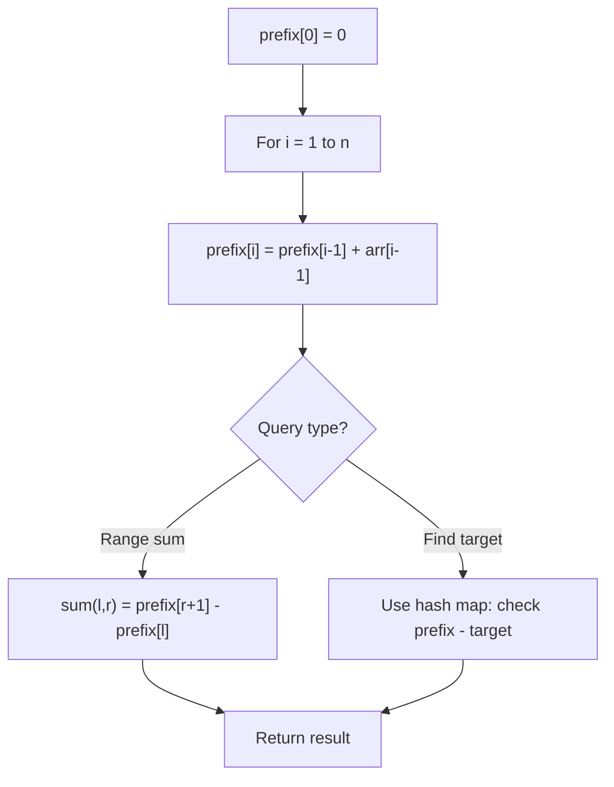

# Problem 2245: Maximum Trailing Zeros in a Cornered Path

**Difficulty:** Medium  
**Tags:** Array, Matrix, Prefix Sum  
**Pattern:** Prefix Sum  
**Link:** [leetcode.com/problems/maximum-trailing-zeros-in-a-cornered-path](https://leetcode.com/problems/maximum-trailing-zeros-in-a-cornered-path/)

## Description

You are given a 2D integer array `grid` of size `m x n`, where each cell contains a positive integer.

A **cornered path** is defined as a set of adjacent cells with **at most** one turn. More specifically, the path should exclusively move either **horizontally** or **vertically** up to the turn (if there is one), without returning to a previously visited cell. After the turn, the path will then move exclusively in the **alternate** direction: move vertically if it moved horizontally, and vice versa, also without returning to a previously visited cell.

The **product** of a path is defined as the product of all the values in the path.

Return *the **maximum** number of **trailing zeros** in the product of a cornered path found in *`grid`.

Note:

	- **Horizontal** movement means moving in either the left or right direction.
	- **Vertical** movement means moving in either the up or down direction.

 

Example 1:

```

**Input:** grid = [[23,17,15,3,20],[8,1,20,27,11],[9,4,6,2,21],[40,9,1,10,6],[22,7,4,5,3]]
**Output:** 3
**Explanation:** The grid on the left shows a valid cornered path.
It has a product of 15 * 20 * 6 * 1 * 10 = 18000 which has 3 trailing zeros.
It can be shown that this is the maximum trailing zeros in the product of a cornered path.

The grid in the middle is not a cornered path as it has more than one turn.
The grid on the right is not a cornered path as it requires a return to a previously visited cell.

```

Example 2:

```

**Input:** grid = [[4,3,2],[7,6,1],[8,8,8]]
**Output:** 0
**Explanation:** The grid is shown in the figure above.
There are no cornered paths in the grid that result in a product with a trailing zero.

```

 

**Constraints:**

	- `m == grid.length`
	- `n == grid[i].length`
	- `1 <= m, n <= 10^5`
	- `1 <= m * n <= 10^5`
	- `1 <= grid[i][j] <= 1000`

## Approach: Prefix Sum

Build a prefix sum array where prefix[i] = sum of elements 0..i-1. Any subarray sum [l..r] = prefix[r+1] - prefix[l]. Combine with hash map for O(n) subarray sum queries.

## Pseudocode

```
1. Build prefix sum array: prefix[0]=0, prefix[i]=prefix[i-1]+arr[i-1]
2. Use prefix sums to answer queries:
   - Subarray sum [l..r] = prefix[r+1] - prefix[l]
   - Or use hash map to find prefix[j]-prefix[i] == target
3. Return result
```

## Algorithm Flow



## Complexity Analysis

- **Time:** O(n)
- **Space:** O(n)

## Solution (Python3)

```python
class Solution:
    def maxTrailingZeros(self, grid: List[List[int]]) -> int:
        # Prefix sum approach - O(n) time, O(n) space
        prefix = {0: -1}
        curr_sum = 0
        result = 0
        target = grid if isinstance(grid, int) else 0
        for i, val in enumerate(grid):
            curr_sum += val
            if curr_sum - target in prefix:
                result = max(result, i - prefix[curr_sum - target])
            if curr_sum not in prefix:
                prefix[curr_sum] = i
        return result
```

## Solution (C++)

```cpp
#include <algorithm>
#include <string>
#include <unordered_map>
#include <vector>
using namespace std;

class Solution {
public:
    int maxTrailingZeros(vector<vector<int>>& grid) {
        // Prefix sum approach - O(n) time, O(n) space
        unordered_map<int, int> prefix;
        prefix[0] = -1;
        int curr_sum = 0, result = 0;
        int target = grid;
        for (int i = 0; i < (int)grid.size(); i++) {
            curr_sum += grid[i];
            if (prefix.count(curr_sum - target)) {
                result = max(result, i - prefix[curr_sum - target]);
            }
            if (!prefix.count(curr_sum)) {
                prefix[curr_sum] = i;
            }
        }
        return result;
    }
};
```
