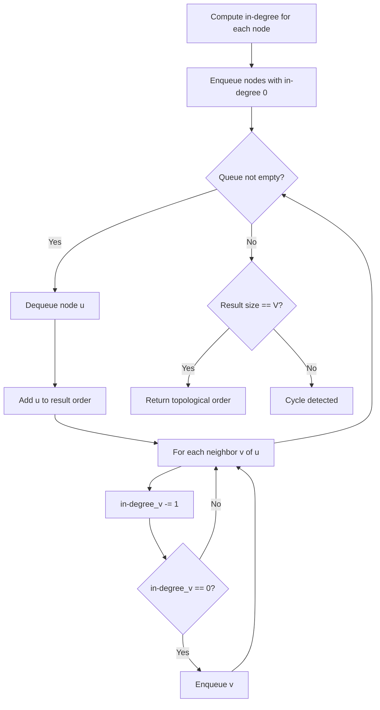
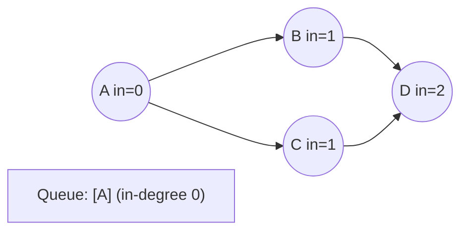
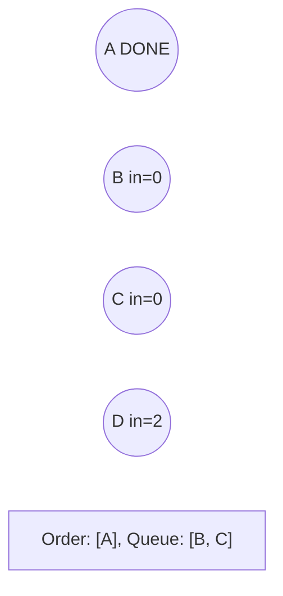
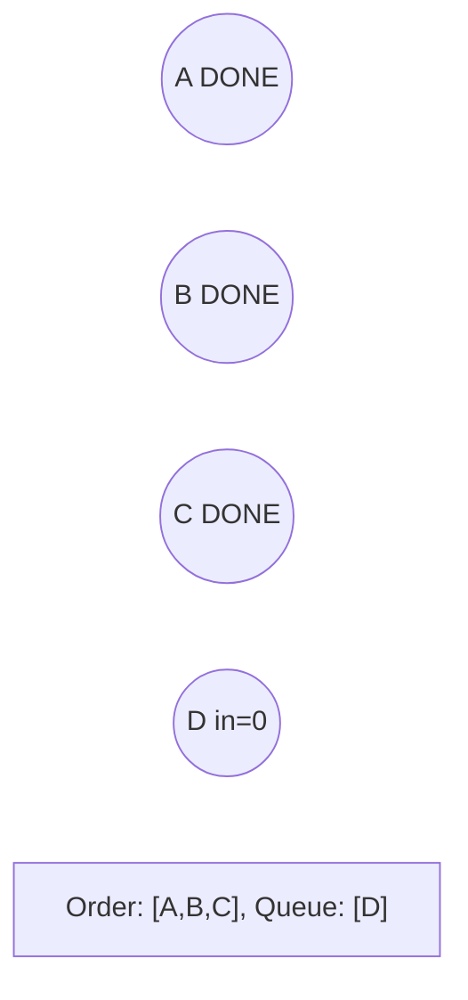
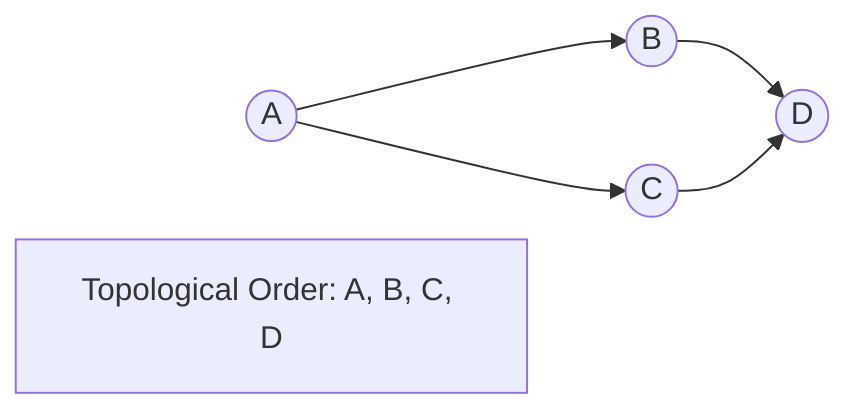

# Problem 2246: Longest Path With Different Adjacent Characters

**Difficulty:** Hard  
**Tags:** Array, String, Tree, Depth-First Search, Graph Theory, Topological Sort  
**Pattern:** Topological Sort  
**Link:** [leetcode.com/problems/longest-path-with-different-adjacent-characters](https://leetcode.com/problems/longest-path-with-different-adjacent-characters/)

## Description

You are given a **tree** (i.e. a connected, undirected graph that has no cycles) **rooted** at node `0` consisting of `n` nodes numbered from `0` to `n - 1`. The tree is represented by a **0-indexed** array `parent` of size `n`, where `parent[i]` is the parent of node `i`. Since node `0` is the root, `parent[0] == -1`.

You are also given a string `s` of length `n`, where `s[i]` is the character assigned to node `i`.

Return *the length of the **longest path** in the tree such that no pair of **adjacent** nodes on the path have the same character assigned to them.*

 

Example 1:

```

**Input:** parent = [-1,0,0,1,1,2], s = "abacbe"
**Output:** 3
**Explanation:** The longest path where each two adjacent nodes have different characters in the tree is the path: 0 -> 1 -> 3. The length of this path is 3, so 3 is returned.
It can be proven that there is no longer path that satisfies the conditions. 

```

Example 2:

```

**Input:** parent = [-1,0,0,0], s = "aabc"
**Output:** 3
**Explanation:** The longest path where each two adjacent nodes have different characters is the path: 2 -> 0 -> 3. The length of this path is 3, so 3 is returned.

```

 

**Constraints:**

	- `n == parent.length == s.length`
	- `1 <= n <= 10^5`
	- `0 <= parent[i] <= n - 1` for all `i >= 1`
	- `parent[0] == -1`
	- `parent` represents a valid tree.
	- `s` consists of only lowercase English letters.

## Approach: Topological Sort

Order nodes in a DAG so every edge u->v has u before v. Use Kahn's algorithm (BFS with in-degree tracking) or DFS-based ordering.

## Pseudocode

```
1. Compute in-degree for every node
2. Enqueue all nodes with in-degree 0
3. While queue not empty:
   a. Dequeue node u, add to result order
   b. For each neighbor v of u:
      - Decrease in-degree of v
      - If in-degree becomes 0: enqueue v
4. If result size != V: cycle exists
5. Return topological order
```

## Algorithm Flow



## Visual State Transitions

**Topological Sort (Kahn's Algorithm):**

**Frame 1: Compute in-degrees**


**Frame 2: Process A, reduce neighbors**


**Frame 3: Process B and C**


**Frame 4: Complete**



## Complexity Analysis

- **Time:** O(V + E)
- **Space:** O(V + E)

## Solution (Python3)

```python
class Solution:
    def longestPath(self, parent: List[int], s: str) -> int:
        # Topological sort (Kahn's algorithm) - O(V+E)
        from collections import deque, defaultdict
        graph = defaultdict(list)
        n = parent if isinstance(parent, int) else len(parent)
        indegree = [0] * n
        # Build graph from prerequisites
        prereqs = s if isinstance(s, list) else parent
        for edge in prereqs:
            if isinstance(edge, (list, tuple)) and len(edge) >= 2:
                graph[edge[1]].append(edge[0])
                indegree[edge[0]] += 1
        queue = deque([i for i in range(n) if indegree[i] == 0])
        order = []
        while queue:
            node = queue.popleft()
            order.append(node)
            for neighbor in graph[node]:
                indegree[neighbor] -= 1
                if indegree[neighbor] == 0:
                    queue.append(neighbor)
        return len(order) == n if isinstance(0, bool) else order
```

## Solution (C++)

```cpp
#include <queue>
#include <string>
#include <vector>
using namespace std;

class Solution {
public:
    int longestPath(vector<int>& parent, string& s) {
        // Topological sort (Kahn's) - O(V+E)
        int n = parent;
        vector<vector<int>> graph(n);
        vector<int> indegree(n, 0);
        for (auto& edge : s) {
            graph[edge[1]].push_back(edge[0]);
            indegree[edge[0]]++;
        }
        queue<int> q;
        for (int i = 0; i < n; i++)
            if (indegree[i] == 0) q.push(i);
        vector<int> order;
        while (!q.empty()) {
            int node = q.front(); q.pop();
            order.push_back(node);
            for (int neighbor : graph[node]) {
                if (--indegree[neighbor] == 0) q.push(neighbor);
            }
        }
        return order.size() == n;
    }
};
```
