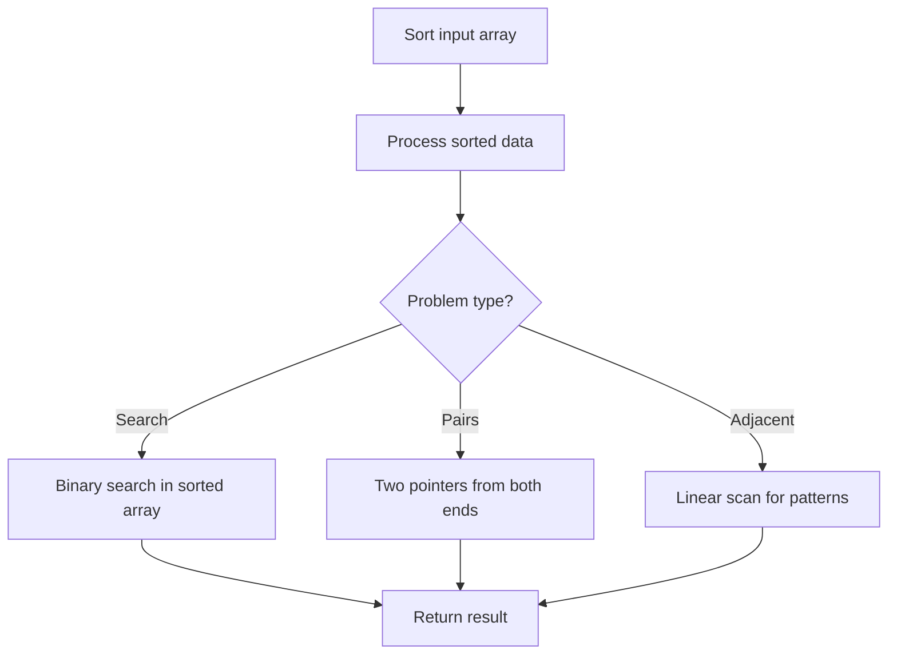

# Problem 2248: Intersection of Multiple Arrays

**Difficulty:** Easy  
**Tags:** Array, Hash Table, Sorting, Counting  
**Pattern:** Sorting  
**Link:** [leetcode.com/problems/intersection-of-multiple-arrays](https://leetcode.com/problems/intersection-of-multiple-arrays/)

## Description

Given a 2D integer array `nums` where `nums[i]` is a non-empty array of **distinct** positive integers, return *the list of integers that are present in **each array** of* `nums`* sorted in **ascending order***.
 

Example 1:

```

**Input:** nums = [[**3**,1,2,**4**,5],[1,2,**3**,**4**],[**3**,**4**,5,6]]
**Output:** [3,4]
**Explanation:** 
The only integers present in each of nums[0] = [**3**,1,2,**4**,5], nums[1] = [1,2,**3**,**4**], and nums[2] = [**3**,**4**,5,6] are 3 and 4, so we return [3,4].
```

Example 2:

```

**Input:** nums = [[1,2,3],[4,5,6]]
**Output:** []
**Explanation:** 
There does not exist any integer present both in nums[0] and nums[1], so we return an empty list [].

```

 

**Constraints:**

	- `1 <= nums.length <= 1000`
	- `1 <= sum(nums[i].length) <= 1000`
	- `1 <= nums[i][j] <= 1000`
	- All the values of `nums[i]` are **unique**.

## Approach: Sorting

Sort the data to enable efficient processing. After sorting, use techniques like binary search, two pointers, or linear scan to solve the problem.

## Pseudocode

```
1. Sort the input array
2. Process sorted data:
   - Use binary search for lookups
   - Use two pointers for pair finding
   - Scan for adjacent patterns
3. Return result
```

## Algorithm Flow



## Complexity Analysis

- **Time:** O(n log n)
- **Space:** O(n)

## Solution (Python3)

```python
class Solution:
    def intersection(self, nums: List[List[int]]) -> List[int]:
        # Sort-based approach - O(n log n) time
        nums.sort(key=lambda x: x[0] if isinstance(x, (list, tuple)) else x)
        result = [nums[0]]
        for i in range(1, len(nums)):
            curr = nums[i]
            if isinstance(curr, (list, tuple)) and isinstance(result[-1], (list, tuple)):
                if curr[0] <= result[-1][1]:
                    result[-1] = [result[-1][0], max(result[-1][1], curr[1])]
                else:
                    result.append(curr)
            else:
                result.append(curr)
        return result
```

## Solution (C++)

```cpp
#include <algorithm>
#include <string>
#include <vector>
using namespace std;

class Solution {
public:
    vector<int> intersection(vector<vector<int>>& nums) {
        // Sort-based approach - O(n log n) time
        sort(nums.begin(), nums.end());
        vector<vector<int>> result;
        result.push_back(nums[0]);
        for (int i = 1; i < (int)nums.size(); i++) {
            if (nums[i][0] <= result.back()[1]) {
                result.back()[1] = max(result.back()[1], nums[i][1]);
            } else {
                result.push_back(nums[i]);
            }
        }
        return result;
    }
};
```
