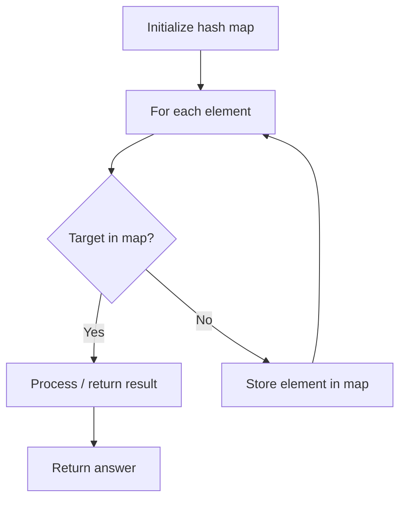

# Problem 2249: Count Lattice Points Inside a Circle

**Difficulty:** Medium  
**Tags:** Array, Hash Table, Math, Geometry, Enumeration  
**Pattern:** Hash Map Lookup  
**Link:** [leetcode.com/problems/count-lattice-points-inside-a-circle](https://leetcode.com/problems/count-lattice-points-inside-a-circle/)

## Description

Given a 2D integer array `circles` where `circles[i] = [xi, yi, ri]` represents the center `(xi, yi)` and radius `ri` of the `i^th` circle drawn on a grid, return *the **number of lattice points** **that are present inside **at least one** circle*.

**Note:**

	- A **lattice point** is a point with integer coordinates.
	- Points that lie **on the circumference of a circle** are also considered to be inside it.

 

Example 1:

```

**Input:** circles = [[2,2,1]]
**Output:** 5
**Explanation:**
The figure above shows the given circle.
The lattice points present inside the circle are (1, 2), (2, 1), (2, 2), (2, 3), and (3, 2) and are shown in green.
Other points such as (1, 1) and (1, 3), which are shown in red, are not considered inside the circle.
Hence, the number of lattice points present inside at least one circle is 5.
```

Example 2:

```

**Input:** circles = [[2,2,2],[3,4,1]]
**Output:** 16
**Explanation:**
The figure above shows the given circles.
There are exactly 16 lattice points which are present inside at least one circle. 
Some of them are (0, 2), (2, 0), (2, 4), (3, 2), and (4, 4).

```

 

**Constraints:**

	- `1 <= circles.length <= 200`
	- `circles[i].length == 3`
	- `1 <= xi, yi <= 100`
	- `1 <= ri <= min(xi, yi)`

## Approach: Hash Map Lookup

Use a hash map (dictionary) to store elements for O(1) lookup. Iterate through the input, checking membership or counting frequencies in the map.

## Pseudocode

```
1. Initialize hash map
2. Iterate through elements:
   a. Check if target/complement exists in map
   b. If found: process result
   c. Otherwise: store element in map
3. Return result
```

## Algorithm Flow



## Complexity Analysis

- **Time:** O(n)
- **Space:** O(n)

## Solution (Python3)

```python
class Solution:
    def countLatticePoints(self, circles: List[List[int]]) -> int:
        # Hash map approach - O(n) time, O(n) space
        seen = {}
        for i, val in enumerate(circles):
            complement = circles - val
            if complement in seen:
                return [seen[complement], i]
            seen[val] = i
        return 0
```

## Solution (C++)

```cpp
#include <string>
#include <unordered_map>
#include <vector>
using namespace std;

class Solution {
public:
    int countLatticePoints(vector<vector<int>>& circles) {
        // Hash map approach - O(n) time, O(n) space
        unordered_map<int, int> seen;
        for (int i = 0; i < circles.size(); i++) {
            int complement = circles - circles[i];
            if (seen.count(complement)) {
                return {seen[complement], i};
            }
            seen[circles[i]] = i;
        }
        return 0;
    }
};
```
