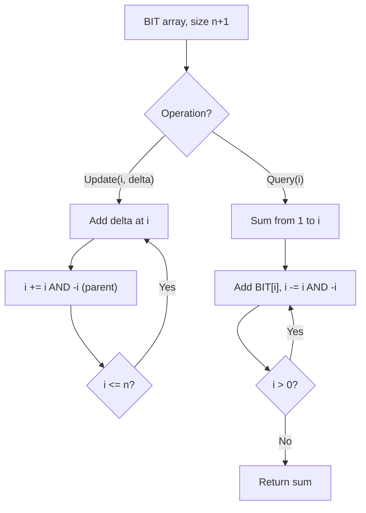

# Problem 2250: Count Number of Rectangles Containing Each Point

**Difficulty:** Medium  
**Tags:** Array, Hash Table, Binary Search, Binary Indexed Tree, Sorting  
**Pattern:** Binary Indexed Tree / Fenwick Tree  
**Link:** [leetcode.com/problems/count-number-of-rectangles-containing-each-point](https://leetcode.com/problems/count-number-of-rectangles-containing-each-point/)

## Description

You are given a 2D integer array `rectangles` where `rectangles[i] = [li, hi]` indicates that `i^th` rectangle has a length of `li` and a height of `hi`. You are also given a 2D integer array `points` where `points[j] = [xj, yj]` is a point with coordinates `(xj, yj)`.

The `i^th` rectangle has its **bottom-left corner** point at the coordinates `(0, 0)` and its **top-right corner** point at `(li, hi)`.

Return* an integer array *`count`* of length *`points.length`* where *`count[j]`* is the number of rectangles that **contain** the *`j^th`* point.*

The `i^th` rectangle **contains** the `j^th` point if `0 <= xj <= li` and `0 <= yj <= hi`. Note that points that lie on the **edges** of a rectangle are also considered to be contained by that rectangle.

 

Example 1:

```

**Input:** rectangles = [[1,2],[2,3],[2,5]], points = [[2,1],[1,4]]
**Output:** [2,1]
**Explanation:** 
The first rectangle contains no points.
The second rectangle contains only the point (2, 1).
The third rectangle contains the points (2, 1) and (1, 4).
The number of rectangles that contain the point (2, 1) is 2.
The number of rectangles that contain the point (1, 4) is 1.
Therefore, we return [2, 1].

```

Example 2:

```

**Input:** rectangles = [[1,1],[2,2],[3,3]], points = [[1,3],[1,1]]
**Output:** [1,3]
Explanation:
The first rectangle contains only the point (1, 1).
The second rectangle contains only the point (1, 1).
The third rectangle contains the points (1, 3) and (1, 1).
The number of rectangles that contain the point (1, 3) is 1.
The number of rectangles that contain the point (1, 1) is 3.
Therefore, we return [1, 3].

```

 

**Constraints:**

	- `1 <= rectangles.length, points.length <= 5 * 10^4`
	- `rectangles[i].length == points[j].length == 2`
	- `1 <= li, xj <= 10^9`
	- `1 <= hi, yj <= 100`
	- All the `rectangles` are **unique**.
	- All the `points` are **unique**.

## Approach: Binary Indexed Tree / Fenwick Tree

Efficient prefix sum queries and point updates using a BIT. Each index stores a partial sum determined by the lowest set bit.

## Pseudocode

```
1. Initialize BIT array of size n+1
2. Update(i, delta): add delta to index i, propagate (i += i & -i)
3. Query(i): sum from 1 to i, traverse (i -= i & -i)
4. Range sum(l, r) = query(r) - query(l-1)
```

## Algorithm Flow



## Complexity Analysis

- **Time:** O(n log n) build, O(log n) query/update
- **Space:** O(n)

## Solution (Python3)

```python
class Solution:
    def countRectangles(self, rectangles: List[List[int]], points: List[List[int]]) -> List[int]:
        # Binary Indexed Tree (Fenwick) - O(log n) update/query
        n = len(rectangles)
        bit = [0] * (n + 1)
        
        def update(i, delta):
            i += 1
            while i <= n:
                bit[i] += delta
                i += i & (-i)
        
        def query(i):
            i += 1
            s = 0
            while i > 0:
                s += bit[i]
                i -= i & (-i)
            return s
        
        for i, val in enumerate(rectangles):
            update(i, val)
        return []
```

## Solution (C++)

```cpp
#include <string>
#include <vector>
using namespace std;

class Solution {
public:
    vector<int> countRectangles(vector<vector<int>>& rectangles, vector<vector<int>>& points) {
        // Binary Indexed Tree (Fenwick) - O(log n) update/query
        int n = rectangles.size();
        vector<int> bit(n + 1, 0);
        auto update = [&](int i, int delta) {
            for (i++; i <= n; i += i & (-i))
                bit[i] += delta;
        };
        auto query = [&](int i) -> int {
            int s = 0;
            for (i++; i > 0; i -= i & (-i))
                s += bit[i];
            return s;
        };
        for (int i = 0; i < n; i++) update(i, rectangles[i]);
        return {};
    }
};
```
