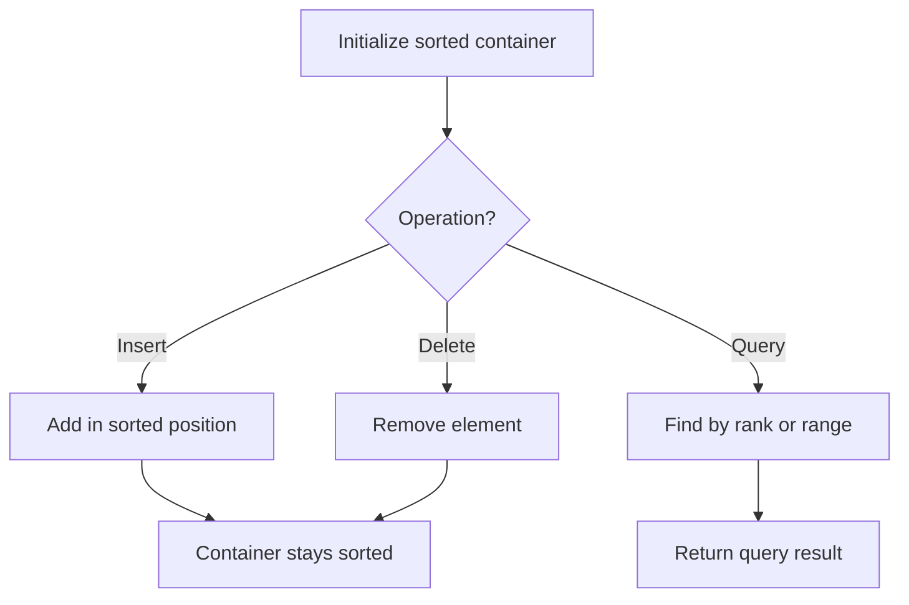

# Problem 2251: Number of Flowers in Full Bloom

**Difficulty:** Hard  
**Tags:** Array, Hash Table, Binary Search, Sorting, Prefix Sum, Ordered Set  
**Pattern:** Ordered Set / SortedList  
**Link:** [leetcode.com/problems/number-of-flowers-in-full-bloom](https://leetcode.com/problems/number-of-flowers-in-full-bloom/)

## Description

You are given a **0-indexed** 2D integer array `flowers`, where `flowers[i] = [starti, endi]` means the `i^th` flower will be in **full bloom** from `starti` to `endi` (**inclusive**). You are also given a **0-indexed** integer array `people` of size `n`, where `people[i]` is the time that the `i^th` person will arrive to see the flowers.

Return *an integer array *`answer`* of size *`n`*, where *`answer[i]`* is the **number** of flowers that are in full bloom when the *`i^th`* person arrives.*

 

Example 1:

```

**Input:** flowers = [[1,6],[3,7],[9,12],[4,13]], people = [2,3,7,11]
**Output:** [1,2,2,2]
**Explanation: **The figure above shows the times when the flowers are in full bloom and when the people arrive.
For each person, we return the number of flowers in full bloom during their arrival.

```

Example 2:

```

**Input:** flowers = [[1,10],[3,3]], people = [3,3,2]
**Output:** [2,2,1]
**Explanation:** The figure above shows the times when the flowers are in full bloom and when the people arrive.
For each person, we return the number of flowers in full bloom during their arrival.

```

 

**Constraints:**

	- `1 <= flowers.length <= 5 * 10^4`
	- `flowers[i].length == 2`
	- `1 <= starti <= endi <= 10^9`
	- `1 <= people.length <= 5 * 10^4`
	- `1 <= people[i] <= 10^9`

## Approach: Ordered Set / SortedList

Maintain elements in sorted order for efficient insertion, deletion, and rank queries. Use balanced BST, skip list, or sorted container.

## Pseudocode

```
1. Initialize sorted container
2. For each operation:
   - Insert: add element in sorted position O(log n)
   - Delete: remove element O(log n)
   - Query: find kth element, count, or range O(log n)
3. Return results
```

## Algorithm Flow



## Complexity Analysis

- **Time:** O(n log n)
- **Space:** O(n)

## Solution (Python3)

```python
class Solution:
    def fullBloomFlowers(self, flowers: List[List[int]], people: List[int]) -> List[int]:
        # Ordered set / SortedList - O(n log n) time
        from sortedcontainers import SortedList
        sl = SortedList()
        result = 0
        for val in flowers:
            pos = sl.bisect_left(val)
            if pos < len(sl):
                result = max(result, sl[pos] - val)
            sl.add(val)
        return result
```

## Solution (C++)

```cpp
#include <algorithm>
#include <set>
#include <string>
#include <vector>
using namespace std;

class Solution {
public:
    vector<int> fullBloomFlowers(vector<vector<int>>& flowers, vector<int>& people) {
        // Ordered set - O(n log n) time
        set<int> ordered;
        int result = 0;
        for (int val : flowers) {
            auto it = ordered.lower_bound(val);
            if (it != ordered.end()) {
                result = max(result, *it - val);
            }
            ordered.insert(val);
        }
        return result;
    }
};
```
