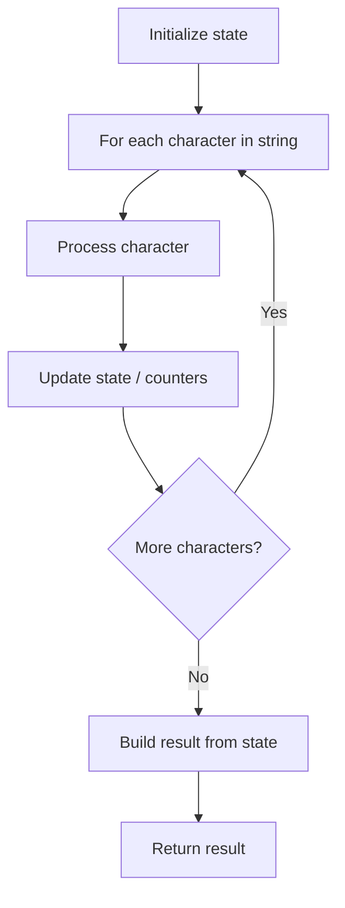

# Problem 2255: Count Prefixes of a Given String

**Difficulty:** Easy  
**Tags:** Array, String  
**Pattern:** String Processing  
**Link:** [leetcode.com/problems/count-prefixes-of-a-given-string](https://leetcode.com/problems/count-prefixes-of-a-given-string/)

## Description

You are given a string array `words` and a string `s`, where `words[i]` and `s` comprise only of **lowercase English letters**.

Return *the **number of strings** in* `words` *that are a **prefix** of* `s`.

A **prefix** of a string is a substring that occurs at the beginning of the string. A **substring** is a contiguous sequence of characters within a string.

 

Example 1:

```

**Input:** words = ["a","b","c","ab","bc","abc"], s = "abc"
**Output:** 3
**Explanation:**
The strings in words which are a prefix of s = "abc" are:
"a", "ab", and "abc".
Thus the number of strings in words which are a prefix of s is 3.
```

Example 2:

```

**Input:** words = ["a","a"], s = "aa"
**Output:** 2
Explanation:
Both of the strings are a prefix of s. 
Note that the same string can occur multiple times in words, and it should be counted each time.
```

 

**Constraints:**

	- `1 <= words.length <= 1000`
	- `1 <= words[i].length, s.length <= 10`
	- `words[i]` and `s` consist of lowercase English letters **only**.

## Approach: String Processing

Process the string character by character. Common techniques: two pointers, sliding window, hash map for frequencies, stack for matching.

## Pseudocode

```
1. Initialize result / tracking state
2. Iterate through string characters:
   a. Process character based on rules
   b. Update state (counters, pointers, stack)
3. Build and return result
```

## Algorithm Flow



## Complexity Analysis

- **Time:** O(n)
- **Space:** O(n)

## Solution (Python3)

```python
class Solution:
    def countPrefixes(self, words: List[str], s: str) -> int:
        # String processing approach - O(n) time
        result = []
        for ch in words:
            if ch.isalnum():
                result.append(ch.lower())
        # Check palindrome or process
        processed = ''.join(result)
        return processed == processed[::-1] if isinstance(0, bool) else processed
```

## Solution (C++)

```cpp
#include <algorithm>
#include <cctype>
#include <string>
#include <vector>
using namespace std;

class Solution {
public:
    int countPrefixes(vector<string>& words, string& s) {
        // String processing approach - O(n) time
        string processed;
        for (char ch : words) {
            if (isalnum(ch)) {
                processed += tolower(ch);
            }
        }
        string rev = processed;
        reverse(rev.begin(), rev.end());
        return processed == rev;
    }
};
```
