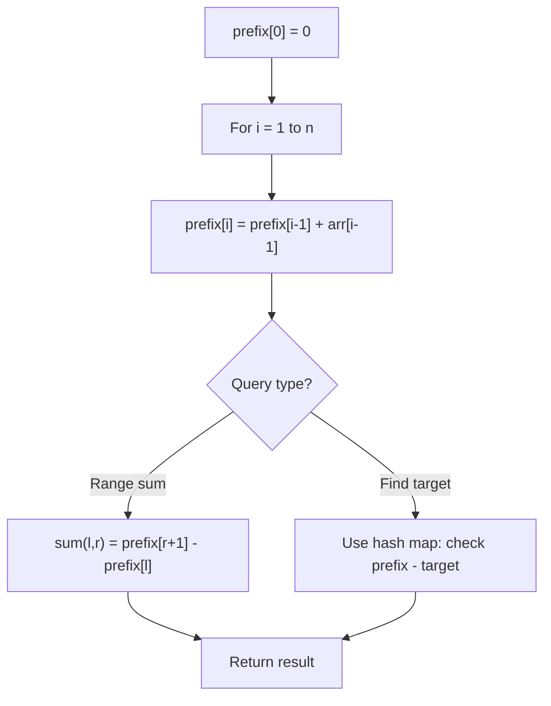

# Problem 2256: Minimum Average Difference

**Difficulty:** Medium  
**Tags:** Array, Prefix Sum  
**Pattern:** Prefix Sum  
**Link:** [leetcode.com/problems/minimum-average-difference](https://leetcode.com/problems/minimum-average-difference/)

## Description

You are given a **0-indexed** integer array `nums` of length `n`.

The **average difference** of the index `i` is the **absolute** **difference** between the average of the **first** `i + 1` elements of `nums` and the average of the **last** `n - i - 1` elements. Both averages should be **rounded down** to the nearest integer.

Return* the index with the **minimum average difference***. If there are multiple such indices, return the **smallest** one.

**Note:**

	- The **absolute difference** of two numbers is the absolute value of their difference.
	- The **average** of `n` elements is the **sum** of the `n` elements divided (**integer division**) by `n`.
	- The average of `0` elements is considered to be `0`.

 

Example 1:

```

**Input:** nums = [2,5,3,9,5,3]
**Output:** 3
**Explanation:**
- The average difference of index 0 is: |2 / 1 - (5 + 3 + 9 + 5 + 3) / 5| = |2 / 1 - 25 / 5| = |2 - 5| = 3.
- The average difference of index 1 is: |(2 + 5) / 2 - (3 + 9 + 5 + 3) / 4| = |7 / 2 - 20 / 4| = |3 - 5| = 2.
- The average difference of index 2 is: |(2 + 5 + 3) / 3 - (9 + 5 + 3) / 3| = |10 / 3 - 17 / 3| = |3 - 5| = 2.
- The average difference of index 3 is: |(2 + 5 + 3 + 9) / 4 - (5 + 3) / 2| = |19 / 4 - 8 / 2| = |4 - 4| = 0.
- The average difference of index 4 is: |(2 + 5 + 3 + 9 + 5) / 5 - 3 / 1| = |24 / 5 - 3 / 1| = |4 - 3| = 1.
- The average difference of index 5 is: |(2 + 5 + 3 + 9 + 5 + 3) / 6 - 0| = |27 / 6 - 0| = |4 - 0| = 4.
The average difference of index 3 is the minimum average difference so return 3.

```

Example 2:

```

**Input:** nums = [0]
**Output:** 0
**Explanation:**
The only index is 0 so return 0.
The average difference of index 0 is: |0 / 1 - 0| = |0 - 0| = 0.

```

 

**Constraints:**

	- `1 <= nums.length <= 10^5`
	- `0 <= nums[i] <= 10^5`

## Approach: Prefix Sum

Build a prefix sum array where prefix[i] = sum of elements 0..i-1. Any subarray sum [l..r] = prefix[r+1] - prefix[l]. Combine with hash map for O(n) subarray sum queries.

## Pseudocode

```
1. Build prefix sum array: prefix[0]=0, prefix[i]=prefix[i-1]+arr[i-1]
2. Use prefix sums to answer queries:
   - Subarray sum [l..r] = prefix[r+1] - prefix[l]
   - Or use hash map to find prefix[j]-prefix[i] == target
3. Return result
```

## Algorithm Flow



## Complexity Analysis

- **Time:** O(n)
- **Space:** O(n)

## Solution (Python3)

```python
class Solution:
    def minimumAverageDifference(self, nums: List[int]) -> int:
        # Prefix sum approach - O(n) time, O(n) space
        prefix = {0: -1}
        curr_sum = 0
        result = 0
        target = nums if isinstance(nums, int) else 0
        for i, val in enumerate(nums):
            curr_sum += val
            if curr_sum - target in prefix:
                result = max(result, i - prefix[curr_sum - target])
            if curr_sum not in prefix:
                prefix[curr_sum] = i
        return result
```

## Solution (C++)

```cpp
#include <algorithm>
#include <string>
#include <unordered_map>
#include <vector>
using namespace std;

class Solution {
public:
    int minimumAverageDifference(vector<int>& nums) {
        // Prefix sum approach - O(n) time, O(n) space
        unordered_map<int, int> prefix;
        prefix[0] = -1;
        int curr_sum = 0, result = 0;
        int target = nums;
        for (int i = 0; i < (int)nums.size(); i++) {
            curr_sum += nums[i];
            if (prefix.count(curr_sum - target)) {
                result = max(result, i - prefix[curr_sum - target]);
            }
            if (!prefix.count(curr_sum)) {
                prefix[curr_sum] = i;
            }
        }
        return result;
    }
};
```
