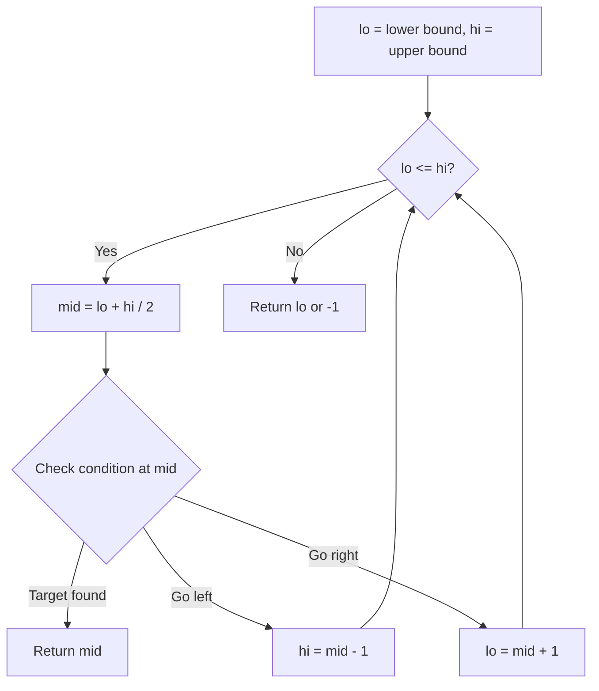
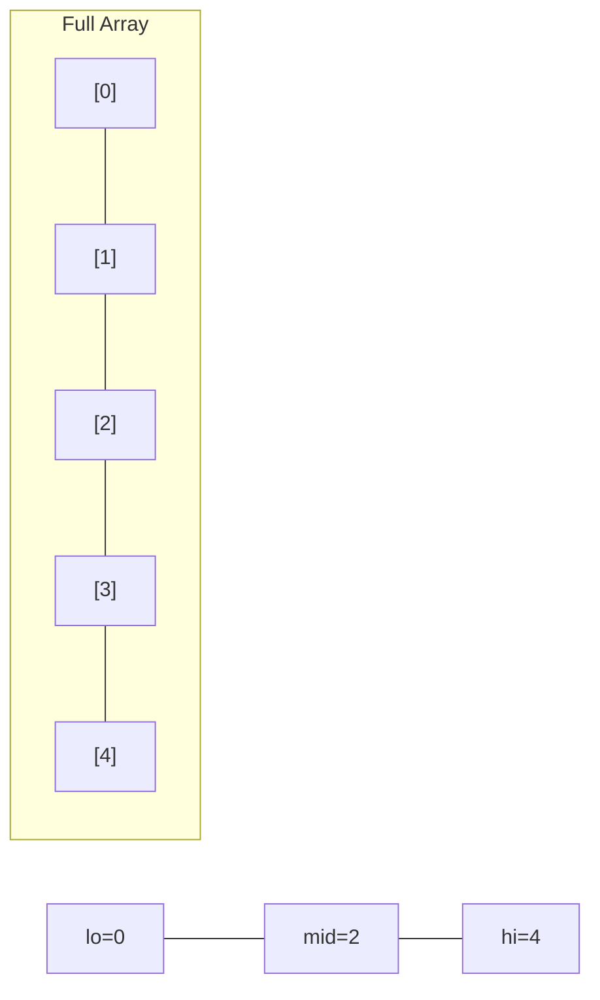
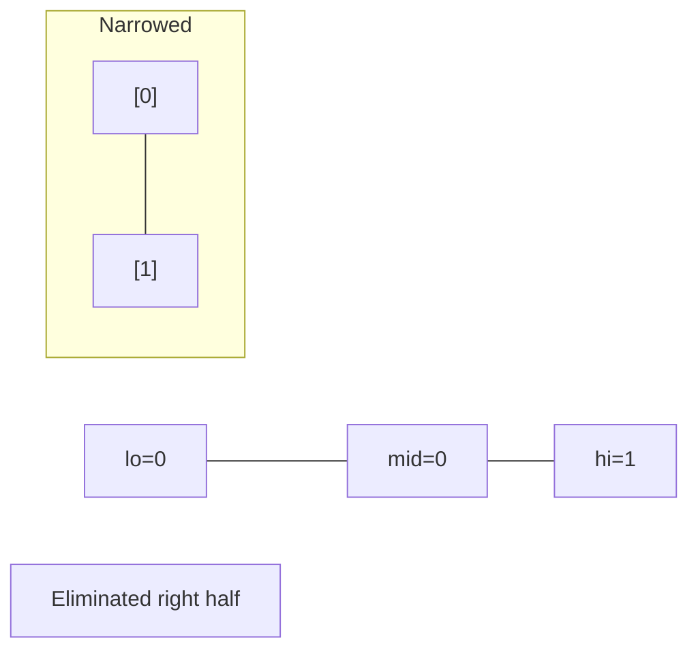
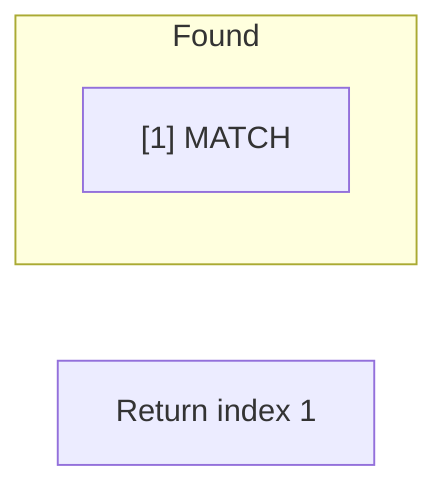

# Problem 2258: Escape the Spreading Fire

**Difficulty:** Hard  
**Tags:** Array, Binary Search, Breadth-First Search, Matrix  
**Pattern:** Binary Search  
**Link:** [leetcode.com/problems/escape-the-spreading-fire](https://leetcode.com/problems/escape-the-spreading-fire/)

## Description

You are given a **0-indexed** 2D integer array `grid` of size `m x n` which represents a field. Each cell has one of three values:

	- `0` represents grass,
	- `1` represents fire,
	- `2` represents a wall that you and fire cannot pass through.

You are situated in the top-left cell, `(0, 0)`, and you want to travel to the safehouse at the bottom-right cell, `(m - 1, n - 1)`. Every minute, you may move to an **adjacent** grass cell. **After** your move, every fire cell will spread to all **adjacent** cells that are not walls.

Return *the **maximum** number of minutes that you can stay in your initial position before moving while still safely reaching the safehouse*. If this is impossible, return `-1`. If you can **always** reach the safehouse regardless of the minutes stayed, return `10^9`.

Note that even if the fire spreads to the safehouse immediately after you have reached it, it will be counted as safely reaching the safehouse.

A cell is **adjacent** to another cell if the former is directly north, east, south, or west of the latter (i.e., their sides are touching).

 

Example 1:

```

**Input:** grid = [[0,2,0,0,0,0,0],[0,0,0,2,2,1,0],[0,2,0,0,1,2,0],[0,0,2,2,2,0,2],[0,0,0,0,0,0,0]]
**Output:** 3
**Explanation:** The figure above shows the scenario where you stay in the initial position for 3 minutes.
You will still be able to safely reach the safehouse.
Staying for more than 3 minutes will not allow you to safely reach the safehouse.
```

Example 2:

```

**Input:** grid = [[0,0,0,0],[0,1,2,0],[0,2,0,0]]
**Output:** -1
**Explanation:** The figure above shows the scenario where you immediately move towards the safehouse.
Fire will spread to any cell you move towards and it is impossible to safely reach the safehouse.
Thus, -1 is returned.

```

Example 3:

```

**Input:** grid = [[0,0,0],[2,2,0],[1,2,0]]
**Output:** 1000000000
**Explanation:** The figure above shows the initial grid.
Notice that the fire is contained by walls and you will always be able to safely reach the safehouse.
Thus, 109 is returned.

```

 

**Constraints:**

	- `m == grid.length`
	- `n == grid[i].length`
	- `2 <= m, n <= 300`
	- `4 <= m * n <= 2 * 10^4`
	- `grid[i][j]` is either `0`, `1`, or `2`.
	- `grid[0][0] == grid[m - 1][n - 1] == 0`

## Approach: Binary Search

Use binary search to halve the search space each iteration. Define the search range [lo, hi], compute mid, and decide which half to keep based on the problem's monotonic condition.

## Pseudocode

```
1. lo = lower_bound, hi = upper_bound
2. While lo <= hi (or lo < hi):
   a. mid = (lo + hi) // 2
   b. If condition(mid) is satisfied: record answer, search left half
   c. Else: search right half
3. Return answer
```

## Algorithm Flow



## Visual State Transitions

**Binary Search Step-by-Step:**

**Frame 1: Initial search space**


**Frame 2: Compare mid, narrow search**


**Frame 3: Found target**



## Complexity Analysis

- **Time:** O(log n)
- **Space:** O(1)

## Solution (Python3)

```python
class Solution:
    def maximumMinutes(self, grid: List[List[int]]) -> int:
        # Binary search - O(log n) time, O(1) space
        lo, hi = 0, len(grid) - 1
        while lo <= hi:
            mid = lo + (hi - lo) // 2
            if grid[mid] == grid:
                return mid
            elif grid[mid] < grid:
                lo = mid + 1
            else:
                hi = mid - 1
        return 0
```

## Solution (C++)

```cpp
#include <string>
#include <vector>
using namespace std;

class Solution {
public:
    int maximumMinutes(vector<vector<int>>& grid) {
        // Binary search - O(log n) time, O(1) space
        int lo = 0, hi = grid.size() - 1;
        while (lo <= hi) {
            int mid = lo + (hi - lo) / 2;
            if (grid[mid] == grid) {
                return mid;
            } else if (grid[mid] < grid) {
                lo = mid + 1;
            } else {
                hi = mid - 1;
            }
        }
        return 0;
    }
};
```
