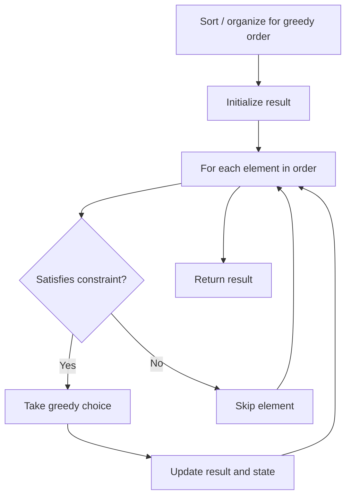

# Problem 2259: Remove Digit From Number to Maximize Result

**Difficulty:** Easy  
**Tags:** String, Greedy, Enumeration  
**Pattern:** Greedy  
**Link:** [leetcode.com/problems/remove-digit-from-number-to-maximize-result](https://leetcode.com/problems/remove-digit-from-number-to-maximize-result/)

## Description

You are given a string `number` representing a **positive integer** and a character `digit`.

Return *the resulting string after removing **exactly one occurrence** of *`digit`* from *`number`* such that the value of the resulting string in **decimal** form is **maximized***. The test cases are generated such that `digit` occurs at least once in `number`.

 

Example 1:

```

**Input:** number = "123", digit = "3"
**Output:** "12"
**Explanation:** There is only one '3' in "123". After removing '3', the result is "12".

```

Example 2:

```

**Input:** number = "1231", digit = "1"
**Output:** "231"
**Explanation:** We can remove the first '1' to get "231" or remove the second '1' to get "123".
Since 231 > 123, we return "231".

```

Example 3:

```

**Input:** number = "551", digit = "5"
**Output:** "51"
**Explanation:** We can remove either the first or second '5' from "551".
Both result in the string "51".

```

 

**Constraints:**

	- `2 <= number.length <= 100`
	- `number` consists of digits from `'1'` to `'9'`.
	- `digit` is a digit from `'1'` to `'9'`.
	- `digit` occurs at least once in `number`.

## Approach: Greedy

Make the locally optimal choice at each step, trusting it leads to a global optimum. Greedy works when the problem has the greedy-choice property and optimal substructure.

## Pseudocode

```
1. Sort or organize data for greedy ordering
2. Initialize result
3. For each element in greedy order:
   a. If element satisfies constraint:
      - Take the greedy choice
      - Update result and state
4. Return result
```

## Algorithm Flow



## Complexity Analysis

- **Time:** O(n log n)
- **Space:** O(1)

## Solution (Python3)

```python
class Solution:
    def removeDigit(self, number: str, digit: str) -> str:
        # Greedy approach - O(n) time
        result = 0
        curr_max = 0
        for i in range(len(number)):
            if isinstance(number[i], int):
                curr_max = max(curr_max, number[i])
                result = max(result, curr_max)
            else:
                result += 1
        return result
```

## Solution (C++)

```cpp
#include <algorithm>
#include <string>
#include <vector>
using namespace std;

class Solution {
public:
    string removeDigit(string& number, string& digit) {
        // Greedy approach - O(n) time
        int result = 0, curr_max = 0;
        for (int i = 0; i < (int)number.size(); i++) {
            curr_max = max(curr_max, number[i]);
            result = max(result, curr_max);
        }
        return result;
    }
};
```
