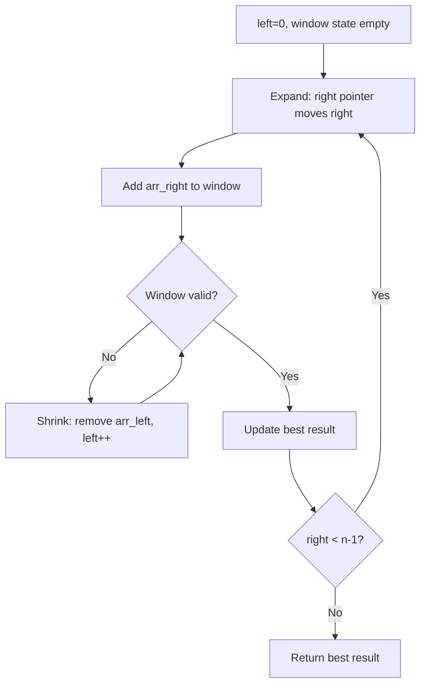
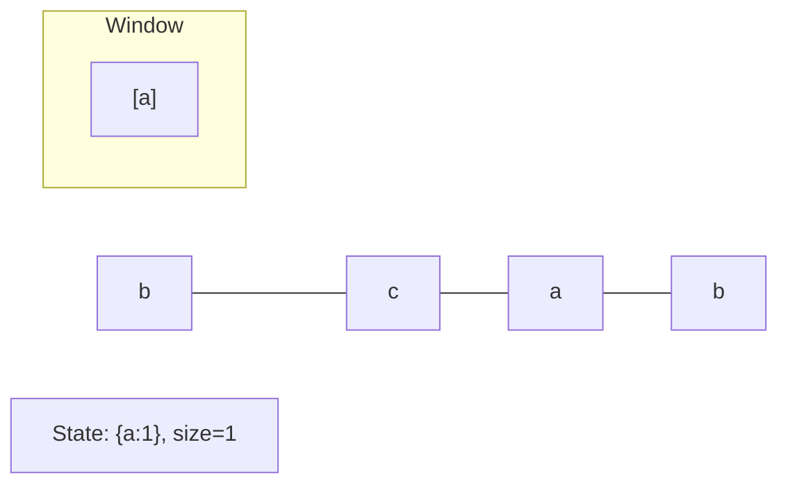
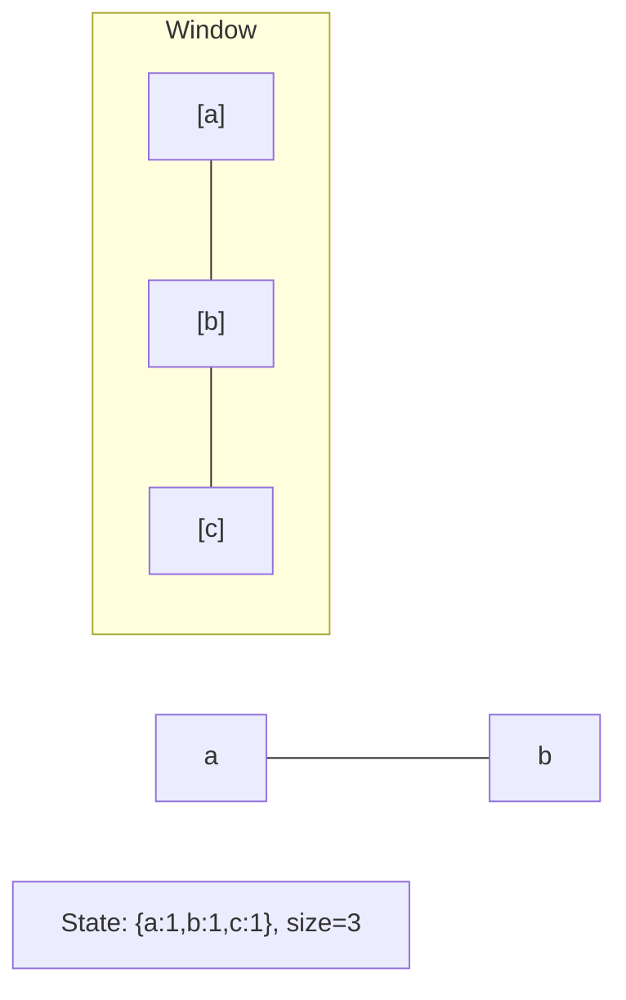
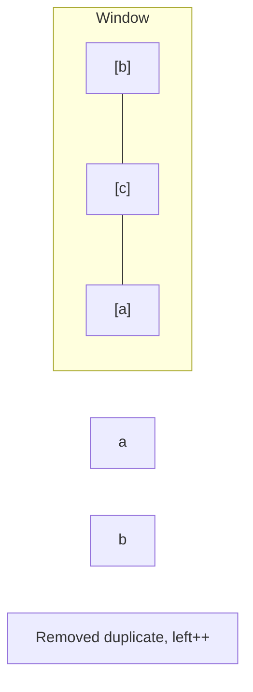
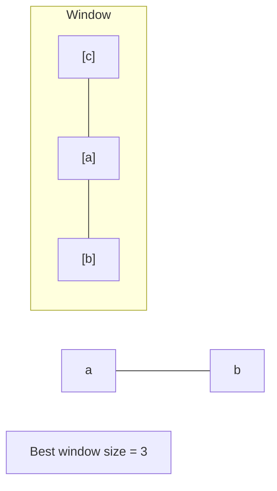

# Problem 2260: Minimum Consecutive Cards to Pick Up

**Difficulty:** Medium  
**Tags:** Array, Hash Table, Sliding Window  
**Pattern:** Sliding Window  
**Link:** [leetcode.com/problems/minimum-consecutive-cards-to-pick-up](https://leetcode.com/problems/minimum-consecutive-cards-to-pick-up/)

## Description

You are given an integer array `cards` where `cards[i]` represents the **value** of the `i^th` card. A pair of cards are **matching** if the cards have the **same** value.

Return* the **minimum** number of **consecutive** cards you have to pick up to have a pair of **matching** cards among the picked cards.* If it is impossible to have matching cards, return `-1`.

 

Example 1:

```

**Input:** cards = [3,4,2,3,4,7]
**Output:** 4
**Explanation:** We can pick up the cards [3,4,2,3] which contain a matching pair of cards with value 3. Note that picking up the cards [4,2,3,4] is also optimal.

```

Example 2:

```

**Input:** cards = [1,0,5,3]
**Output:** -1
**Explanation:** There is no way to pick up a set of consecutive cards that contain a pair of matching cards.

```

 

**Constraints:**

	- `1 <= cards.length <= 10^5`
	- `0 <= cards[i] <= 10^6`

## Approach: Sliding Window

Maintain a window over the data using two pointers. Expand the right boundary to include new elements, and shrink the left boundary when the window constraint is violated. Track the optimal window.

## Pseudocode

```
1. Initialize left = 0, result = initial_value
2. For right in range(n):
   a. Add element at right to window state
   b. While window is invalid:
      - Remove element at left from window state
      - left++
   c. Update result = best of (result, window size/value)
3. Return result
```

## Algorithm Flow



## Visual State Transitions

**Sliding Window Step-by-Step:**

**Frame 1: Initial window (left=0, right=0)**


**Frame 2: Expand right (right=2)**


**Frame 3: Violation - shrink left**


**Frame 4: Continue expanding**



## Complexity Analysis

- **Time:** O(n)
- **Space:** O(k)

## Solution (Python3)

```python
class Solution:
    def minimumCardPickup(self, cards: List[int]) -> int:
        # Sliding window approach - O(n) time, O(k) space
        from collections import defaultdict
        window = defaultdict(int)
        left = 0
        result = 0
        for right in range(len(cards)):
            window[cards[right]] += 1
            while len(window) > (cards if isinstance(cards, int) else len(cards)):
                window[cards[left]] -= 1
                if window[cards[left]] == 0:
                    del window[cards[left]]
                left += 1
            result = max(result, right - left + 1)
        return result
```

## Solution (C++)

```cpp
#include <algorithm>
#include <string>
#include <unordered_map>
#include <vector>
using namespace std;

class Solution {
public:
    int minimumCardPickup(vector<int>& cards) {
        // Sliding window approach - O(n) time, O(k) space
        unordered_map<char, int> window;
        int left = 0, result = 0;
        for (int right = 0; right < cards.size(); right++) {
            window[cards[right]]++;
            while ((int)window.size() > cards) {
                window[cards[left]]--;
                if (window[cards[left]] == 0)
                    window.erase(cards[left]);
                left++;
            }
            result = max(result, right - left + 1);
        }
        return result;
    }
};
```
