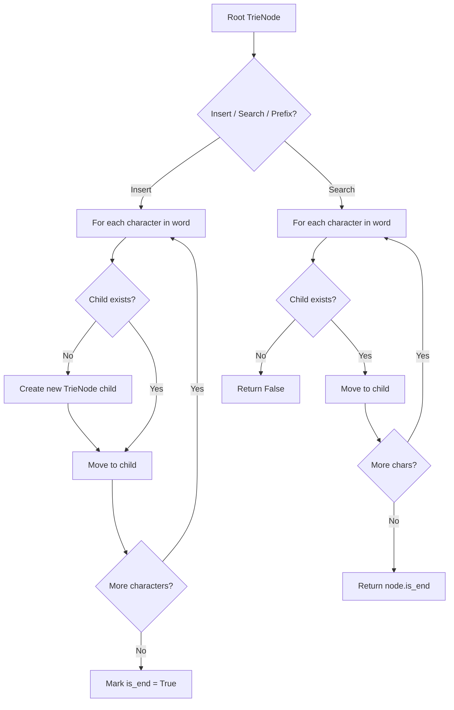
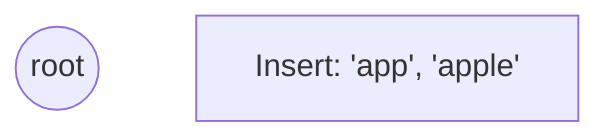
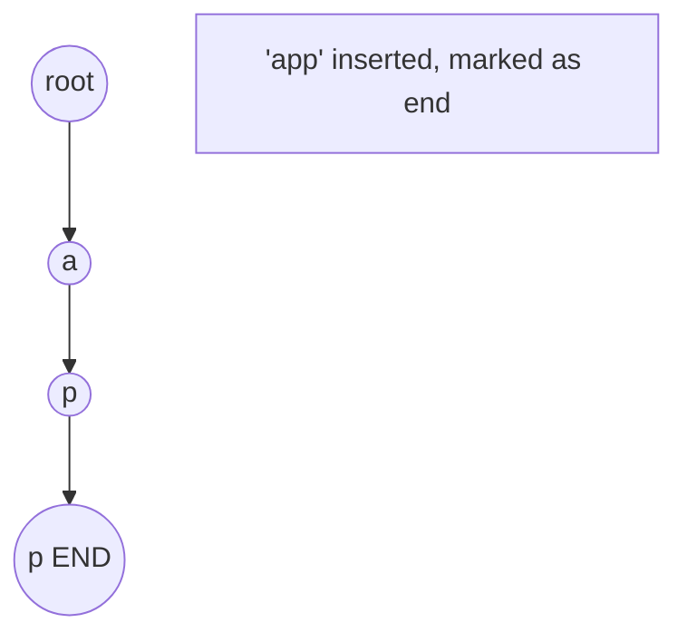
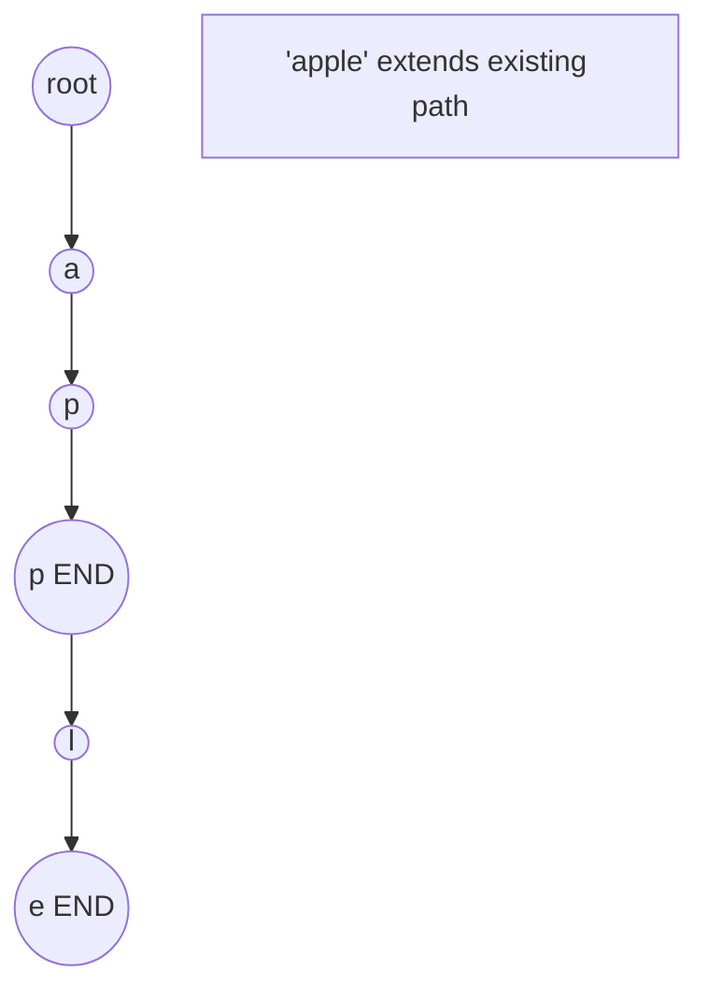
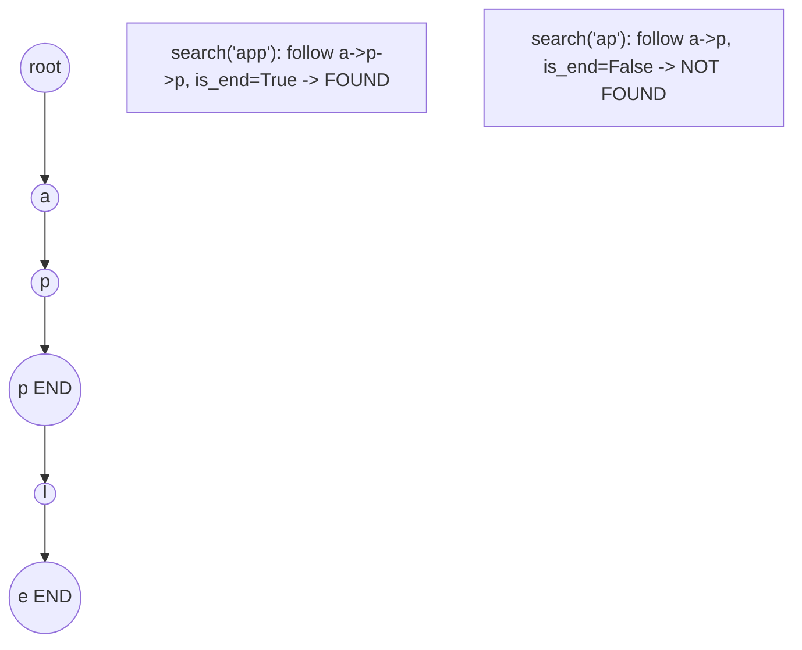

# Problem 2261: K Divisible Elements Subarrays

**Difficulty:** Medium  
**Tags:** Array, Hash Table, Trie, Rolling Hash, Hash Function, Enumeration  
**Pattern:** Trie / Prefix Tree  
**Link:** [leetcode.com/problems/k-divisible-elements-subarrays](https://leetcode.com/problems/k-divisible-elements-subarrays/)

## Description

Given an integer array `nums` and two integers `k` and `p`, return *the number of **distinct subarrays,** which have **at most*** `k` *elements *that are *divisible by* `p`.

Two arrays `nums1` and `nums2` are said to be **distinct** if:

	- They are of **different** lengths, or
	- There exists **at least** one index `i` where `nums1[i] != nums2[i]`.

A **subarray** is defined as a **non-empty** contiguous sequence of elements in an array.

 

Example 1:

```

**Input:** nums = [**2**,3,3,**2**,**2**], k = 2, p = 2
**Output:** 11
**Explanation:**
The elements at indices 0, 3, and 4 are divisible by p = 2.
The 11 distinct subarrays which have at most k = 2 elements divisible by 2 are:
[2], [2,3], [2,3,3], [2,3,3,2], [3], [3,3], [3,3,2], [3,3,2,2], [3,2], [3,2,2], and [2,2].
Note that the subarrays [2] and [3] occur more than once in nums, but they should each be counted only once.
The subarray [2,3,3,2,2] should not be counted because it has 3 elements that are divisible by 2.

```

Example 2:

```

**Input:** nums = [1,2,3,4], k = 4, p = 1
**Output:** 10
**Explanation:**
All element of nums are divisible by p = 1.
Also, every subarray of nums will have at most 4 elements that are divisible by 1.
Since all subarrays are distinct, the total number of subarrays satisfying all the constraints is 10.

```

 

**Constraints:**

	- `1 <= nums.length <= 200`
	- `1 <= nums[i], p <= 200`
	- `1 <= k <= nums.length`

 

**Follow up:**

Can you solve this problem in O(n^2) time complexity?

## Approach: Trie / Prefix Tree

Build a trie (prefix tree) where each node represents a character. Insert words character by character, and search by following child pointers. Supports efficient prefix matching.

## Pseudocode

```
1. TrieNode: children = {}, is_end = False
2. Insert(word):
   - For each char: create child if absent, move to child
   - Mark last node as end
3. Search(word):
   - For each char: if child absent return False, move to child
   - Return node.is_end
4. StartsWith(prefix): same as search but return True at end
```

## Algorithm Flow



## Visual State Transitions

**Trie Insert and Search:**

**Frame 1: Empty trie**


**Frame 2: Insert 'app'**


**Frame 3: Insert 'apple'**


**Frame 4: Search 'app' = True, 'ap' = False**



## Complexity Analysis

- **Time:** O(L) per operation
- **Space:** O(N * L)

## Solution (Python3)

```python
class Solution:
    def countDistinct(self, nums: List[int], k: int, p: int) -> int:
        # Trie-based approach
        trie = {}
        # Build trie from word list
        words = nums if isinstance(nums, list) else [nums]
        for word in words:
            node = trie
            for ch in word:
                if ch not in node:
                    node[ch] = {}
                node = node[ch]
            node['#'] = True
        
        # Search in trie
        def search(word):
            node = trie
            for ch in word:
                if ch not in node:
                    return False
                node = node[ch]
            return '#' in node
        
        return 0
```

## Solution (C++)

```cpp
#include <string>
#include <vector>
using namespace std;

class Solution {
public:
    int countDistinct(vector<int>& nums, int k, int p) {
        // Trie-based approach
        struct TrieNode {
            TrieNode* children[26] = {};
            bool isEnd = false;
        };
        TrieNode* root = new TrieNode();
        // Build trie
        for (auto& word : nums) {
            TrieNode* node = root;
            for (char ch : word) {
                int idx = ch - 'a';
                if (!node->children[idx])
                    node->children[idx] = new TrieNode();
                node = node->children[idx];
            }
            node->isEnd = true;
        }
        return 0;
    }
};
```
