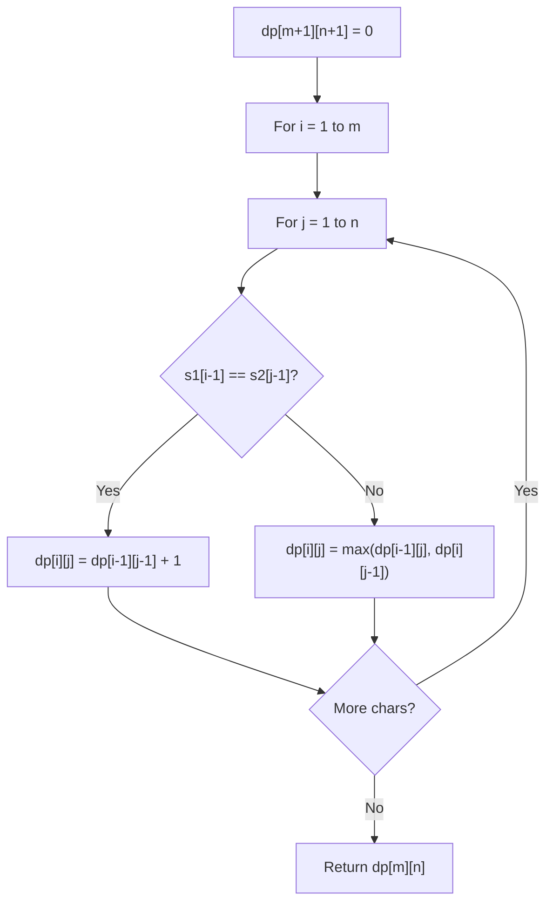

# Problem 2262: Total Appeal of A String

**Difficulty:** Hard  
**Tags:** Hash Table, String, Dynamic Programming  
**Pattern:** Dynamic Programming (String)  
**Link:** [leetcode.com/problems/total-appeal-of-a-string](https://leetcode.com/problems/total-appeal-of-a-string/)

## Description

The **appeal** of a string is the number of **distinct** characters found in the string.

	- For example, the appeal of `"abbca"` is `3` because it has `3` distinct characters: `'a'`, `'b'`, and `'c'`.

Given a string `s`, return *the **total appeal of all of its substrings**.*

A **substring** is a contiguous sequence of characters within a string.

 

Example 1:

```

**Input:** s = "abbca"
**Output:** 28
**Explanation:** The following are the substrings of "abbca":
- Substrings of length 1: "a", "b", "b", "c", "a" have an appeal of 1, 1, 1, 1, and 1 respectively. The sum is 5.
- Substrings of length 2: "ab", "bb", "bc", "ca" have an appeal of 2, 1, 2, and 2 respectively. The sum is 7.
- Substrings of length 3: "abb", "bbc", "bca" have an appeal of 2, 2, and 3 respectively. The sum is 7.
- Substrings of length 4: "abbc", "bbca" have an appeal of 3 and 3 respectively. The sum is 6.
- Substrings of length 5: "abbca" has an appeal of 3. The sum is 3.
The total sum is 5 + 7 + 7 + 6 + 3 = 28.

```

Example 2:

```

**Input:** s = "code"
**Output:** 20
**Explanation:** The following are the substrings of "code":
- Substrings of length 1: "c", "o", "d", "e" have an appeal of 1, 1, 1, and 1 respectively. The sum is 4.
- Substrings of length 2: "co", "od", "de" have an appeal of 2, 2, and 2 respectively. The sum is 6.
- Substrings of length 3: "cod", "ode" have an appeal of 3 and 3 respectively. The sum is 6.
- Substrings of length 4: "code" has an appeal of 4. The sum is 4.
The total sum is 4 + 6 + 6 + 4 = 20.

```

 

**Constraints:**

	- `1 <= s.length <= 10^5`
	- `s` consists of lowercase English letters.

## Approach: Dynamic Programming (String)

Compare or match two strings using a 2D DP table. dp[i][j] represents the answer for substrings s1[0..i-1] and s2[0..j-1]. Common patterns: LCS, edit distance, regex matching.

## Pseudocode

```
1. Create dp[m+1][n+1]
2. Initialize base cases
3. For i from 1 to m:
   For j from 1 to n:
     If s1[i-1] == s2[j-1]: dp[i][j] = dp[i-1][j-1] + 1
     Else: dp[i][j] = best of (dp[i-1][j], dp[i][j-1], dp[i-1][j-1])
4. Return dp[m][n]
```

## Algorithm Flow



## Complexity Analysis

- **Time:** O(m * n)
- **Space:** O(m * n)

## Solution (Python3)

```python
class Solution:
    def appealSum(self, s: str) -> int:
        # String DP - O(m*n) time and space
        m, n = len(s), len(s)
        dp = [[0] * (n + 1) for _ in range(m + 1)]
        for i in range(1, m + 1):
            for j in range(1, n + 1):
                if s[i-1] == s[j-1]:
                    dp[i][j] = dp[i-1][j-1] + 1
                else:
                    dp[i][j] = max(dp[i-1][j], dp[i][j-1])
        return dp[m][n]
```

## Solution (C++)

```cpp
#include <algorithm>
#include <string>
#include <vector>
using namespace std;

class Solution {
public:
    int appealSum(string& s) {
        // String DP - O(m*n) time and space
        int m = s.size(), n = s.size();
        vector<vector<int>> dp(m + 1, vector<int>(n + 1, 0));
        for (int i = 1; i <= m; i++) {
            for (int j = 1; j <= n; j++) {
                if (s[i-1] == s[j-1])
                    dp[i][j] = dp[i-1][j-1] + 1;
                else
                    dp[i][j] = max(dp[i-1][j], dp[i][j-1]);
            }
        }
        return dp[m][n];
    }
};
```
