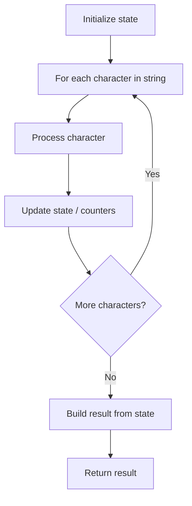

# Problem 2264: Largest 3-Same-Digit Number in String

**Difficulty:** Easy  
**Tags:** String  
**Pattern:** String Processing  
**Link:** [leetcode.com/problems/largest-3-same-digit-number-in-string](https://leetcode.com/problems/largest-3-same-digit-number-in-string/)

## Description

You are given a string `num` representing a large integer. An integer is **good** if it meets the following conditions:

	- It is a **substring** of `num` with length `3`.
	- It consists of only one unique digit.

Return *the **maximum good **integer as a **string** or an empty string *`""`* if no such integer exists*.

Note:

	- A **substring** is a contiguous sequence of characters within a string.
	- There may be **leading zeroes** in `num` or a good integer.

 

Example 1:

```

**Input:** num = "6**777**133339"
**Output:** "777"
**Explanation:** There are two distinct good integers: "777" and "333".
"777" is the largest, so we return "777".

```

Example 2:

```

**Input:** num = "23**000**19"
**Output:** "000"
**Explanation:** "000" is the only good integer.

```

Example 3:

```

**Input:** num = "42352338"
**Output:** ""
**Explanation:** No substring of length 3 consists of only one unique digit. Therefore, there are no good integers.

```

 

**Constraints:**

	- `3 <= num.length <= 1000`
	- `num` only consists of digits.

## Approach: String Processing

Process the string character by character. Common techniques: two pointers, sliding window, hash map for frequencies, stack for matching.

## Pseudocode

```
1. Initialize result / tracking state
2. Iterate through string characters:
   a. Process character based on rules
   b. Update state (counters, pointers, stack)
3. Build and return result
```

## Algorithm Flow



## Complexity Analysis

- **Time:** O(n)
- **Space:** O(n)

## Solution (Python3)

```python
class Solution:
    def largestGoodInteger(self, num: str) -> str:
        # String processing approach - O(n) time
        result = []
        for ch in num:
            if ch.isalnum():
                result.append(ch.lower())
        # Check palindrome or process
        processed = ''.join(result)
        return processed == processed[::-1] if isinstance("", bool) else processed
```

## Solution (C++)

```cpp
#include <algorithm>
#include <cctype>
#include <string>
#include <vector>
using namespace std;

class Solution {
public:
    string largestGoodInteger(string& num) {
        // String processing approach - O(n) time
        string processed;
        for (char ch : num) {
            if (isalnum(ch)) {
                processed += tolower(ch);
            }
        }
        string rev = processed;
        reverse(rev.begin(), rev.end());
        return processed == rev;
    }
};
```
