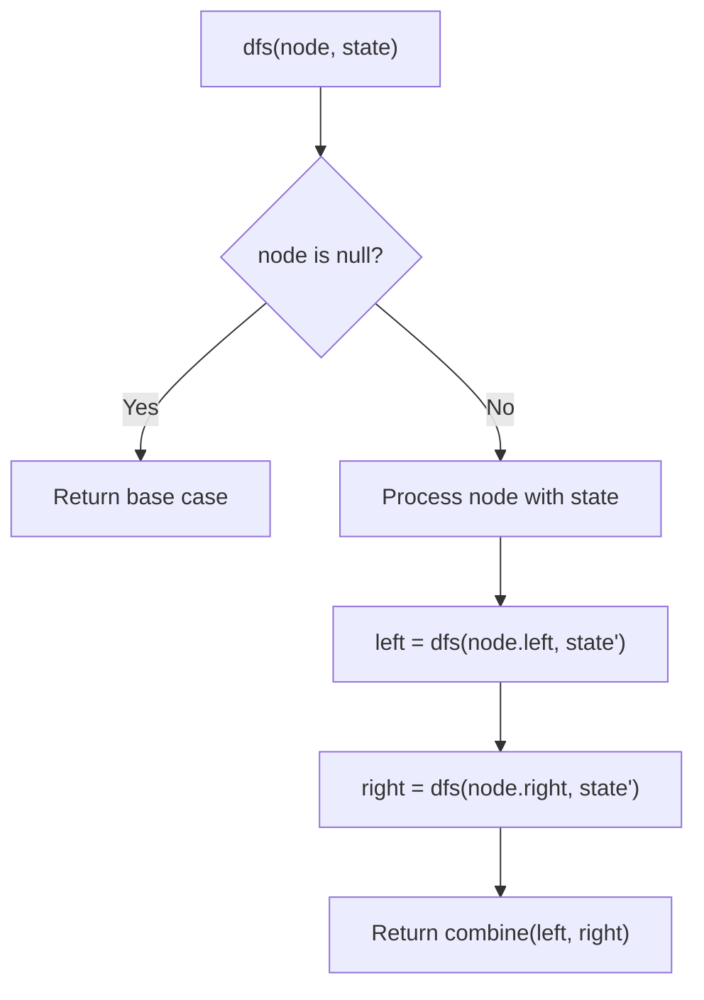
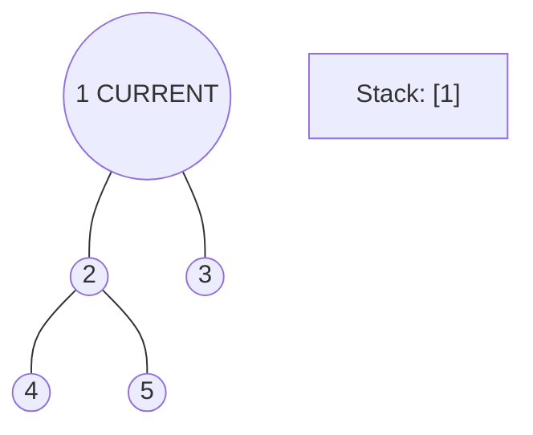
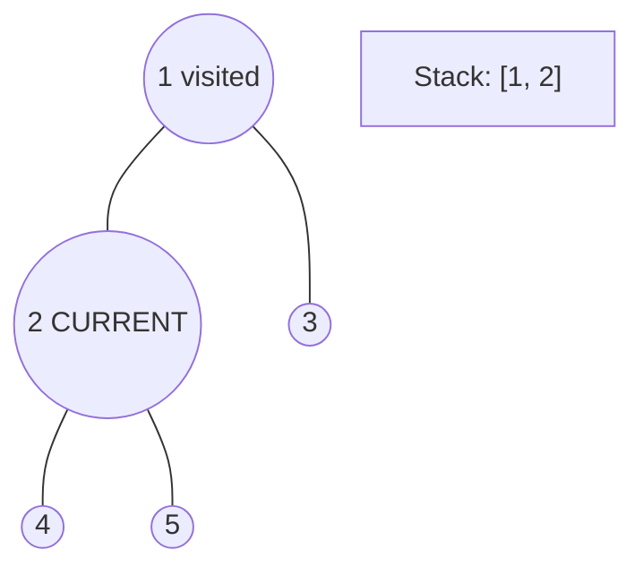
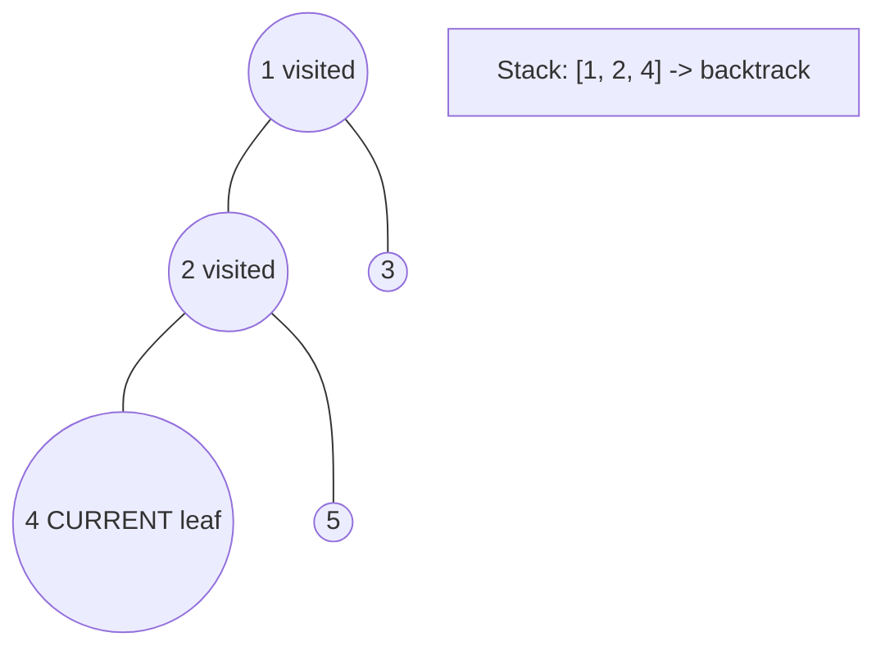
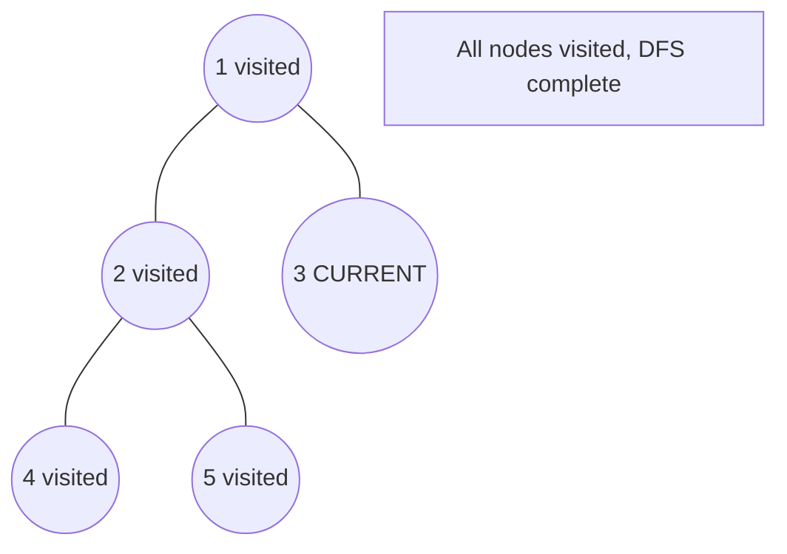

# Problem 2265: Count Nodes Equal to Average of Subtree

**Difficulty:** Medium  
**Tags:** Tree, Depth-First Search, Binary Tree  
**Pattern:** DFS Tree Traversal  
**Link:** [leetcode.com/problems/count-nodes-equal-to-average-of-subtree](https://leetcode.com/problems/count-nodes-equal-to-average-of-subtree/)

## Description

Given the `root` of a binary tree, return *the number of nodes where the value of the node is equal to the **average** of the values in its **subtree***.

**Note:**

	- The **average** of `n` elements is the **sum** of the `n` elements divided by `n` and **rounded down** to the nearest integer.
	- A **subtree** of `root` is a tree consisting of `root` and all of its descendants.

 

Example 1:

```

**Input:** root = [4,8,5,0,1,null,6]
**Output:** 5
**Explanation:** 
For the node with value 4: The average of its subtree is (4 + 8 + 5 + 0 + 1 + 6) / 6 = 24 / 6 = 4.
For the node with value 5: The average of its subtree is (5 + 6) / 2 = 11 / 2 = 5.
For the node with value 0: The average of its subtree is 0 / 1 = 0.
For the node with value 1: The average of its subtree is 1 / 1 = 1.
For the node with value 6: The average of its subtree is 6 / 1 = 6.

```

Example 2:

```

**Input:** root = [1]
**Output:** 1
**Explanation:** For the node with value 1: The average of its subtree is 1 / 1 = 1.

```

 

**Constraints:**

	- The number of nodes in the tree is in the range `[1, 1000]`.
	- `0 <= Node.val <= 1000`

## Approach: DFS Tree Traversal

Perform depth-first search on the tree. Recurse on left and right subtrees, combining results bottom-up. Track state (path, depth, sum) during traversal.

## Pseudocode

```
1. Define dfs(node, state):
   a. Base case: if null, return default
   b. Process node with current state
   c. left_result = dfs(node.left, updated_state)
   d. right_result = dfs(node.right, updated_state)
   e. Return combine(left_result, right_result)
2. Return dfs(root, initial_state)
```

## Algorithm Flow



## Visual State Transitions

**DFS Tree Traversal Step-by-Step:**

**Frame 1: Start at root**


**Frame 2: Go left - visit node 2**


**Frame 3: Go left - visit node 4 (leaf)**


**Frame 4: Backtrack, visit node 5, then node 3**



## Complexity Analysis

- **Time:** O(n)
- **Space:** O(h)

## Solution (Python3)

```python
class Solution:
    def averageOfSubtree(self, root: TreeNode) -> int:
        # DFS on binary tree - O(n) time, O(h) space
        def dfs(node):
            if not node:
                return 0
            left = dfs(node.left)
            right = dfs(node.right)
            return 1 + max(left, right)
        
        result = dfs(root)
        return result
```

## Solution (C++)

```cpp
#include <algorithm>
#include <functional>
#include <string>
#include <vector>
using namespace std;

class Solution {
public:
    int averageOfSubtree(TreeNode* root) {
        // DFS on binary tree - O(n) time, O(h) space
        function<int(TreeNode*)> dfs = [&](TreeNode* node) -> int {
            if (!node) return 0;
            int left = dfs(node->left);
            int right = dfs(node->right);
            return 1 + max(left, right);
        };
        return dfs(root);
    }
};
```
