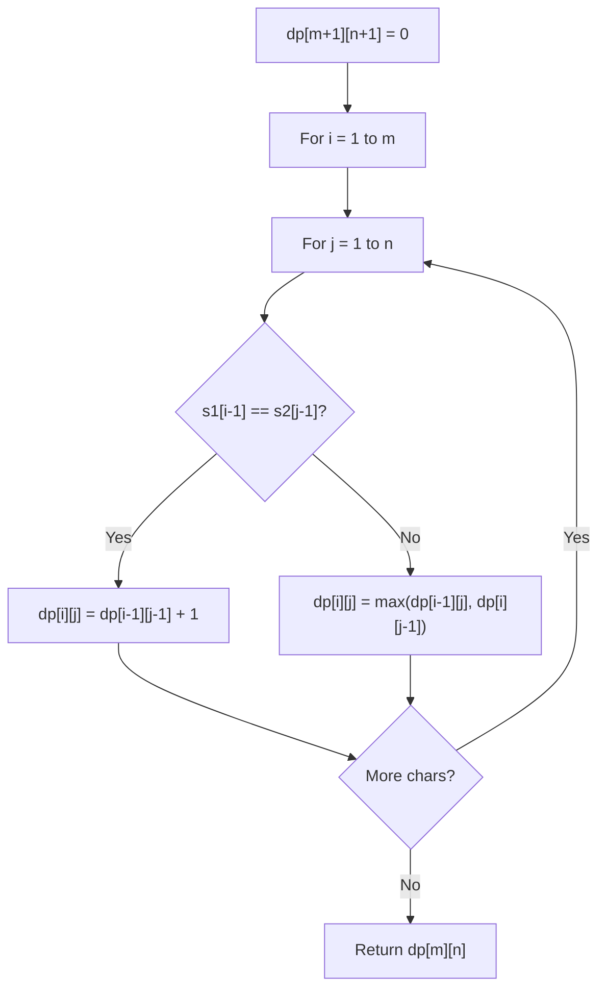

# Problem 2266: Count Number of Texts

**Difficulty:** Medium  
**Tags:** Hash Table, Math, String, Dynamic Programming  
**Pattern:** Dynamic Programming (String)  
**Link:** [leetcode.com/problems/count-number-of-texts](https://leetcode.com/problems/count-number-of-texts/)

## Description

Alice is texting Bob using her phone. The **mapping** of digits to letters is shown in the figure below.

In order to **add** a letter, Alice has to **press** the key of the corresponding digit `i` times, where `i` is the position of the letter in the key.

	- For example, to add the letter `'s'`, Alice has to press `'7'` four times. Similarly, to add the letter `'k'`, Alice has to press `'5'` twice.
	- Note that the digits `'0'` and `'1'` do not map to any letters, so Alice **does not** use them.

However, due to an error in transmission, Bob did not receive Alice's text message but received a **string of pressed keys** instead.

	- For example, when Alice sent the message `"bob"`, Bob received the string `"2266622"`.

Given a string `pressedKeys` representing the string received by Bob, return *the **total number of possible text messages** Alice could have sent*.

Since the answer may be very large, return it **modulo** `10^9 + 7`.

 

Example 1:

```

**Input:** pressedKeys = "22233"
**Output:** 8
**Explanation:**
The possible text messages Alice could have sent are:
"aaadd", "abdd", "badd", "cdd", "aaae", "abe", "bae", and "ce".
Since there are 8 possible messages, we return 8.

```

Example 2:

```

**Input:** pressedKeys = "222222222222222222222222222222222222"
**Output:** 82876089
**Explanation:**
There are 2082876103 possible text messages Alice could have sent.
Since we need to return the answer modulo 109 + 7, we return 2082876103 % (109 + 7) = 82876089.

```

 

**Constraints:**

	- `1 <= pressedKeys.length <= 10^5`
	- `pressedKeys` only consists of digits from `'2'` - `'9'`.

## Approach: Dynamic Programming (String)

Compare or match two strings using a 2D DP table. dp[i][j] represents the answer for substrings s1[0..i-1] and s2[0..j-1]. Common patterns: LCS, edit distance, regex matching.

## Pseudocode

```
1. Create dp[m+1][n+1]
2. Initialize base cases
3. For i from 1 to m:
   For j from 1 to n:
     If s1[i-1] == s2[j-1]: dp[i][j] = dp[i-1][j-1] + 1
     Else: dp[i][j] = best of (dp[i-1][j], dp[i][j-1], dp[i-1][j-1])
4. Return dp[m][n]
```

## Algorithm Flow



## Complexity Analysis

- **Time:** O(m * n)
- **Space:** O(m * n)

## Solution (Python3)

```python
class Solution:
    def countTexts(self, pressedKeys: str) -> int:
        # String DP - O(m*n) time and space
        m, n = len(pressedKeys), len(pressedKeys)
        dp = [[0] * (n + 1) for _ in range(m + 1)]
        for i in range(1, m + 1):
            for j in range(1, n + 1):
                if pressedKeys[i-1] == pressedKeys[j-1]:
                    dp[i][j] = dp[i-1][j-1] + 1
                else:
                    dp[i][j] = max(dp[i-1][j], dp[i][j-1])
        return dp[m][n]
```

## Solution (C++)

```cpp
#include <algorithm>
#include <string>
#include <vector>
using namespace std;

class Solution {
public:
    int countTexts(string& pressedKeys) {
        // String DP - O(m*n) time and space
        int m = pressedKeys.size(), n = pressedKeys.size();
        vector<vector<int>> dp(m + 1, vector<int>(n + 1, 0));
        for (int i = 1; i <= m; i++) {
            for (int j = 1; j <= n; j++) {
                if (pressedKeys[i-1] == pressedKeys[j-1])
                    dp[i][j] = dp[i-1][j-1] + 1;
                else
                    dp[i][j] = max(dp[i-1][j], dp[i][j-1]);
            }
        }
        return dp[m][n];
    }
};
```
