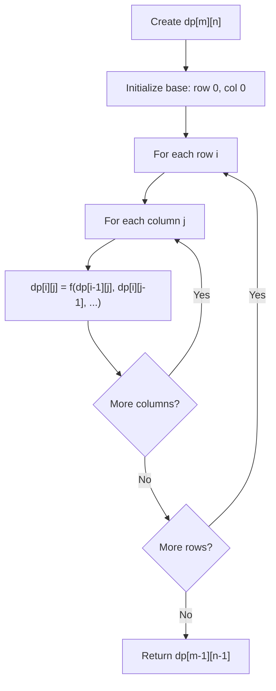
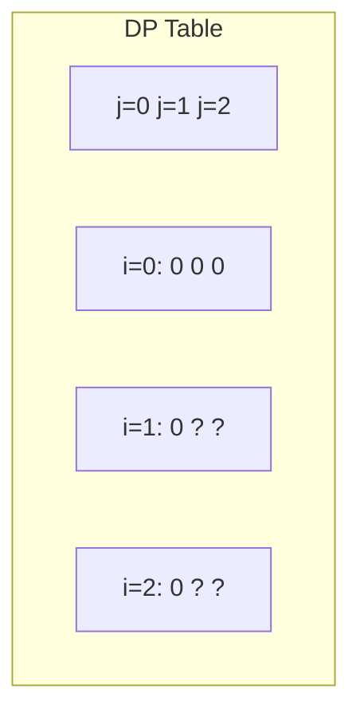
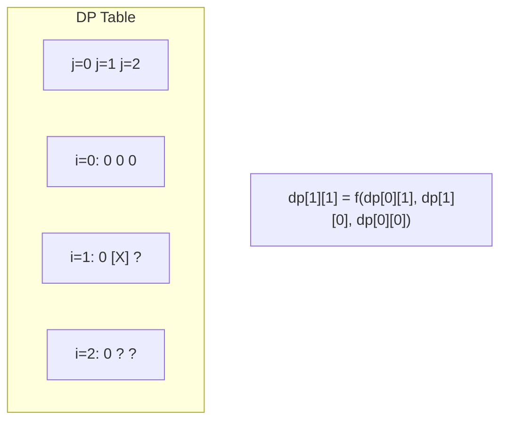
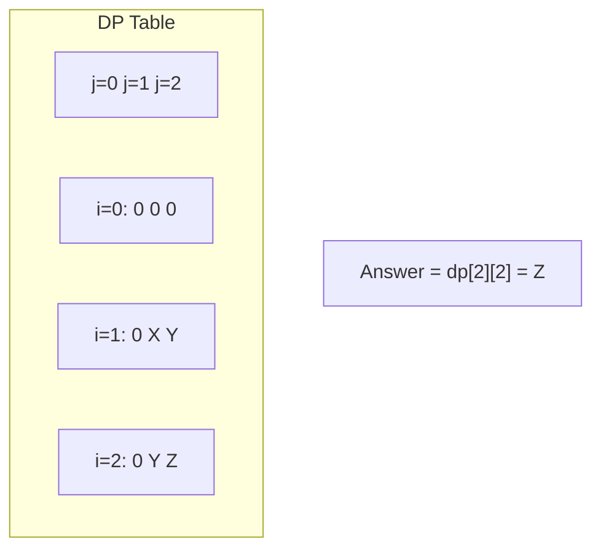

# Problem 2267:  Check if There Is a Valid Parentheses String Path

**Difficulty:** Hard  
**Tags:** Array, Dynamic Programming, Matrix  
**Pattern:** Dynamic Programming (2D Grid/Matrix)  
**Link:** [leetcode.com/problems/check-if-there-is-a-valid-parentheses-string-path](https://leetcode.com/problems/check-if-there-is-a-valid-parentheses-string-path/)

## Description

A parentheses string is a **non-empty** string consisting only of `'('` and `')'`. It is **valid** if **any** of the following conditions is **true**:

	- It is `()`.
	- It can be written as `AB` (`A` concatenated with `B`), where `A` and `B` are valid parentheses strings.
	- It can be written as `(A)`, where `A` is a valid parentheses string.

You are given an `m x n` matrix of parentheses `grid`. A **valid parentheses string path** in the grid is a path satisfying **all** of the following conditions:

	- The path starts from the upper left cell `(0, 0)`.
	- The path ends at the bottom-right cell `(m - 1, n - 1)`.
	- The path only ever moves **down** or **right**.
	- The resulting parentheses string formed by the path is **valid**.

Return `true` *if there exists a **valid parentheses string path** in the grid.* Otherwise, return `false`.

 

Example 1:

```

**Input:** grid = [["(","(","("],[")","(",")"],["(","(",")"],["(","(",")"]]
**Output:** true
**Explanation:** The above diagram shows two possible paths that form valid parentheses strings.
The first path shown results in the valid parentheses string "()(())".
The second path shown results in the valid parentheses string "((()))".
Note that there may be other valid parentheses string paths.

```

Example 2:

```

**Input:** grid = [[")",")"],["(","("]]
**Output:** false
**Explanation:** The two possible paths form the parentheses strings "))(" and ")((". Since neither of them are valid parentheses strings, we return false.

```

 

**Constraints:**

	- `m == grid.length`
	- `n == grid[i].length`
	- `1 <= m, n <= 100`
	- `grid[i][j]` is either `'('` or `')'`.

## Approach: Dynamic Programming (2D Grid/Matrix)

Use a 2D DP table where dp[i][j] represents the optimal value for the subproblem defined by rows 0..i and columns 0..j. Fill row by row or column by column.

## Pseudocode

```
1. Create dp[m][n] table
2. Initialize base cases (first row, first column)
3. For i from 1 to m-1:
   For j from 1 to n-1:
     dp[i][j] = recurrence(dp[i-1][j], dp[i][j-1], dp[i-1][j-1])
4. Return dp[m-1][n-1]
```

## Algorithm Flow



## Visual State Transitions

**2D DP Table Build:**

**Frame 1: Initialize borders**


**Frame 2: Fill cell by cell**


**Frame 3: Table complete**



## Complexity Analysis

- **Time:** O(m * n)
- **Space:** O(m * n)

## Solution (Python3)

```python
class Solution:
    def hasValidPath(self, grid: List[List[str]]) -> bool:
        # Dynamic programming (2D) - O(m*n) time and space
        if not grid:
            return 0
        m, n = len(grid), len(grid[0])
        dp = [[0] * (n + 1) for _ in range(m + 1)]
        for i in range(1, m + 1):
            for j in range(1, n + 1):
                dp[i][j] = max(dp[i-1][j], dp[i][j-1])
                # Add problem-specific transition
        return dp[m][n]
```

## Solution (C++)

```cpp
#include <algorithm>
#include <string>
#include <vector>
using namespace std;

class Solution {
public:
    bool hasValidPath(vector<vector<string>>& grid) {
        // Dynamic programming (2D) - O(m*n) time and space
        if (grid.empty()) return 0;
        int m = grid.size(), n = grid[0].size();
        vector<vector<int>> dp(m + 1, vector<int>(n + 1, 0));
        for (int i = 1; i <= m; i++) {
            for (int j = 1; j <= n; j++) {
                dp[i][j] = max(dp[i-1][j], dp[i][j-1]);
            }
        }
        return dp[m][n];
    }
};
```
