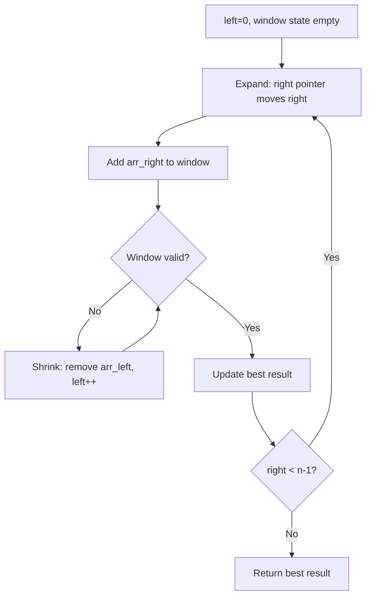
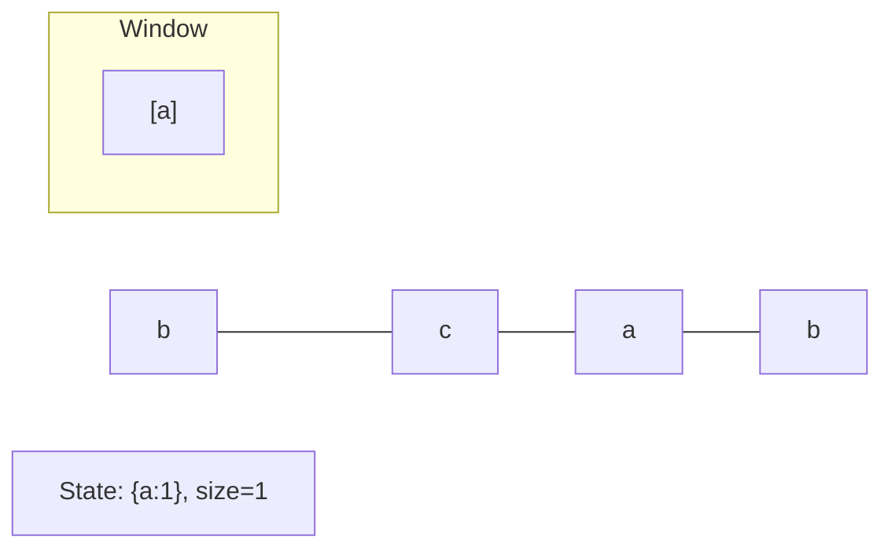
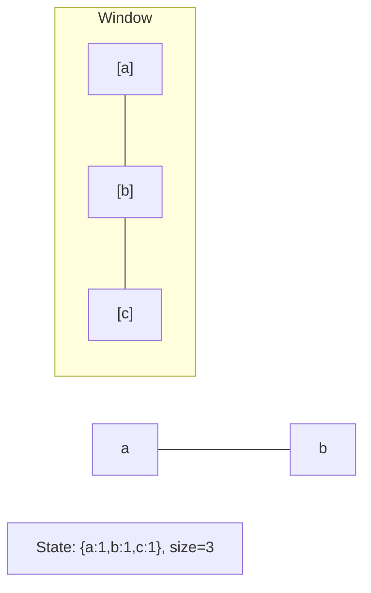
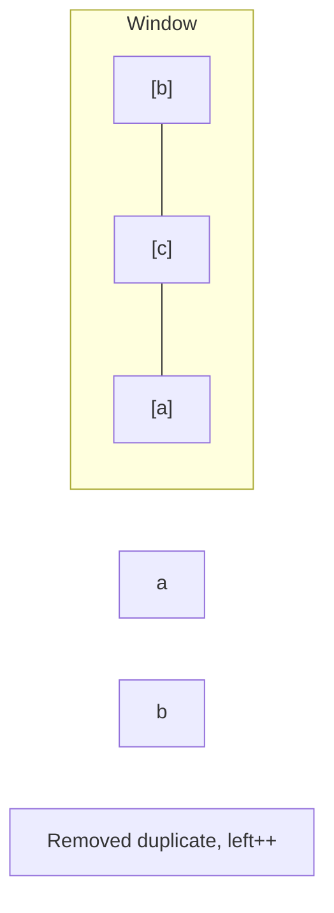
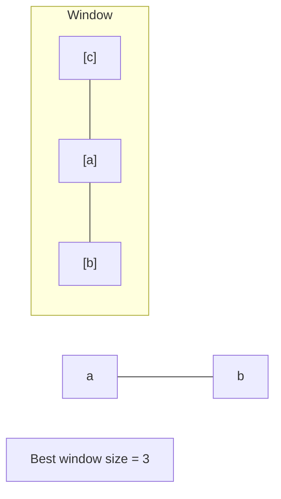

# Problem 2269: Find the K-Beauty of a Number

**Difficulty:** Easy  
**Tags:** Math, String, Sliding Window  
**Pattern:** Sliding Window  
**Link:** [leetcode.com/problems/find-the-k-beauty-of-a-number](https://leetcode.com/problems/find-the-k-beauty-of-a-number/)

## Description

The **k-beauty** of an integer `num` is defined as the number of **substrings** of `num` when it is read as a string that meet the following conditions:

	- It has a length of `k`.
	- It is a divisor of `num`.

Given integers `num` and `k`, return *the k-beauty of *`num`.

Note:

	- **Leading zeros** are allowed.
	- `0` is not a divisor of any value.

A **substring** is a contiguous sequence of characters in a string.

 

Example 1:

```

**Input:** num = 240, k = 2
**Output:** 2
**Explanation:** The following are the substrings of num of length k:
- "24" from "**24**0": 24 is a divisor of 240.
- "40" from "2**40**": 40 is a divisor of 240.
Therefore, the k-beauty is 2.

```

Example 2:

```

**Input:** num = 430043, k = 2
**Output:** 2
**Explanation:** The following are the substrings of num of length k:
- "43" from "**43**0043": 43 is a divisor of 430043.
- "30" from "4**30**043": 30 is not a divisor of 430043.
- "00" from "43**00**43": 0 is not a divisor of 430043.
- "04" from "430**04**3": 4 is not a divisor of 430043.
- "43" from "4300**43**": 43 is a divisor of 430043.
Therefore, the k-beauty is 2.

```

 

**Constraints:**

	- `1 <= num <= 10^9`
	- `1 <= k <= num.length` (taking `num` as a string)

## Approach: Sliding Window

Maintain a window over the data using two pointers. Expand the right boundary to include new elements, and shrink the left boundary when the window constraint is violated. Track the optimal window.

## Pseudocode

```
1. Initialize left = 0, result = initial_value
2. For right in range(n):
   a. Add element at right to window state
   b. While window is invalid:
      - Remove element at left from window state
      - left++
   c. Update result = best of (result, window size/value)
3. Return result
```

## Algorithm Flow



## Visual State Transitions

**Sliding Window Step-by-Step:**

**Frame 1: Initial window (left=0, right=0)**


**Frame 2: Expand right (right=2)**


**Frame 3: Violation - shrink left**


**Frame 4: Continue expanding**



## Complexity Analysis

- **Time:** O(n)
- **Space:** O(k)

## Solution (Python3)

```python
class Solution:
    def divisorSubstrings(self, num: int, k: int) -> int:
        # Sliding window approach - O(n) time, O(k) space
        from collections import defaultdict
        window = defaultdict(int)
        left = 0
        result = 0
        for right in range(len(num)):
            window[num[right]] += 1
            while len(window) > (k if isinstance(k, int) else len(num)):
                window[num[left]] -= 1
                if window[num[left]] == 0:
                    del window[num[left]]
                left += 1
            result = max(result, right - left + 1)
        return result
```

## Solution (C++)

```cpp
#include <algorithm>
#include <string>
#include <unordered_map>
#include <vector>
using namespace std;

class Solution {
public:
    int divisorSubstrings(int num, int k) {
        // Sliding window approach - O(n) time, O(k) space
        unordered_map<char, int> window;
        int left = 0, result = 0;
        for (int right = 0; right < num.size(); right++) {
            window[num[right]]++;
            while ((int)window.size() > k) {
                window[num[left]]--;
                if (window[num[left]] == 0)
                    window.erase(num[left]);
                left++;
            }
            result = max(result, right - left + 1);
        }
        return result;
    }
};
```
