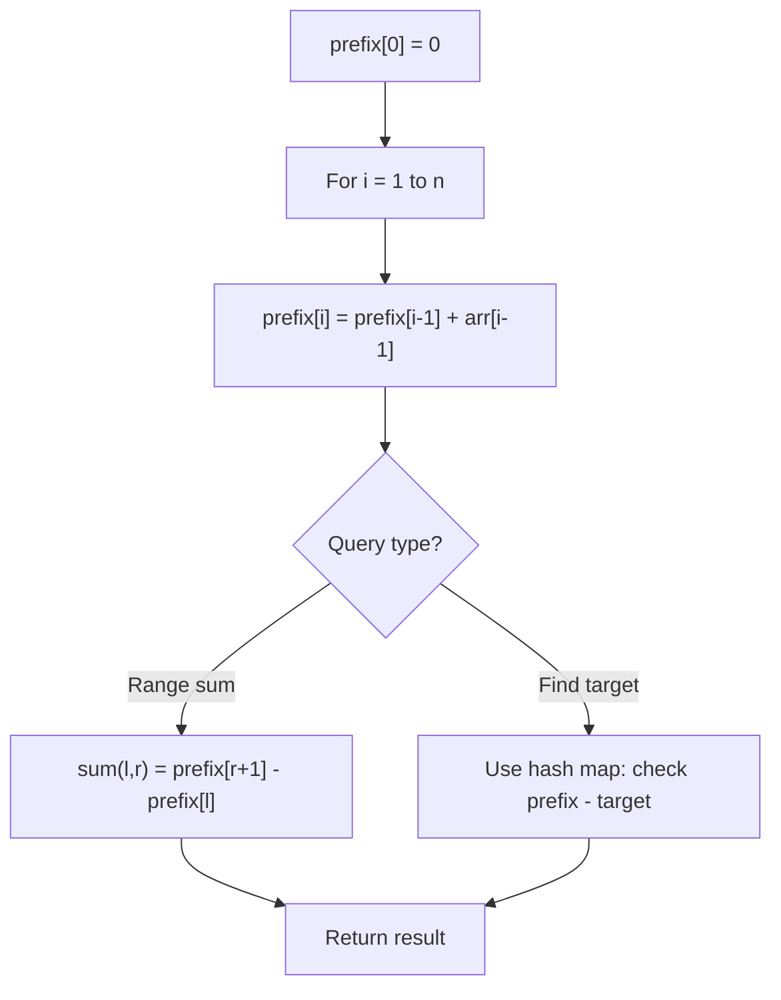

# Problem 2270: Number of Ways to Split Array

**Difficulty:** Medium  
**Tags:** Array, Prefix Sum  
**Pattern:** Prefix Sum  
**Link:** [leetcode.com/problems/number-of-ways-to-split-array](https://leetcode.com/problems/number-of-ways-to-split-array/)

## Description

You are given a **0-indexed** integer array `nums` of length `n`.

`nums` contains a **valid split** at index `i` if the following are true:

	- The sum of the first `i + 1` elements is **greater than or equal to** the sum of the last `n - i - 1` elements.
	- There is **at least one** element to the right of `i`. That is, `0 <= i < n - 1`.

Return *the number of **valid splits** in* `nums`.

 

Example 1:

```

**Input:** nums = [10,4,-8,7]
**Output:** 2
**Explanation:** 
There are three ways of splitting nums into two non-empty parts:
- Split nums at index 0. Then, the first part is [10], and its sum is 10. The second part is [4,-8,7], and its sum is 3. Since 10 >= 3, i = 0 is a valid split.
- Split nums at index 1. Then, the first part is [10,4], and its sum is 14. The second part is [-8,7], and its sum is -1. Since 14 >= -1, i = 1 is a valid split.
- Split nums at index 2. Then, the first part is [10,4,-8], and its sum is 6. The second part is [7], and its sum is 7. Since 6 < 7, i = 2 is not a valid split.
Thus, the number of valid splits in nums is 2.

```

Example 2:

```

**Input:** nums = [2,3,1,0]
**Output:** 2
**Explanation:** 
There are two valid splits in nums:
- Split nums at index 1. Then, the first part is [2,3], and its sum is 5. The second part is [1,0], and its sum is 1. Since 5 >= 1, i = 1 is a valid split. 
- Split nums at index 2. Then, the first part is [2,3,1], and its sum is 6. The second part is [0], and its sum is 0. Since 6 >= 0, i = 2 is a valid split.

```

 

**Constraints:**

	- `2 <= nums.length <= 10^5`
	- `-10^5 <= nums[i] <= 10^5`

## Approach: Prefix Sum

Build a prefix sum array where prefix[i] = sum of elements 0..i-1. Any subarray sum [l..r] = prefix[r+1] - prefix[l]. Combine with hash map for O(n) subarray sum queries.

## Pseudocode

```
1. Build prefix sum array: prefix[0]=0, prefix[i]=prefix[i-1]+arr[i-1]
2. Use prefix sums to answer queries:
   - Subarray sum [l..r] = prefix[r+1] - prefix[l]
   - Or use hash map to find prefix[j]-prefix[i] == target
3. Return result
```

## Algorithm Flow



## Complexity Analysis

- **Time:** O(n)
- **Space:** O(n)

## Solution (Python3)

```python
class Solution:
    def waysToSplitArray(self, nums: List[int]) -> int:
        # Prefix sum approach - O(n) time, O(n) space
        prefix = {0: -1}
        curr_sum = 0
        result = 0
        target = nums if isinstance(nums, int) else 0
        for i, val in enumerate(nums):
            curr_sum += val
            if curr_sum - target in prefix:
                result = max(result, i - prefix[curr_sum - target])
            if curr_sum not in prefix:
                prefix[curr_sum] = i
        return result
```

## Solution (C++)

```cpp
#include <algorithm>
#include <string>
#include <unordered_map>
#include <vector>
using namespace std;

class Solution {
public:
    int waysToSplitArray(vector<int>& nums) {
        // Prefix sum approach - O(n) time, O(n) space
        unordered_map<int, int> prefix;
        prefix[0] = -1;
        int curr_sum = 0, result = 0;
        int target = nums;
        for (int i = 0; i < (int)nums.size(); i++) {
            curr_sum += nums[i];
            if (prefix.count(curr_sum - target)) {
                result = max(result, i - prefix[curr_sum - target]);
            }
            if (!prefix.count(curr_sum)) {
                prefix[curr_sum] = i;
            }
        }
        return result;
    }
};
```
