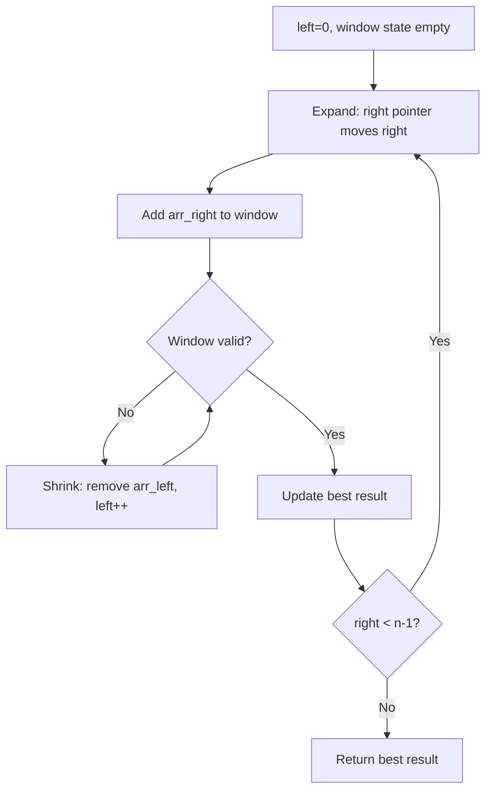
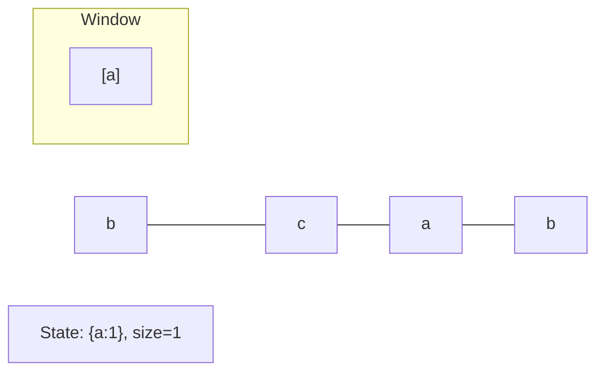
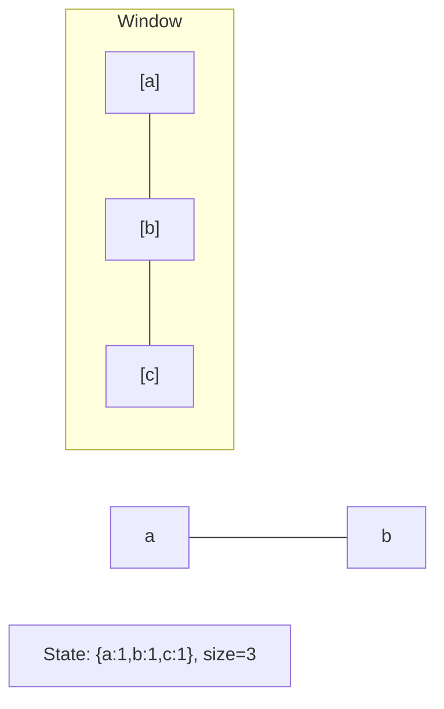
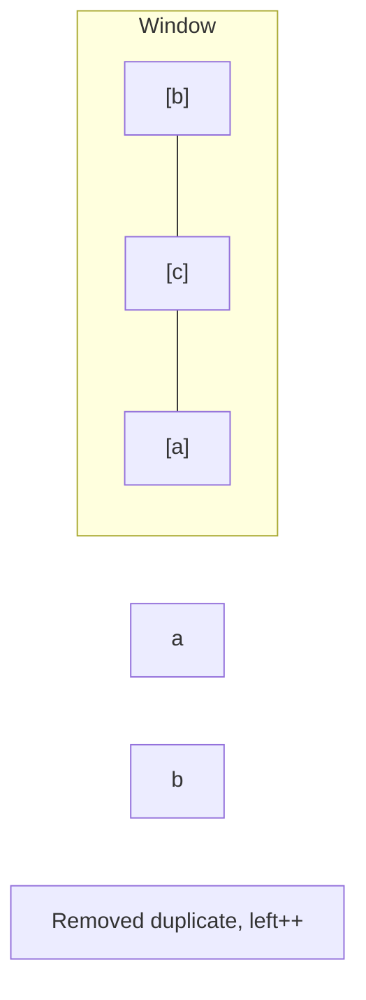
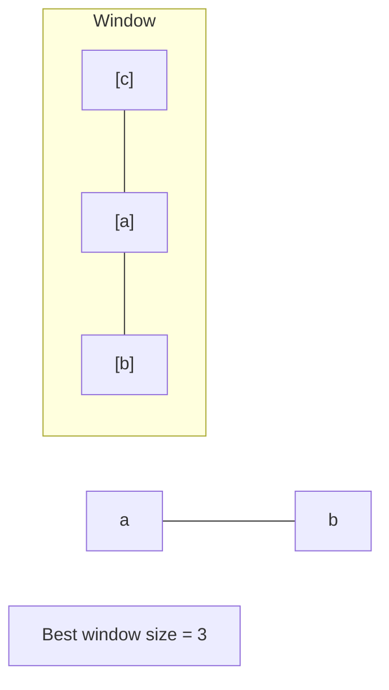

# Problem 2271: Maximum White Tiles Covered by a Carpet

**Difficulty:** Medium  
**Tags:** Array, Binary Search, Greedy, Sliding Window, Sorting, Prefix Sum  
**Pattern:** Sliding Window  
**Link:** [leetcode.com/problems/maximum-white-tiles-covered-by-a-carpet](https://leetcode.com/problems/maximum-white-tiles-covered-by-a-carpet/)

## Description

You are given a 2D integer array `tiles` where `tiles[i] = [li, ri]` represents that every tile `j` in the range `li <= j <= ri` is colored white.

You are also given an integer `carpetLen`, the length of a single carpet that can be placed **anywhere**.

Return *the **maximum** number of white tiles that can be covered by the carpet*.

 

Example 1:

```

**Input:** tiles = [[1,5],[10,11],[12,18],[20,25],[30,32]], carpetLen = 10
**Output:** 9
**Explanation:** Place the carpet starting on tile 10. 
It covers 9 white tiles, so we return 9.
Note that there may be other places where the carpet covers 9 white tiles.
It can be shown that the carpet cannot cover more than 9 white tiles.

```

Example 2:

```

**Input:** tiles = [[10,11],[1,1]], carpetLen = 2
**Output:** 2
**Explanation:** Place the carpet starting on tile 10. 
It covers 2 white tiles, so we return 2.

```

 

**Constraints:**

	- `1 <= tiles.length <= 5 * 10^4`
	- `tiles[i].length == 2`
	- `1 <= li <= ri <= 10^9`
	- `1 <= carpetLen <= 10^9`
	- The `tiles` are **non-overlapping**.

## Approach: Sliding Window

Maintain a window over the data using two pointers. Expand the right boundary to include new elements, and shrink the left boundary when the window constraint is violated. Track the optimal window.

## Pseudocode

```
1. Initialize left = 0, result = initial_value
2. For right in range(n):
   a. Add element at right to window state
   b. While window is invalid:
      - Remove element at left from window state
      - left++
   c. Update result = best of (result, window size/value)
3. Return result
```

## Algorithm Flow



## Visual State Transitions

**Sliding Window Step-by-Step:**

**Frame 1: Initial window (left=0, right=0)**


**Frame 2: Expand right (right=2)**


**Frame 3: Violation - shrink left**


**Frame 4: Continue expanding**



## Complexity Analysis

- **Time:** O(n)
- **Space:** O(k)

## Solution (Python3)

```python
class Solution:
    def maximumWhiteTiles(self, tiles: List[List[int]], carpetLen: int) -> int:
        # Sliding window approach - O(n) time, O(k) space
        from collections import defaultdict
        window = defaultdict(int)
        left = 0
        result = 0
        for right in range(len(tiles)):
            window[tiles[right]] += 1
            while len(window) > (carpetLen if isinstance(carpetLen, int) else len(tiles)):
                window[tiles[left]] -= 1
                if window[tiles[left]] == 0:
                    del window[tiles[left]]
                left += 1
            result = max(result, right - left + 1)
        return result
```

## Solution (C++)

```cpp
#include <algorithm>
#include <string>
#include <unordered_map>
#include <vector>
using namespace std;

class Solution {
public:
    int maximumWhiteTiles(vector<vector<int>>& tiles, int carpetLen) {
        // Sliding window approach - O(n) time, O(k) space
        unordered_map<char, int> window;
        int left = 0, result = 0;
        for (int right = 0; right < tiles.size(); right++) {
            window[tiles[right]]++;
            while ((int)window.size() > carpetLen) {
                window[tiles[left]]--;
                if (window[tiles[left]] == 0)
                    window.erase(tiles[left]);
                left++;
            }
            result = max(result, right - left + 1);
        }
        return result;
    }
};
```
