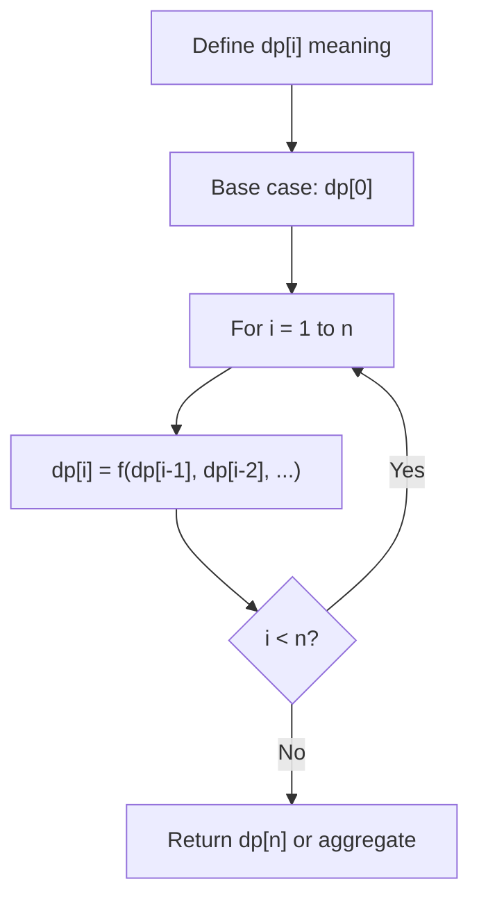
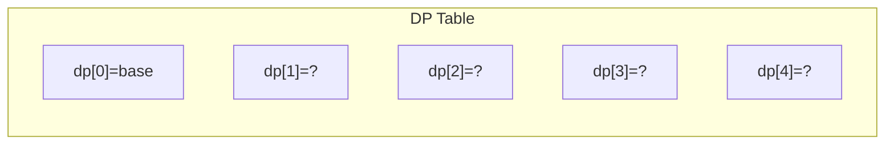
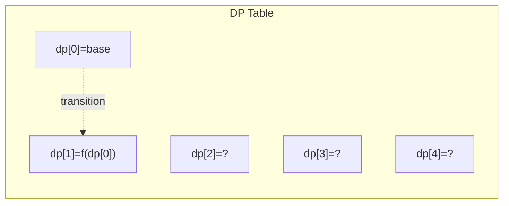
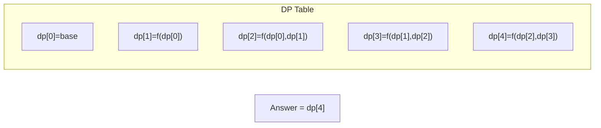

# Problem 2272: Substring With Largest Variance

**Difficulty:** Hard  
**Tags:** Array, Dynamic Programming  
**Pattern:** Dynamic Programming (1D)  
**Link:** [leetcode.com/problems/substring-with-largest-variance](https://leetcode.com/problems/substring-with-largest-variance/)

## Description

The **variance** of a string is defined as the largest difference between the number of occurrences of **any** `2` characters present in the string. Note the two characters may or may not be the same.

Given a string `s` consisting of lowercase English letters only, return *the **largest variance** possible among all **substrings** of* `s`.

A **substring** is a contiguous sequence of characters within a string.

 

Example 1:

```

**Input:** s = "aababbb"
**Output:** 3
**Explanation:**
All possible variances along with their respective substrings are listed below:
- Variance 0 for substrings "a", "aa", "ab", "abab", "aababb", "ba", "b", "bb", and "bbb".
- Variance 1 for substrings "aab", "aba", "abb", "aabab", "ababb", "aababbb", and "bab".
- Variance 2 for substrings "aaba", "ababbb", "abbb", and "babb".
- Variance 3 for substring "babbb".
Since the largest possible variance is 3, we return it.

```

Example 2:

```

**Input:** s = "abcde"
**Output:** 0
**Explanation:**
No letter occurs more than once in s, so the variance of every substring is 0.

```

 

**Constraints:**

	- `1 <= s.length <= 10^4`
	- `s` consists of lowercase English letters.

## Approach: Dynamic Programming (1D)

Break the problem into overlapping subproblems. Define dp[i] as the optimal value for the subproblem ending at or considering index i. Build the solution bottom-up, using previously computed dp values.

## Pseudocode

```
1. Define dp[i] = optimal value for subproblem i
2. Base case: dp[0] = initial value
3. For i from 1 to n:
   a. dp[i] = recurrence(dp[i-1], dp[i-2], ...)
4. Return dp[n] or max/min of dp
```

## Algorithm Flow



## Visual State Transitions

**1D Dynamic Programming Table Build:**

**Frame 1: Initialize base cases**


**Frame 2: Fill dp[1] from dp[0]**


**Frame 3: Fill remaining cells**



## Complexity Analysis

- **Time:** O(n)
- **Space:** O(n)

## Solution (Python3)

```python
class Solution:
    def largestVariance(self, s: str) -> int:
        # Dynamic programming (1D) - O(n) time, O(n) space
        if not s:
            return 0
        n = len(s) if isinstance(s, list) else s
        dp = [0] * (n + 1)
        dp[0] = 1  # base case
        for i in range(1, n + 1):
            dp[i] = dp[i-1]  # transition (customize per problem)
            if i >= 2:
                dp[i] += dp[i-2]
        return dp[n]
```

## Solution (C++)

```cpp
#include <string>
#include <vector>
using namespace std;

class Solution {
public:
    int largestVariance(string& s) {
        // Dynamic programming (1D) - O(n) time, O(n) space
        int n = s;
        if (n <= 0) return 0;
        vector<int> dp(n + 1, 0);
        dp[0] = 1;
        for (int i = 1; i <= n; i++) {
            dp[i] = dp[i-1];
            if (i >= 2) dp[i] += dp[i-2];
        }
        return dp[n];
    }
};
```
