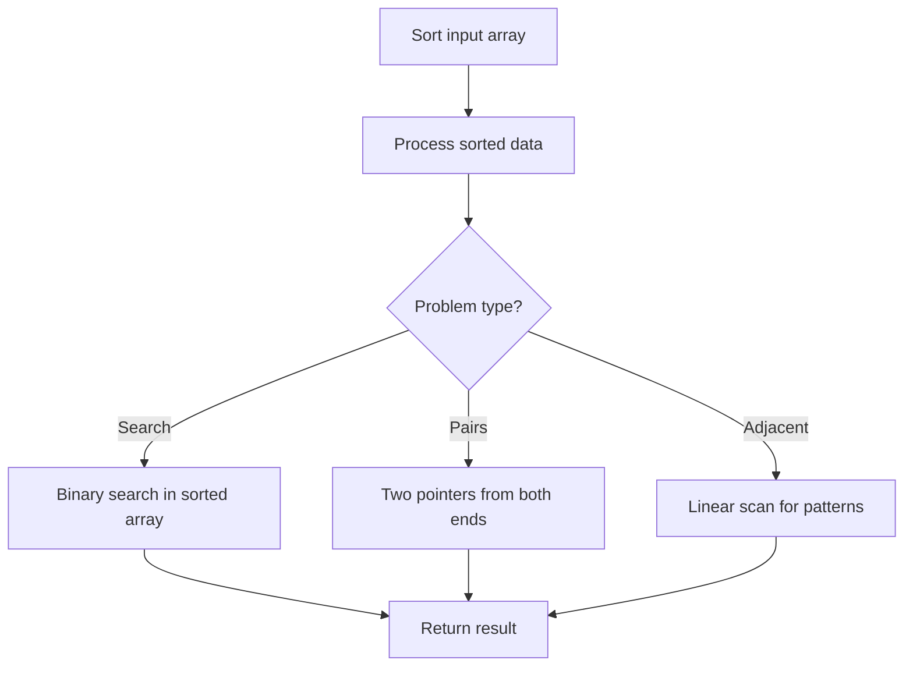

# Problem 2273: Find Resultant Array After Removing Anagrams

**Difficulty:** Easy  
**Tags:** Array, Hash Table, String, Sorting  
**Pattern:** Sorting  
**Link:** [leetcode.com/problems/find-resultant-array-after-removing-anagrams](https://leetcode.com/problems/find-resultant-array-after-removing-anagrams/)

## Description

You are given a **0-indexed** string array `words`, where `words[i]` consists of lowercase English letters.

In one operation, select any index `i` such that `0 < i < words.length` and `words[i - 1]` and `words[i]` are **anagrams**, and **delete** `words[i]` from `words`. Keep performing this operation as long as you can select an index that satisfies the conditions.

Return `words` *after performing all operations*. It can be shown that selecting the indices for each operation in **any** arbitrary order will lead to the same result.

An **Anagram** is a word or phrase formed by rearranging the letters of a different word or phrase using all the original letters exactly once. For example, `"dacb"` is an anagram of `"abdc"`.

 

Example 1:

```

**Input:** words = ["abba","baba","bbaa","cd","cd"]
**Output:** ["abba","cd"]
**Explanation:**
One of the ways we can obtain the resultant array is by using the following operations:
- Since words[2] = "bbaa" and words[1] = "baba" are anagrams, we choose index 2 and delete words[2].
  Now words = ["abba","baba","cd","cd"].
- Since words[1] = "baba" and words[0] = "abba" are anagrams, we choose index 1 and delete words[1].
  Now words = ["abba","cd","cd"].
- Since words[2] = "cd" and words[1] = "cd" are anagrams, we choose index 2 and delete words[2].
  Now words = ["abba","cd"].
We can no longer perform any operations, so ["abba","cd"] is the final answer.
```

Example 2:

```

**Input:** words = ["a","b","c","d","e"]
**Output:** ["a","b","c","d","e"]
**Explanation:**
No two adjacent strings in words are anagrams of each other, so no operations are performed.
```

 

**Constraints:**

	- `1 <= words.length <= 100`
	- `1 <= words[i].length <= 10`
	- `words[i]` consists of lowercase English letters.

## Approach: Sorting

Sort the data to enable efficient processing. After sorting, use techniques like binary search, two pointers, or linear scan to solve the problem.

## Pseudocode

```
1. Sort the input array
2. Process sorted data:
   - Use binary search for lookups
   - Use two pointers for pair finding
   - Scan for adjacent patterns
3. Return result
```

## Algorithm Flow



## Complexity Analysis

- **Time:** O(n log n)
- **Space:** O(n)

## Solution (Python3)

```python
class Solution:
    def removeAnagrams(self, words: List[str]) -> List[str]:
        # Sort-based approach - O(n log n) time
        words.sort(key=lambda x: x[0] if isinstance(x, (list, tuple)) else x)
        result = [words[0]]
        for i in range(1, len(words)):
            curr = words[i]
            if isinstance(curr, (list, tuple)) and isinstance(result[-1], (list, tuple)):
                if curr[0] <= result[-1][1]:
                    result[-1] = [result[-1][0], max(result[-1][1], curr[1])]
                else:
                    result.append(curr)
            else:
                result.append(curr)
        return result
```

## Solution (C++)

```cpp
#include <algorithm>
#include <string>
#include <vector>
using namespace std;

class Solution {
public:
    vector<string> removeAnagrams(vector<string>& words) {
        // Sort-based approach - O(n log n) time
        sort(words.begin(), words.end());
        vector<vector<int>> result;
        result.push_back(words[0]);
        for (int i = 1; i < (int)words.size(); i++) {
            if (words[i][0] <= result.back()[1]) {
                result.back()[1] = max(result.back()[1], words[i][1]);
            } else {
                result.push_back(words[i]);
            }
        }
        return result;
    }
};
```
