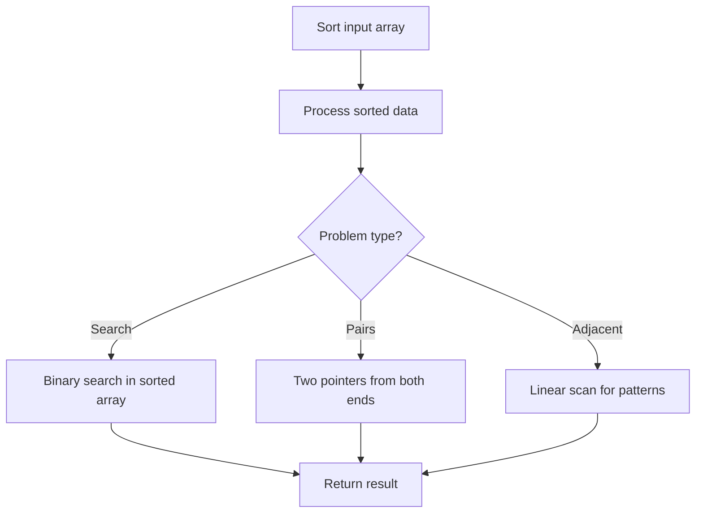

# Problem 2274: Maximum Consecutive Floors Without Special Floors

**Difficulty:** Medium  
**Tags:** Array, Sorting  
**Pattern:** Sorting  
**Link:** [leetcode.com/problems/maximum-consecutive-floors-without-special-floors](https://leetcode.com/problems/maximum-consecutive-floors-without-special-floors/)

## Description

Alice manages a company and has rented some floors of a building as office space. Alice has decided some of these floors should be **special floors**, used for relaxation only.

You are given two integers `bottom` and `top`, which denote that Alice has rented all the floors from `bottom` to `top` (**inclusive**). You are also given the integer array `special`, where `special[i]` denotes a special floor that Alice has designated for relaxation.

Return *the **maximum** number of consecutive floors without a special floor*.

 

Example 1:

```

**Input:** bottom = 2, top = 9, special = [4,6]
**Output:** 3
**Explanation:** The following are the ranges (inclusive) of consecutive floors without a special floor:
- (2, 3) with a total amount of 2 floors.
- (5, 5) with a total amount of 1 floor.
- (7, 9) with a total amount of 3 floors.
Therefore, we return the maximum number which is 3 floors.

```

Example 2:

```

**Input:** bottom = 6, top = 8, special = [7,6,8]
**Output:** 0
**Explanation:** Every floor rented is a special floor, so we return 0.

```

 

**Constraints:**

	- `1 <= special.length <= 10^5`
	- `1 <= bottom <= special[i] <= top <= 10^9`
	- All the values of `special` are **unique**.

## Approach: Sorting

Sort the data to enable efficient processing. After sorting, use techniques like binary search, two pointers, or linear scan to solve the problem.

## Pseudocode

```
1. Sort the input array
2. Process sorted data:
   - Use binary search for lookups
   - Use two pointers for pair finding
   - Scan for adjacent patterns
3. Return result
```

## Algorithm Flow



## Complexity Analysis

- **Time:** O(n log n)
- **Space:** O(n)

## Solution (Python3)

```python
class Solution:
    def maxConsecutive(self, bottom: int, top: int, special: List[int]) -> int:
        # Sort-based approach - O(n log n) time
        bottom.sort(key=lambda x: x[0] if isinstance(x, (list, tuple)) else x)
        result = [bottom[0]]
        for i in range(1, len(bottom)):
            curr = bottom[i]
            if isinstance(curr, (list, tuple)) and isinstance(result[-1], (list, tuple)):
                if curr[0] <= result[-1][1]:
                    result[-1] = [result[-1][0], max(result[-1][1], curr[1])]
                else:
                    result.append(curr)
            else:
                result.append(curr)
        return result
```

## Solution (C++)

```cpp
#include <algorithm>
#include <string>
#include <vector>
using namespace std;

class Solution {
public:
    int maxConsecutive(int bottom, int top, vector<int>& special) {
        // Sort-based approach - O(n log n) time
        sort(bottom.begin(), bottom.end());
        vector<vector<int>> result;
        result.push_back(bottom[0]);
        for (int i = 1; i < (int)bottom.size(); i++) {
            if (bottom[i][0] <= result.back()[1]) {
                result.back()[1] = max(result.back()[1], bottom[i][1]);
            } else {
                result.push_back(bottom[i]);
            }
        }
        return result;
    }
};
```
