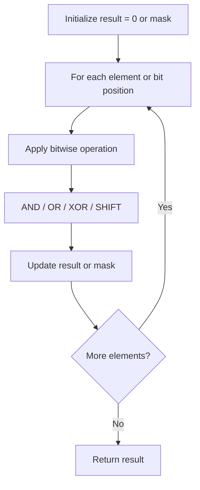

# Problem 2275: Largest Combination With Bitwise AND Greater Than Zero

**Difficulty:** Medium  
**Tags:** Array, Hash Table, Bit Manipulation, Counting  
**Pattern:** Bit Manipulation  
**Link:** [leetcode.com/problems/largest-combination-with-bitwise-and-greater-than-zero](https://leetcode.com/problems/largest-combination-with-bitwise-and-greater-than-zero/)

## Description

The **bitwise AND** of an array `nums` is the bitwise AND of all integers in `nums`.

	- For example, for `nums = [1, 5, 3]`, the bitwise AND is equal to `1 & 5 & 3 = 1`.
	- Also, for `nums = [7]`, the bitwise AND is `7`.

You are given an array of positive integers `candidates`. Compute the **bitwise AND** for all possible **combinations** of elements in the `candidates` array.

Return *the size of the **largest** combination of *`candidates`* with a bitwise AND **greater** than *`0`.

 

Example 1:

```

**Input:** candidates = [16,17,71,62,12,24,14]
**Output:** 4
**Explanation:** The combination [16,17,62,24] has a bitwise AND of 16 & 17 & 62 & 24 = 16 > 0.
The size of the combination is 4.
It can be shown that no combination with a size greater than 4 has a bitwise AND greater than 0.
Note that more than one combination may have the largest size.
For example, the combination [62,12,24,14] has a bitwise AND of 62 & 12 & 24 & 14 = 8 > 0.

```

Example 2:

```

**Input:** candidates = [8,8]
**Output:** 2
**Explanation:** The largest combination [8,8] has a bitwise AND of 8 & 8 = 8 > 0.
The size of the combination is 2, so we return 2.

```

 

**Constraints:**

	- `1 <= candidates.length <= 10^5`
	- `1 <= candidates[i] <= 10^7`

## Approach: Bit Manipulation

Operate on individual bits using bitwise operators (AND, OR, XOR, shift). Common tricks: x & (x-1) removes lowest set bit, x ^ x = 0, XOR all elements to find unique.

## Pseudocode

```
1. Apply bitwise operations:
   - XOR all elements to cancel paired bits
   - Use bitmask to track state
   - Shift and mask to extract/set individual bits
2. Return result
```

## Algorithm Flow



## Complexity Analysis

- **Time:** O(n) or O(log n)
- **Space:** O(1)

## Solution (Python3)

```python
class Solution:
    def largestCombination(self, candidates: List[int]) -> int:
        # Bit manipulation - O(n) time, O(1) space
        result = 0
        for val in candidates:
            result ^= val
        return result
```

## Solution (C++)

```cpp
#include <string>
#include <vector>
using namespace std;

class Solution {
public:
    int largestCombination(vector<int>& candidates) {
        // Bit manipulation - O(n) time, O(1) space
        int result = 0;
        for (int val : candidates) {
            result ^= val;
        }
        return result;
    }
};
```
