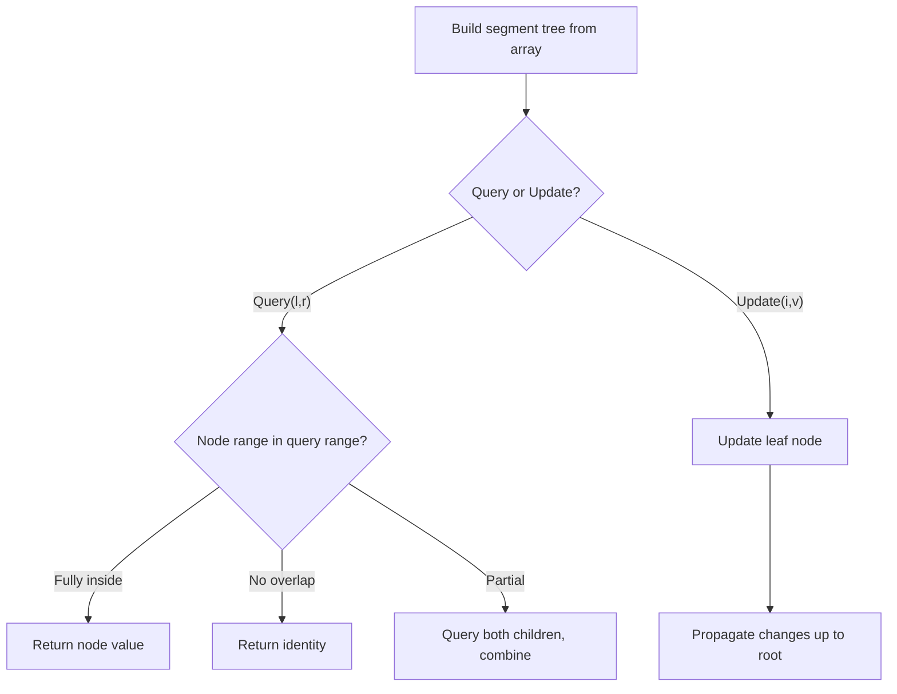

# Problem 2276: Count Integers in Intervals

**Difficulty:** Hard  
**Tags:** Design, Segment Tree, Ordered Set  
**Pattern:** Segment Tree  
**Link:** [leetcode.com/problems/count-integers-in-intervals](https://leetcode.com/problems/count-integers-in-intervals/)

## Description

Given an **empty** set of intervals, implement a data structure that can:

	- **Add** an interval to the set of intervals.
	- **Count** the number of integers that are present in **at least one** interval.

Implement the `CountIntervals` class:

	- `CountIntervals()` Initializes the object with an empty set of intervals.
	- `void add(int left, int right)` Adds the interval `[left, right]` to the set of intervals.
	- `int count()` Returns the number of integers that are present in **at least one** interval.

**Note** that an interval `[left, right]` denotes all the integers `x` where `left <= x <= right`.

 

Example 1:

```

**Input**
["CountIntervals", "add", "add", "count", "add", "count"]
[[], [2, 3], [7, 10], [], [5, 8], []]
**Output**
[null, null, null, 6, null, 8]

**Explanation**
CountIntervals countIntervals = new CountIntervals(); // initialize the object with an empty set of intervals. 
countIntervals.add(2, 3);  // add [2, 3] to the set of intervals.
countIntervals.add(7, 10); // add [7, 10] to the set of intervals.
countIntervals.count();    // return 6
                           // the integers 2 and 3 are present in the interval [2, 3].
                           // the integers 7, 8, 9, and 10 are present in the interval [7, 10].
countIntervals.add(5, 8);  // add [5, 8] to the set of intervals.
countIntervals.count();    // return 8
                           // the integers 2 and 3 are present in the interval [2, 3].
                           // the integers 5 and 6 are present in the interval [5, 8].
                           // the integers 7 and 8 are present in the intervals [5, 8] and [7, 10].
                           // the integers 9 and 10 are present in the interval [7, 10].

```

 

**Constraints:**

	- `1 <= left <= right <= 10^9`
	- At most `10^5` calls **in total** will be made to `add` and `count`.
	- At least **one** call will be made to `count`.

## Approach: Segment Tree

Build a segment tree for range queries (sum, min, max) with point or range updates. Each node covers a range; queries are answered by combining relevant segments.

## Pseudocode

```
1. Build segment tree from array (O(n))
2. Query(l, r):
   - If node range within [l,r]: return node value
   - If no overlap: return identity
   - Else: combine query(left_child) and query(right_child)
3. Update(i, val): update leaf and propagate up
```

## Algorithm Flow



## Complexity Analysis

- **Time:** O(n log n) build, O(log n) query/update
- **Space:** O(n)

## Solution (Python3)

```python
class CountIntervals:
    def __init__(self):
        # Initialize data structure
        pass

    def add(self, left: int, right: int) -> None:
        return None

    def count(self) -> int:
        return 0

```

## Solution (C++)

```cpp
#include <functional>
#include <string>
#include <vector>
using namespace std;

class CountIntervals {
public:
    CountIntervals() {
        // Initialize
    }

    void add(int left, int right) {
        return ;
    }

    int count() {
        return 0;
    }

};
```
