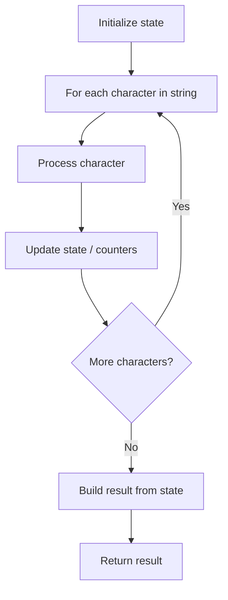

# Problem 2278: Percentage of Letter in String

**Difficulty:** Easy  
**Tags:** String  
**Pattern:** String Processing  
**Link:** [leetcode.com/problems/percentage-of-letter-in-string](https://leetcode.com/problems/percentage-of-letter-in-string/)

## Description

Given a string `s` and a character `letter`, return* the **percentage** of characters in *`s`* that equal *`letter`* **rounded down** to the nearest whole percent.*

 

Example 1:

```

**Input:** s = "foobar", letter = "o"
**Output:** 33
**Explanation:**
The percentage of characters in s that equal the letter 'o' is 2 / 6 * 100% = 33% when rounded down, so we return 33.

```

Example 2:

```

**Input:** s = "jjjj", letter = "k"
**Output:** 0
**Explanation:**
The percentage of characters in s that equal the letter 'k' is 0%, so we return 0.
```

 

**Constraints:**

	- `1 <= s.length <= 100`
	- `s` consists of lowercase English letters.
	- `letter` is a lowercase English letter.

## Approach: String Processing

Process the string character by character. Common techniques: two pointers, sliding window, hash map for frequencies, stack for matching.

## Pseudocode

```
1. Initialize result / tracking state
2. Iterate through string characters:
   a. Process character based on rules
   b. Update state (counters, pointers, stack)
3. Build and return result
```

## Algorithm Flow



## Complexity Analysis

- **Time:** O(n)
- **Space:** O(n)

## Solution (Python3)

```python
class Solution:
    def percentageLetter(self, s: str, letter: str) -> int:
        # String processing approach - O(n) time
        result = []
        for ch in s:
            if ch.isalnum():
                result.append(ch.lower())
        # Check palindrome or process
        processed = ''.join(result)
        return processed == processed[::-1] if isinstance(0, bool) else processed
```

## Solution (C++)

```cpp
#include <algorithm>
#include <cctype>
#include <string>
#include <vector>
using namespace std;

class Solution {
public:
    int percentageLetter(string& s, string& letter) {
        // String processing approach - O(n) time
        string processed;
        for (char ch : s) {
            if (isalnum(ch)) {
                processed += tolower(ch);
            }
        }
        string rev = processed;
        reverse(rev.begin(), rev.end());
        return processed == rev;
    }
};
```
