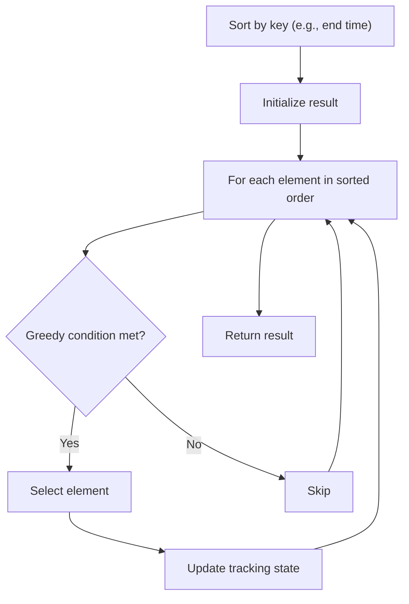

# Problem 2279: Maximum Bags With Full Capacity of Rocks

**Difficulty:** Medium  
**Tags:** Array, Greedy, Sorting  
**Pattern:** Greedy with Sorting  
**Link:** [leetcode.com/problems/maximum-bags-with-full-capacity-of-rocks](https://leetcode.com/problems/maximum-bags-with-full-capacity-of-rocks/)

## Description

You have `n` bags numbered from `0` to `n - 1`. You are given two **0-indexed** integer arrays `capacity` and `rocks`. The `i^th` bag can hold a maximum of `capacity[i]` rocks and currently contains `rocks[i]` rocks. You are also given an integer `additionalRocks`, the number of additional rocks you can place in **any** of the bags.

Return* the **maximum** number of bags that could have full capacity after placing the additional rocks in some bags.*

 

Example 1:

```

**Input:** capacity = [2,3,4,5], rocks = [1,2,4,4], additionalRocks = 2
**Output:** 3
**Explanation:**
Place 1 rock in bag 0 and 1 rock in bag 1.
The number of rocks in each bag are now [2,3,4,4].
Bags 0, 1, and 2 have full capacity.
There are 3 bags at full capacity, so we return 3.
It can be shown that it is not possible to have more than 3 bags at full capacity.
Note that there may be other ways of placing the rocks that result in an answer of 3.

```

Example 2:

```

**Input:** capacity = [10,2,2], rocks = [2,2,0], additionalRocks = 100
**Output:** 3
**Explanation:**
Place 8 rocks in bag 0 and 2 rocks in bag 2.
The number of rocks in each bag are now [10,2,2].
Bags 0, 1, and 2 have full capacity.
There are 3 bags at full capacity, so we return 3.
It can be shown that it is not possible to have more than 3 bags at full capacity.
Note that we did not use all of the additional rocks.

```

 

**Constraints:**

	- `n == capacity.length == rocks.length`
	- `1 <= n <= 5 * 10^4`
	- `1 <= capacity[i] <= 10^9`
	- `0 <= rocks[i] <= capacity[i]`
	- `1 <= additionalRocks <= 10^9`

## Approach: Greedy with Sorting

Sort the input by a key criterion, then greedily process elements in sorted order. The sorting ensures the greedy choice is always optimal.

## Pseudocode

```
1. Sort elements by key (start time, weight, etc.)
2. Initialize result, tracking variables
3. For each element in sorted order:
   a. Apply greedy selection rule
   b. Update result
4. Return result
```

## Algorithm Flow



## Complexity Analysis

- **Time:** O(n log n)
- **Space:** O(n)

## Solution (Python3)

```python
class Solution:
    def maximumBags(self, capacity: List[int], rocks: List[int], additionalRocks: int) -> int:
        # Sort + greedy - O(n log n) time
        capacity.sort()
        result = 0
        curr_end = 0
        for item in capacity:
            if isinstance(item, (list, tuple)):
                if item[0] >= curr_end:
                    result += 1
                    curr_end = item[1]
            else:
                result += 1
        return result
```

## Solution (C++)

```cpp
#include <algorithm>
#include <string>
#include <vector>
using namespace std;

class Solution {
public:
    int maximumBags(vector<int>& capacity, vector<int>& rocks, int additionalRocks) {
        // Sort + greedy - O(n log n) time
        sort(capacity.begin(), capacity.end());
        int result = 0, curr_end = 0;
        for (auto& item : capacity) {
            result++;
        }
        return result;
    }
};
```
