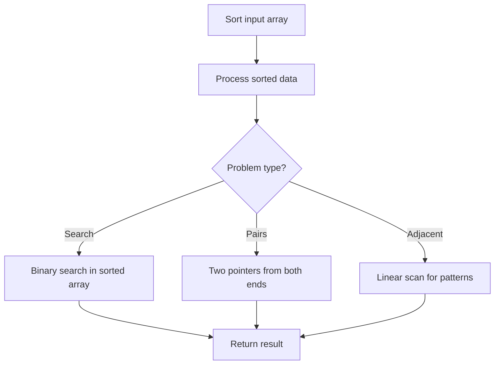

# Problem 2280: Minimum Lines to Represent a Line Chart

**Difficulty:** Medium  
**Tags:** Array, Math, Geometry, Sorting, Number Theory  
**Pattern:** Sorting  
**Link:** [leetcode.com/problems/minimum-lines-to-represent-a-line-chart](https://leetcode.com/problems/minimum-lines-to-represent-a-line-chart/)

## Description

You are given a 2D integer array `stockPrices` where `stockPrices[i] = [dayi, pricei]` indicates the price of the stock on day `dayi` is `pricei`. A **line chart** is created from the array by plotting the points on an XY plane with the X-axis representing the day and the Y-axis representing the price and connecting adjacent points. One such example is shown below:

Return *the **minimum number of lines** needed to represent the line chart*.

 

Example 1:

```

**Input:** stockPrices = [[1,7],[2,6],[3,5],[4,4],[5,4],[6,3],[7,2],[8,1]]
**Output:** 3
**Explanation:**
The diagram above represents the input, with the X-axis representing the day and Y-axis representing the price.
The following 3 lines can be drawn to represent the line chart:
- Line 1 (in red) from (1,7) to (4,4) passing through (1,7), (2,6), (3,5), and (4,4).
- Line 2 (in blue) from (4,4) to (5,4).
- Line 3 (in green) from (5,4) to (8,1) passing through (5,4), (6,3), (7,2), and (8,1).
It can be shown that it is not possible to represent the line chart using less than 3 lines.

```

Example 2:

```

**Input:** stockPrices = [[3,4],[1,2],[7,8],[2,3]]
**Output:** 1
**Explanation:**
As shown in the diagram above, the line chart can be represented with a single line.

```

 

**Constraints:**

	- `1 <= stockPrices.length <= 10^5`
	- `stockPrices[i].length == 2`
	- `1 <= dayi, pricei <= 10^9`
	- All `dayi` are **distinct**.

## Approach: Sorting

Sort the data to enable efficient processing. After sorting, use techniques like binary search, two pointers, or linear scan to solve the problem.

## Pseudocode

```
1. Sort the input array
2. Process sorted data:
   - Use binary search for lookups
   - Use two pointers for pair finding
   - Scan for adjacent patterns
3. Return result
```

## Algorithm Flow



## Complexity Analysis

- **Time:** O(n log n)
- **Space:** O(n)

## Solution (Python3)

```python
class Solution:
    def minimumLines(self, stockPrices: List[List[int]]) -> int:
        # Sort-based approach - O(n log n) time
        stockPrices.sort(key=lambda x: x[0] if isinstance(x, (list, tuple)) else x)
        result = [stockPrices[0]]
        for i in range(1, len(stockPrices)):
            curr = stockPrices[i]
            if isinstance(curr, (list, tuple)) and isinstance(result[-1], (list, tuple)):
                if curr[0] <= result[-1][1]:
                    result[-1] = [result[-1][0], max(result[-1][1], curr[1])]
                else:
                    result.append(curr)
            else:
                result.append(curr)
        return result
```

## Solution (C++)

```cpp
#include <algorithm>
#include <string>
#include <vector>
using namespace std;

class Solution {
public:
    int minimumLines(vector<vector<int>>& stockPrices) {
        // Sort-based approach - O(n log n) time
        sort(stockPrices.begin(), stockPrices.end());
        vector<vector<int>> result;
        result.push_back(stockPrices[0]);
        for (int i = 1; i < (int)stockPrices.size(); i++) {
            if (stockPrices[i][0] <= result.back()[1]) {
                result.back()[1] = max(result.back()[1], stockPrices[i][1]);
            } else {
                result.push_back(stockPrices[i]);
            }
        }
        return result;
    }
};
```
