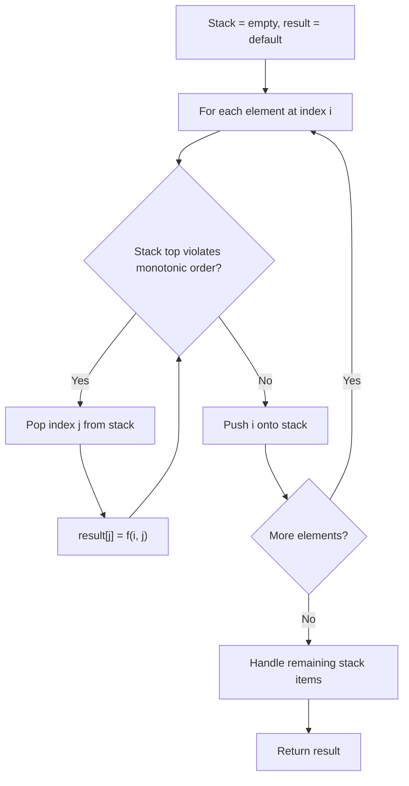
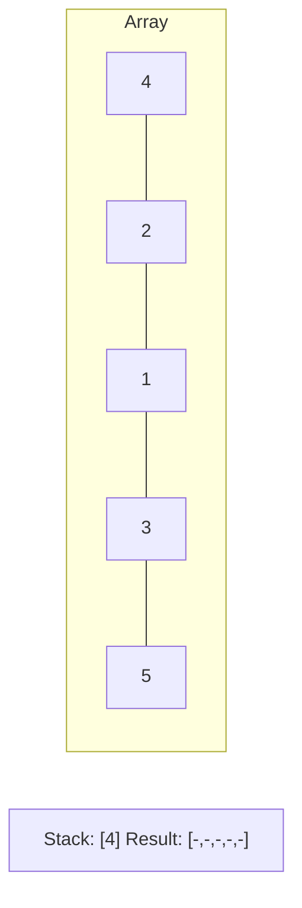
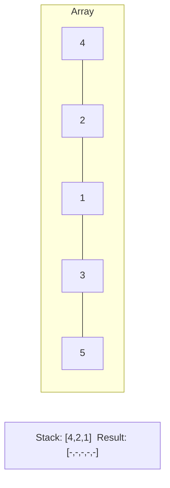
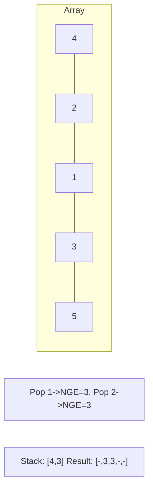
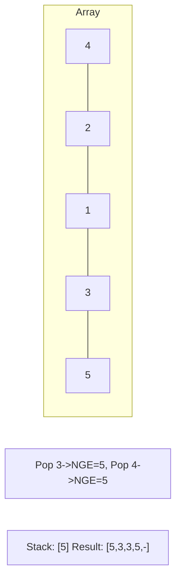

# Problem 2281: Sum of Total Strength of Wizards

**Difficulty:** Hard  
**Tags:** Array, Stack, Monotonic Stack, Prefix Sum  
**Pattern:** Monotonic Stack  
**Link:** [leetcode.com/problems/sum-of-total-strength-of-wizards](https://leetcode.com/problems/sum-of-total-strength-of-wizards/)

## Description

As the ruler of a kingdom, you have an army of wizards at your command.

You are given a **0-indexed** integer array `strength`, where `strength[i]` denotes the strength of the `i^th` wizard. For a **contiguous** group of wizards (i.e. the wizards' strengths form a **subarray** of `strength`), the **total strength** is defined as the **product** of the following two values:

	- The strength of the **weakest** wizard in the group.
	- The **total** of all the individual strengths of the wizards in the group.

Return *the **sum** of the total strengths of **all** contiguous groups of wizards*. Since the answer may be very large, return it **modulo** `10^9 + 7`.

A **subarray** is a contiguous **non-empty** sequence of elements within an array.

 

Example 1:

```

**Input:** strength = [1,3,1,2]
**Output:** 44
**Explanation:** The following are all the contiguous groups of wizards:
- [1] from [**1**,3,1,2] has a total strength of min([1]) * sum([1]) = 1 * 1 = 1
- [3] from [1,**3**,1,2] has a total strength of min([3]) * sum([3]) = 3 * 3 = 9
- [1] from [1,3,**1**,2] has a total strength of min([1]) * sum([1]) = 1 * 1 = 1
- [2] from [1,3,1,**2**] has a total strength of min([2]) * sum([2]) = 2 * 2 = 4
- [1,3] from [**1,3**,1,2] has a total strength of min([1,3]) * sum([1,3]) = 1 * 4 = 4
- [3,1] from [1,**3,1**,2] has a total strength of min([3,1]) * sum([3,1]) = 1 * 4 = 4
- [1,2] from [1,3,**1,2**] has a total strength of min([1,2]) * sum([1,2]) = 1 * 3 = 3
- [1,3,1] from [**1,3,1**,2] has a total strength of min([1,3,1]) * sum([1,3,1]) = 1 * 5 = 5
- [3,1,2] from [1,**3,1,2**] has a total strength of min([3,1,2]) * sum([3,1,2]) = 1 * 6 = 6
- [1,3,1,2] from [**1,3,1,2**] has a total strength of min([1,3,1,2]) * sum([1,3,1,2]) = 1 * 7 = 7
The sum of all the total strengths is 1 + 9 + 1 + 4 + 4 + 4 + 3 + 5 + 6 + 7 = 44.

```

Example 2:

```

**Input:** strength = [5,4,6]
**Output:** 213
**Explanation:** The following are all the contiguous groups of wizards: 
- [5] from [**5**,4,6] has a total strength of min([5]) * sum([5]) = 5 * 5 = 25
- [4] from [5,**4**,6] has a total strength of min([4]) * sum([4]) = 4 * 4 = 16
- [6] from [5,4,**6**] has a total strength of min([6]) * sum([6]) = 6 * 6 = 36
- [5,4] from [**5,4**,6] has a total strength of min([5,4]) * sum([5,4]) = 4 * 9 = 36
- [4,6] from [5,**4,6**] has a total strength of min([4,6]) * sum([4,6]) = 4 * 10 = 40
- [5,4,6] from [**5,4,6**] has a total strength of min([5,4,6]) * sum([5,4,6]) = 4 * 15 = 60
The sum of all the total strengths is 25 + 16 + 36 + 36 + 40 + 60 = 213.

```

 

**Constraints:**

	- `1 <= strength.length <= 10^5`
	- `1 <= strength[i] <= 10^9`

## Approach: Monotonic Stack

Maintain a stack where elements are always in monotonic order (increasing or decreasing). When a new element violates the monotonic property, pop elements and compute results (e.g., next greater/smaller element, spans, areas).

## Pseudocode

```
1. Initialize empty stack, result array
2. For each element (index i):
   a. While stack not empty and arr[i] breaks monotonic order:
      - Pop index j from stack
      - result[j] = compute(i, j)
   b. Push i onto stack
3. Handle remaining elements in stack
4. Return result
```

## Algorithm Flow



## Visual State Transitions

**Monotonic Stack (Next Greater Element):**

**Frame 1: Process first elements**


**Frame 2: Push smaller elements**


**Frame 3: Element 3 pops 1 and 2**


**Frame 4: Element 5 pops all**



## Complexity Analysis

- **Time:** O(n)
- **Space:** O(n)

## Solution (Python3)

```python
class Solution:
    def totalStrength(self, strength: List[int]) -> int:
        # Monotonic stack - O(n) time, O(n) space
        n = len(strength)
        result = [0] * n
        stack = []  # indices
        for i in range(n):
            while stack and strength[i] > strength[stack[-1]]:
                idx = stack.pop()
                result[idx] = i - idx
            stack.append(i)
        return result
```

## Solution (C++)

```cpp
#include <stack>
#include <string>
#include <vector>
using namespace std;

class Solution {
public:
    int totalStrength(vector<int>& strength) {
        // Monotonic stack - O(n) time, O(n) space
        int n = strength.size();
        vector<int> result(n, 0);
        stack<int> st;
        for (int i = 0; i < n; i++) {
            while (!st.empty() && strength[i] > strength[st.top()]) {
                int idx = st.top(); st.pop();
                result[idx] = i - idx;
            }
            st.push(i);
        }
        return result;
    }
};
```
