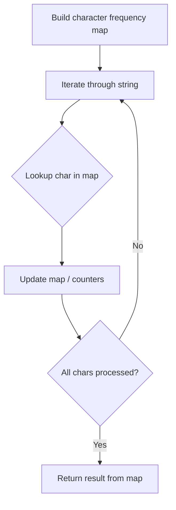

# Problem 2283: Check if Number Has Equal Digit Count and Digit Value

**Difficulty:** Easy  
**Tags:** Hash Table, String, Counting  
**Pattern:** Hash Map String Processing  
**Link:** [leetcode.com/problems/check-if-number-has-equal-digit-count-and-digit-value](https://leetcode.com/problems/check-if-number-has-equal-digit-count-and-digit-value/)

## Description

You are given a **0-indexed** string `num` of length `n` consisting of digits.

Return `true` *if for **every** index *`i`* in the range *`0 <= i < n`*, the digit *`i`* occurs *`num[i]`* times in *`num`*, otherwise return *`false`.

 

Example 1:

```

**Input:** num = "1210"
**Output:** true
**Explanation:**
num[0] = '1'. The digit 0 occurs once in num.
num[1] = '2'. The digit 1 occurs twice in num.
num[2] = '1'. The digit 2 occurs once in num.
num[3] = '0'. The digit 3 occurs zero times in num.
The condition holds true for every index in "1210", so return true.

```

Example 2:

```

**Input:** num = "030"
**Output:** false
**Explanation:**
num[0] = '0'. The digit 0 should occur zero times, but actually occurs twice in num.
num[1] = '3'. The digit 1 should occur three times, but actually occurs zero times in num.
num[2] = '0'. The digit 2 occurs zero times in num.
The indices 0 and 1 both violate the condition, so return false.

```

 

**Constraints:**

	- `n == num.length`
	- `1 <= n <= 10`
	- `num` consists of digits.

## Approach: Hash Map String Processing

Use a hash map to count character frequencies or map characters/strings for O(1) lookups. Process the string in one or two passes.

## Pseudocode

```
1. Build frequency map / char-to-index map
2. Iterate through string:
   a. Look up character in map
   b. Update counts or mappings
3. Return result based on map state
```

## Algorithm Flow



## Complexity Analysis

- **Time:** O(n)
- **Space:** O(n)

## Solution (Python3)

```python
class Solution:
    def digitCount(self, num: str) -> bool:
        # Hash map for string/character frequency - O(n) time
        freq = {}
        for ch in num:
            freq[ch] = freq.get(ch, 0) + 1
        # Process frequency map
        for ch, cnt in freq.items():
            if cnt == 1:
                return num.index(ch)
        return False
```

## Solution (C++)

```cpp
#include <string>
#include <unordered_map>
#include <vector>
using namespace std;

class Solution {
public:
    bool digitCount(string& num) {
        // Hash map for string/character frequency - O(n) time
        unordered_map<char, int> freq;
        for (char ch : num) {
            freq[ch]++;
        }
        // Process frequency map
        for (int i = 0; i < num.size(); i++) {
            if (freq[num[i]] == 1) return i;
        }
        return false;
    }
};
```
