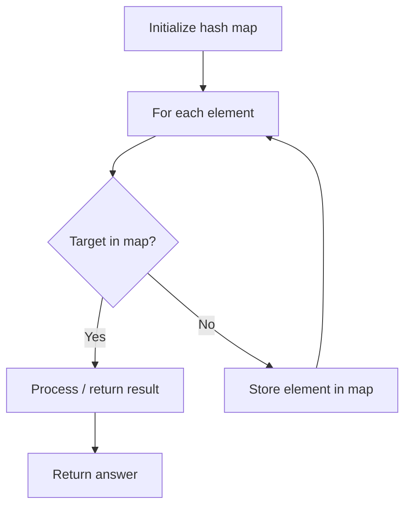

# Problem 2284: Sender With Largest Word Count

**Difficulty:** Medium  
**Tags:** Array, Hash Table, String, Counting  
**Pattern:** Hash Map Lookup  
**Link:** [leetcode.com/problems/sender-with-largest-word-count](https://leetcode.com/problems/sender-with-largest-word-count/)

## Description

You have a chat log of `n` messages. You are given two string arrays `messages` and `senders` where `messages[i]` is a **message** sent by `senders[i]`.

A **message** is list of **words** that are separated by a single space with no leading or trailing spaces. The **word count** of a sender is the total number of **words** sent by the sender. Note that a sender may send more than one message.

Return *the sender with the **largest** word count*. If there is more than one sender with the largest word count, return *the one with the **lexicographically largest** name*.

**Note:**

	- Uppercase letters come before lowercase letters in lexicographical order.
	- `"Alice"` and `"alice"` are distinct.

 

Example 1:

```

**Input:** messages = ["Hello userTwooo","Hi userThree","Wonderful day Alice","Nice day userThree"], senders = ["Alice","userTwo","userThree","Alice"]
**Output:** "Alice"
**Explanation:** Alice sends a total of 2 + 3 = 5 words.
userTwo sends a total of 2 words.
userThree sends a total of 3 words.
Since Alice has the largest word count, we return "Alice".

```

Example 2:

```

**Input:** messages = ["How is leetcode for everyone","Leetcode is useful for practice"], senders = ["Bob","Charlie"]
**Output:** "Charlie"
**Explanation:** Bob sends a total of 5 words.
Charlie sends a total of 5 words.
Since there is a tie for the largest word count, we return the sender with the lexicographically larger name, Charlie.
```

 

**Constraints:**

	- `n == messages.length == senders.length`
	- `1 <= n <= 10^4`
	- `1 <= messages[i].length <= 100`
	- `1 <= senders[i].length <= 10`
	- `messages[i]` consists of uppercase and lowercase English letters and `' '`.
	- All the words in `messages[i]` are separated by **a single space**.
	- `messages[i]` does not have leading or trailing spaces.
	- `senders[i]` consists of uppercase and lowercase English letters only.

## Approach: Hash Map Lookup

Use a hash map (dictionary) to store elements for O(1) lookup. Iterate through the input, checking membership or counting frequencies in the map.

## Pseudocode

```
1. Initialize hash map
2. Iterate through elements:
   a. Check if target/complement exists in map
   b. If found: process result
   c. Otherwise: store element in map
3. Return result
```

## Algorithm Flow



## Complexity Analysis

- **Time:** O(n)
- **Space:** O(n)

## Solution (Python3)

```python
class Solution:
    def largestWordCount(self, messages: List[str], senders: List[str]) -> str:
        # Hash map approach - O(n) time, O(n) space
        seen = {}
        for i, val in enumerate(messages):
            complement = senders - val
            if complement in seen:
                return [seen[complement], i]
            seen[val] = i
        return ""
```

## Solution (C++)

```cpp
#include <string>
#include <unordered_map>
#include <vector>
using namespace std;

class Solution {
public:
    string largestWordCount(vector<string>& messages, vector<string>& senders) {
        // Hash map approach - O(n) time, O(n) space
        unordered_map<int, int> seen;
        for (int i = 0; i < messages.size(); i++) {
            int complement = senders - messages[i];
            if (seen.count(complement)) {
                return {seen[complement], i};
            }
            seen[messages[i]] = i;
        }
        return "";
    }
};
```
