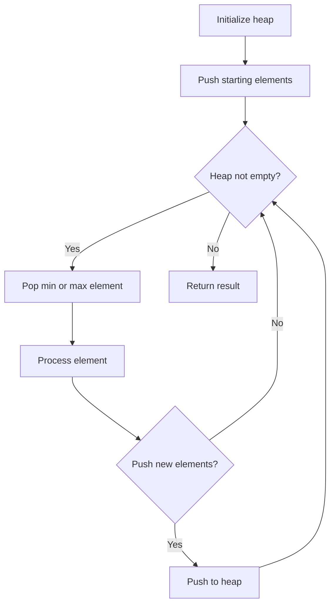
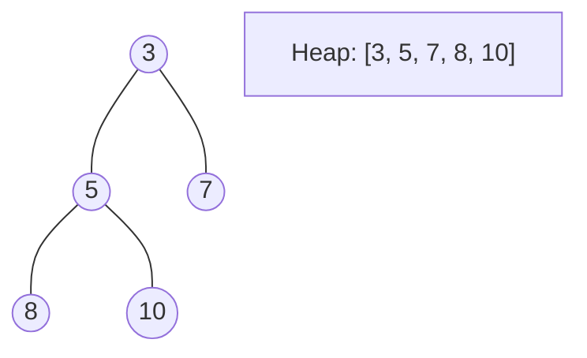
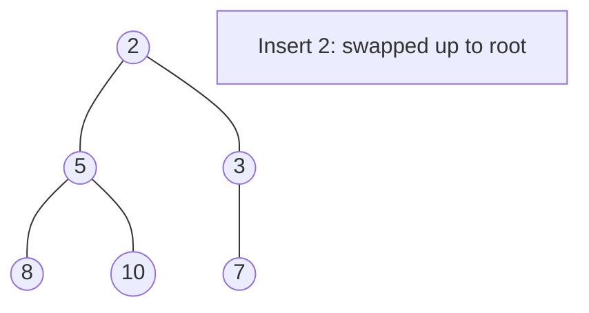
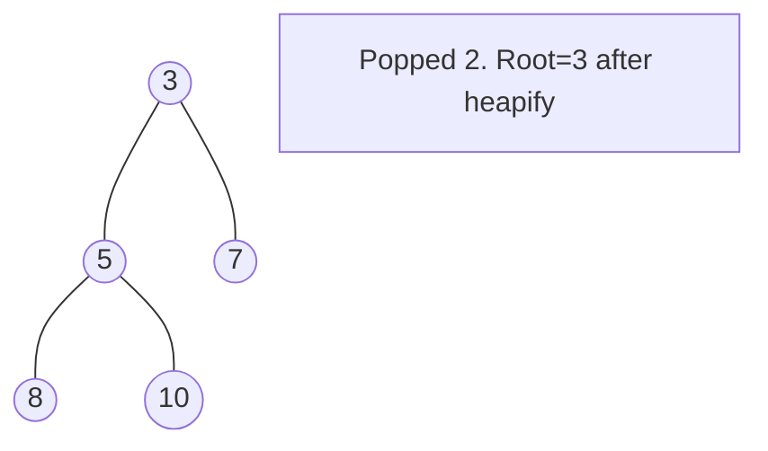

# Problem 2285: Maximum Total Importance of Roads

**Difficulty:** Medium  
**Tags:** Greedy, Graph Theory, Sorting, Heap (Priority Queue)  
**Pattern:** Heap / Priority Queue  
**Link:** [leetcode.com/problems/maximum-total-importance-of-roads](https://leetcode.com/problems/maximum-total-importance-of-roads/)

## Description

You are given an integer `n` denoting the number of cities in a country. The cities are numbered from `0` to `n - 1`.

You are also given a 2D integer array `roads` where `roads[i] = [ai, bi]` denotes that there exists a **bidirectional** road connecting cities `ai` and `bi`.

You need to assign each city with an integer value from `1` to `n`, where each value can only be used **once**. The **importance** of a road is then defined as the **sum** of the values of the two cities it connects.

Return *the **maximum total importance** of all roads possible after assigning the values optimally.*

 

Example 1:

```

**Input:** n = 5, roads = [[0,1],[1,2],[2,3],[0,2],[1,3],[2,4]]
**Output:** 43
**Explanation:** The figure above shows the country and the assigned values of [2,4,5,3,1].
- The road (0,1) has an importance of 2 + 4 = 6.
- The road (1,2) has an importance of 4 + 5 = 9.
- The road (2,3) has an importance of 5 + 3 = 8.
- The road (0,2) has an importance of 2 + 5 = 7.
- The road (1,3) has an importance of 4 + 3 = 7.
- The road (2,4) has an importance of 5 + 1 = 6.
The total importance of all roads is 6 + 9 + 8 + 7 + 7 + 6 = 43.
It can be shown that we cannot obtain a greater total importance than 43.

```

Example 2:

```

**Input:** n = 5, roads = [[0,3],[2,4],[1,3]]
**Output:** 20
**Explanation:** The figure above shows the country and the assigned values of [4,3,2,5,1].
- The road (0,3) has an importance of 4 + 5 = 9.
- The road (2,4) has an importance of 2 + 1 = 3.
- The road (1,3) has an importance of 3 + 5 = 8.
The total importance of all roads is 9 + 3 + 8 = 20.
It can be shown that we cannot obtain a greater total importance than 20.

```

 

**Constraints:**

	- `2 <= n <= 5 * 10^4`
	- `1 <= roads.length <= 5 * 10^4`
	- `roads[i].length == 2`
	- `0 <= ai, bi <= n - 1`
	- `ai != bi`
	- There are no duplicate roads.

## Approach: Heap / Priority Queue

Use a min-heap or max-heap to efficiently access the smallest/largest element. Push elements and pop the top to process in priority order.

## Pseudocode

```
1. Initialize heap (min or max)
2. Push initial elements onto heap
3. While heap not empty and condition:
   a. Pop top element (min or max)
   b. Process element
   c. Push new elements if needed
4. Return result
```

## Algorithm Flow



## Visual State Transitions

**Heap Operations (Min-Heap):**

**Frame 1: Initial heap**


**Frame 2: Insert 2 - bubble up**


**Frame 3: Pop minimum (2) - heapify down**



## Complexity Analysis

- **Time:** O(n log n)
- **Space:** O(n)

## Solution (Python3)

```python
class Solution:
    def maximumImportance(self, n: int, roads: List[List[int]]) -> int:
        # Heap/Priority Queue - O(n log k) time
        import heapq
        if not n:
            return 0
        # Min heap (negate for max heap)
        heap = []
        for val in n:
            heapq.heappush(heap, val)
            if len(heap) > (roads if isinstance(roads, int) else len(n)):
                heapq.heappop(heap)
        return heap[0] if heap else 0
```

## Solution (C++)

```cpp
#include <queue>
#include <string>
#include <vector>
using namespace std;

class Solution {
public:
    int maximumImportance(int n, vector<vector<int>>& roads) {
        // Heap/Priority Queue - O(n log k) time
        priority_queue<int, vector<int>, greater<int>> pq;
        for (int val : n) {
            pq.push(val);
            if ((int)pq.size() > roads)
                pq.pop();
        }
        return pq.empty() ? 0 : pq.top();
    }
};
```
