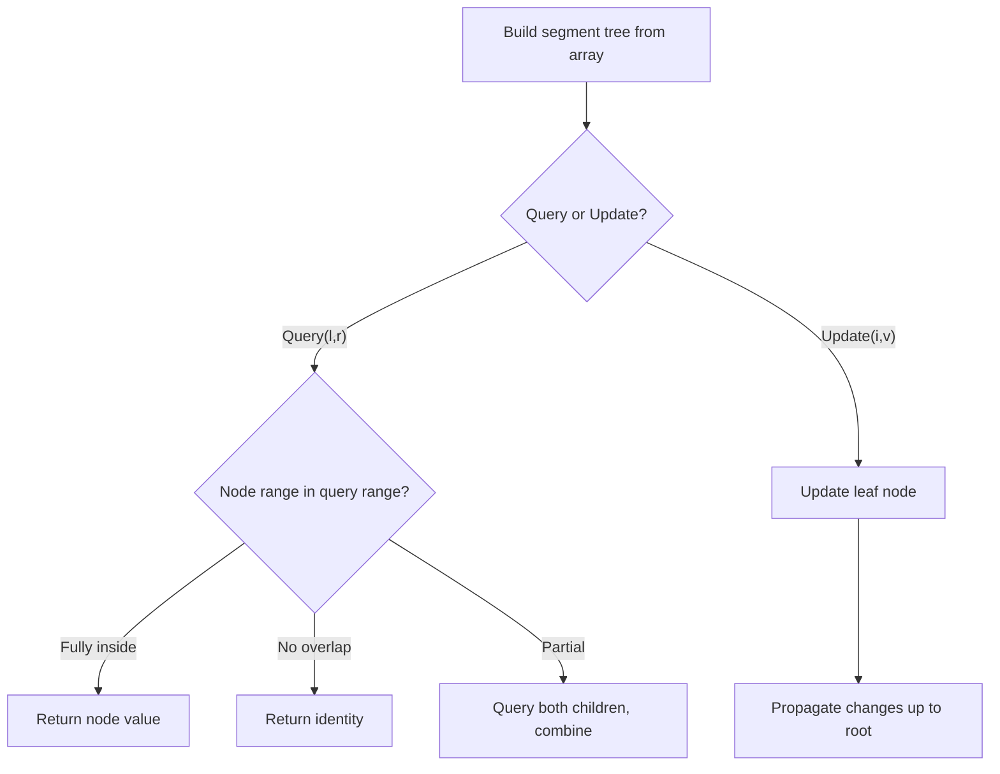

# Problem 2286: Booking Concert Tickets in Groups

**Difficulty:** Hard  
**Tags:** Binary Search, Design, Binary Indexed Tree, Segment Tree  
**Pattern:** Segment Tree  
**Link:** [leetcode.com/problems/booking-concert-tickets-in-groups](https://leetcode.com/problems/booking-concert-tickets-in-groups/)

## Description

A concert hall has `n` rows numbered from `0` to `n - 1`, each with `m` seats, numbered from `0` to `m - 1`. You need to design a ticketing system that can allocate seats in the following cases:

	- If a group of `k` spectators can sit **together** in a row.
	- If **every** member of a group of `k` spectators can get a seat. They may or **may not** sit together.

Note that the spectators are very picky. Hence:

	- They will book seats only if each member of their group can get a seat with row number **less than or equal** to `maxRow`. `maxRow` can **vary** from group to group.
	- In case there are multiple rows to choose from, the row with the **smallest** number is chosen. If there are multiple seats to choose in the same row, the seat with the **smallest** number is chosen.

Implement the `BookMyShow` class:

	- `BookMyShow(int n, int m)` Initializes the object with `n` as number of rows and `m` as number of seats per row.
	- `int[] gather(int k, int maxRow)` Returns an array of length `2` denoting the row and seat number (respectively) of the **first seat** being allocated to the `k` members of the group, who must sit **together**. In other words, it returns the smallest possible `r` and `c` such that all `[c, c + k - 1]` seats are valid and empty in row `r`, and `r <= maxRow`. Returns `[]` in case it is **not possible** to allocate seats to the group.
	- `boolean scatter(int k, int maxRow)` Returns `true` if all `k` members of the group can be allocated seats in rows `0` to `maxRow`, who may or **may not** sit together. If the seats can be allocated, it allocates `k` seats to the group with the **smallest** row numbers, and the smallest possible seat numbers in each row. Otherwise, returns `false`.

 

Example 1:

```

**Input**
["BookMyShow", "gather", "gather", "scatter", "scatter"]
[[2, 5], [4, 0], [2, 0], [5, 1], [5, 1]]
**Output**
[null, [0, 0], [], true, false]

**Explanation**
BookMyShow bms = new BookMyShow(2, 5); // There are 2 rows with 5 seats each 
bms.gather(4, 0); // return [0, 0]
                  // The group books seats [0, 3] of row 0. 
bms.gather(2, 0); // return []
                  // There is only 1 seat left in row 0,
                  // so it is not possible to book 2 consecutive seats. 
bms.scatter(5, 1); // return True
                   // The group books seat 4 of row 0 and seats [0, 3] of row 1. 
bms.scatter(5, 1); // return False
                   // There is only one seat left in the hall.

```

 

**Constraints:**

	- `1 <= n <= 5 * 10^4`
	- `1 <= m, k <= 10^9`
	- `0 <= maxRow <= n - 1`
	- At most `5 * 10^4` calls **in total** will be made to `gather` and `scatter`.

## Approach: Segment Tree

Build a segment tree for range queries (sum, min, max) with point or range updates. Each node covers a range; queries are answered by combining relevant segments.

## Pseudocode

```
1. Build segment tree from array (O(n))
2. Query(l, r):
   - If node range within [l,r]: return node value
   - If no overlap: return identity
   - Else: combine query(left_child) and query(right_child)
3. Update(i, val): update leaf and propagate up
```

## Algorithm Flow



## Complexity Analysis

- **Time:** O(n log n) build, O(log n) query/update
- **Space:** O(n)

## Solution (Python3)

```python
class BookMyShow:
    def __init__(self, n: int, m: int):
        # Initialize data structure
        self.n = n
        self.m = m

    def gather(self, k: int, maxRow: int) -> List[int]:
        return []

    def scatter(self, k: int, maxRow: int) -> bool:
        return False

```

## Solution (C++)

```cpp
#include <functional>
#include <string>
#include <vector>
using namespace std;

class BookMyShow {
public:
    BookMyShow(int n, int m) {
        // Initialize
    }

    vector<int> gather(int k, int maxRow) {
        return {};
    }

    bool scatter(int k, int maxRow) {
        return false;
    }

};
```
