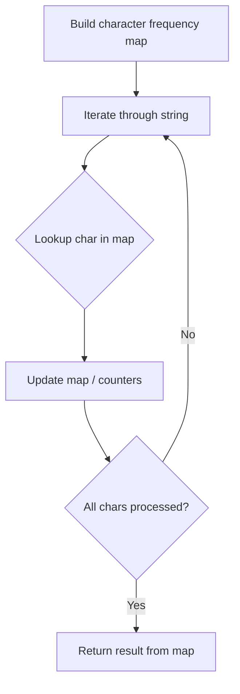

# Problem 2287: Rearrange Characters to Make Target String

**Difficulty:** Easy  
**Tags:** Hash Table, String, Counting  
**Pattern:** Hash Map String Processing  
**Link:** [leetcode.com/problems/rearrange-characters-to-make-target-string](https://leetcode.com/problems/rearrange-characters-to-make-target-string/)

## Description

You are given two **0-indexed** strings `s` and `target`. You can take some letters from `s` and rearrange them to form new strings.

Return* the **maximum** number of copies of *`target`* that can be formed by taking letters from *`s`* and rearranging them.*

 

Example 1:

```

**Input:** s = "ilovecodingonleetcode", target = "code"
**Output:** 2
**Explanation:**
For the first copy of "code", take the letters at indices 4, 5, 6, and 7.
For the second copy of "code", take the letters at indices 17, 18, 19, and 20.
The strings that are formed are "ecod" and "code" which can both be rearranged into "code".
We can make at most two copies of "code", so we return 2.

```

Example 2:

```

**Input:** s = "abcba", target = "abc"
**Output:** 1
**Explanation:**
We can make one copy of "abc" by taking the letters at indices 0, 1, and 2.
We can make at most one copy of "abc", so we return 1.
Note that while there is an extra 'a' and 'b' at indices 3 and 4, we cannot reuse the letter 'c' at index 2, so we cannot make a second copy of "abc".

```

Example 3:

```

**Input:** s = "abbaccaddaeea", target = "aaaaa"
**Output:** 1
**Explanation:**
We can make one copy of "aaaaa" by taking the letters at indices 0, 3, 6, 9, and 12.
We can make at most one copy of "aaaaa", so we return 1.

```

 

**Constraints:**

	- `1 <= s.length <= 100`
	- `1 <= target.length <= 10`
	- `s` and `target` consist of lowercase English letters.

 

**Note:** This question is the same as  1189: Maximum Number of Balloons.

## Approach: Hash Map String Processing

Use a hash map to count character frequencies or map characters/strings for O(1) lookups. Process the string in one or two passes.

## Pseudocode

```
1. Build frequency map / char-to-index map
2. Iterate through string:
   a. Look up character in map
   b. Update counts or mappings
3. Return result based on map state
```

## Algorithm Flow



## Complexity Analysis

- **Time:** O(n)
- **Space:** O(n)

## Solution (Python3)

```python
class Solution:
    def rearrangeCharacters(self, s: str, target: str) -> int:
        # Hash map for string/character frequency - O(n) time
        freq = {}
        for ch in s:
            freq[ch] = freq.get(ch, 0) + 1
        # Process frequency map
        for ch, cnt in freq.items():
            if cnt == 1:
                return s.index(ch)
        return 0
```

## Solution (C++)

```cpp
#include <string>
#include <unordered_map>
#include <vector>
using namespace std;

class Solution {
public:
    int rearrangeCharacters(string& s, string& target) {
        // Hash map for string/character frequency - O(n) time
        unordered_map<char, int> freq;
        for (char ch : s) {
            freq[ch]++;
        }
        // Process frequency map
        for (int i = 0; i < s.size(); i++) {
            if (freq[s[i]] == 1) return i;
        }
        return 0;
    }
};
```
