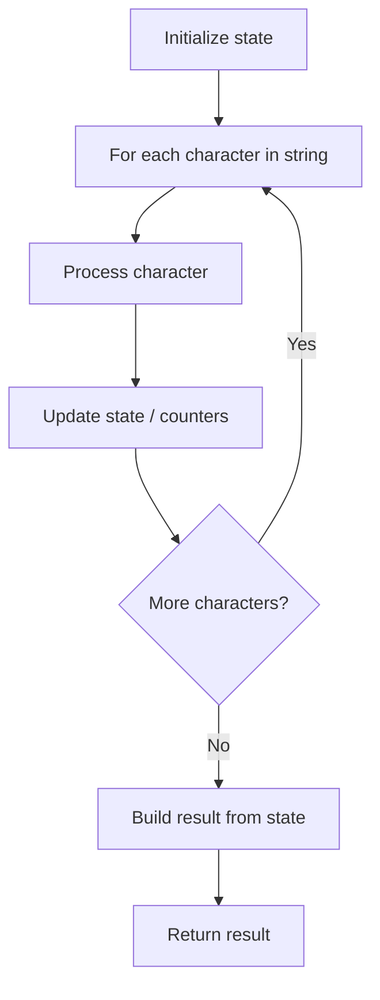

# Problem 2288: Apply Discount to Prices

**Difficulty:** Medium  
**Tags:** String  
**Pattern:** String Processing  
**Link:** [leetcode.com/problems/apply-discount-to-prices](https://leetcode.com/problems/apply-discount-to-prices/)

## Description

A **sentence** is a string of single-space separated words where each word can contain digits, lowercase letters, and the dollar sign `'$'`. A word represents a **price** if it is a sequence of digits preceded by a dollar sign.

	- For example, `"$100"`, `"$23"`, and `"$6"` represent prices while `"100"`, `"$"`, and `"$1e5"` do not.

You are given a string `sentence` representing a sentence and an integer `discount`. For each word representing a price, apply a discount of `discount%` on the price and **update** the word in the sentence. All updated prices should be represented with **exactly two** decimal places.

Return *a string representing the modified sentence*.

Note that all prices will contain **at most** `10` digits.

 

Example 1:

```

**Input:** sentence = "there are $1 $2 and 5$ candies in the shop", discount = 50
**Output:** "there are $0.50 $1.00 and 5$ candies in the shop"
**Explanation:** 
The words which represent prices are "$1" and "$2". 
- A 50% discount on "$1" yields "$0.50", so "$1" is replaced by "$0.50".
- A 50% discount on "$2" yields "$1". Since we need to have exactly 2 decimal places after a price, we replace "$2" with "$1.00".

```

Example 2:

```

**Input:** sentence = "1 2 $3 4 $5 $6 7 8$ $9 $10$", discount = 100
**Output:** "1 2 $0.00 4 $0.00 $0.00 7 8$ $0.00 $10$"
**Explanation:** 
Applying a 100% discount on any price will result in 0.
The words representing prices are "$3", "$5", "$6", and "$9".
Each of them is replaced by "$0.00".

```

 

**Constraints:**

	- `1 <= sentence.length <= 10^5`
	- `sentence` consists of lowercase English letters, digits, `' '`, and `'$'`.
	- `sentence` does not have leading or trailing spaces.
	- All words in `sentence` are separated by a single space.
	- All prices will be **positive** numbers without leading zeros.
	- All prices will have **at most** `10` digits.
	- `0 <= discount <= 100`

## Approach: String Processing

Process the string character by character. Common techniques: two pointers, sliding window, hash map for frequencies, stack for matching.

## Pseudocode

```
1. Initialize result / tracking state
2. Iterate through string characters:
   a. Process character based on rules
   b. Update state (counters, pointers, stack)
3. Build and return result
```

## Algorithm Flow



## Complexity Analysis

- **Time:** O(n)
- **Space:** O(n)

## Solution (Python3)

```python
class Solution:
    def discountPrices(self, sentence: str, discount: int) -> str:
        # String processing approach - O(n) time
        result = []
        for ch in sentence:
            if ch.isalnum():
                result.append(ch.lower())
        # Check palindrome or process
        processed = ''.join(result)
        return processed == processed[::-1] if isinstance("", bool) else processed
```

## Solution (C++)

```cpp
#include <algorithm>
#include <cctype>
#include <string>
#include <vector>
using namespace std;

class Solution {
public:
    string discountPrices(string& sentence, int discount) {
        // String processing approach - O(n) time
        string processed;
        for (char ch : sentence) {
            if (isalnum(ch)) {
                processed += tolower(ch);
            }
        }
        string rev = processed;
        reverse(rev.begin(), rev.end());
        return processed == rev;
    }
};
```
