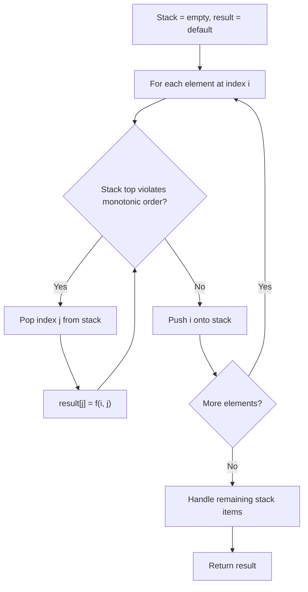
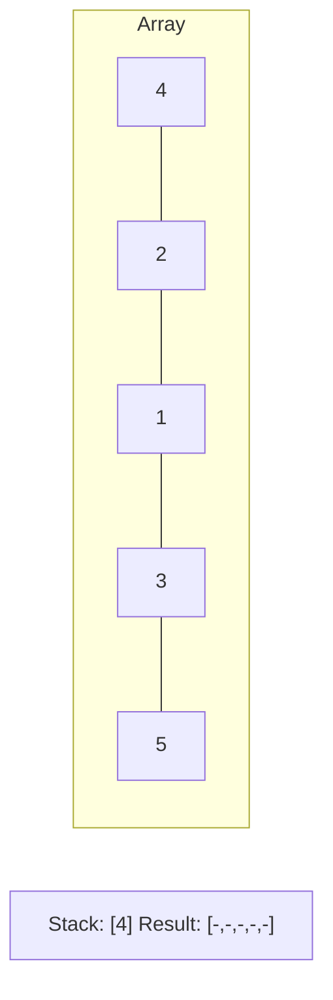
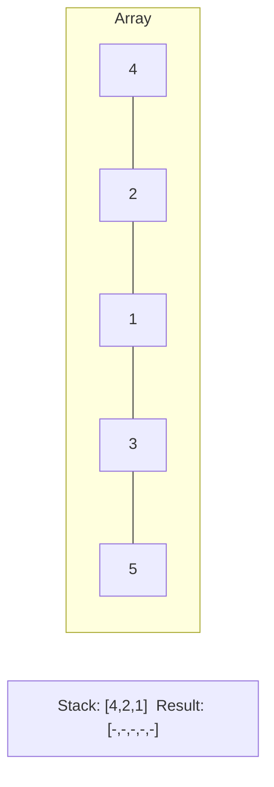
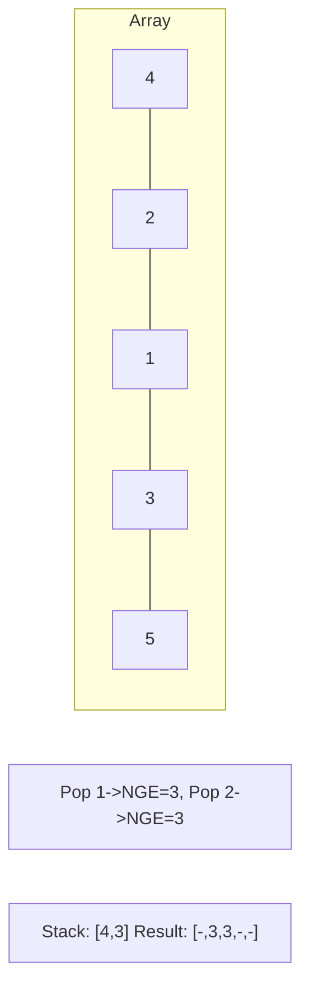
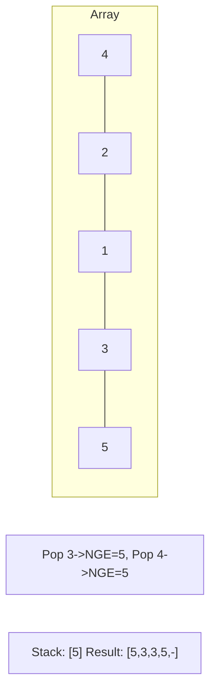

# Problem 2289: Steps to Make Array Non-decreasing

**Difficulty:** Medium  
**Tags:** Array, Linked List, Stack, Monotonic Stack  
**Pattern:** Monotonic Stack  
**Link:** [leetcode.com/problems/steps-to-make-array-non-decreasing](https://leetcode.com/problems/steps-to-make-array-non-decreasing/)

## Description

You are given a **0-indexed** integer array `nums`. In one step, **remove** all elements `nums[i]` where `nums[i - 1] > nums[i]` for all `0 < i < nums.length`.

Return *the number of steps performed until *`nums`* becomes a **non-decreasing** array*.

 

Example 1:

```

**Input:** nums = [5,3,4,4,7,3,6,11,8,5,11]
**Output:** 3
**Explanation:** The following are the steps performed:
- Step 1: [5,**3**,4,4,7,**3**,6,11,**8**,**5**,11] becomes [5,4,4,7,6,11,11]
- Step 2: [5,**4**,4,7,**6**,11,11] becomes [5,4,7,11,11]
- Step 3: [5,**4**,7,11,11] becomes [5,7,11,11]
[5,7,11,11] is a non-decreasing array. Therefore, we return 3.

```

Example 2:

```

**Input:** nums = [4,5,7,7,13]
**Output:** 0
**Explanation:** nums is already a non-decreasing array. Therefore, we return 0.

```

 

**Constraints:**

	- `1 <= nums.length <= 10^5`
	- `1 <= nums[i] <= 10^9`

## Approach: Monotonic Stack

Maintain a stack where elements are always in monotonic order (increasing or decreasing). When a new element violates the monotonic property, pop elements and compute results (e.g., next greater/smaller element, spans, areas).

## Pseudocode

```
1. Initialize empty stack, result array
2. For each element (index i):
   a. While stack not empty and arr[i] breaks monotonic order:
      - Pop index j from stack
      - result[j] = compute(i, j)
   b. Push i onto stack
3. Handle remaining elements in stack
4. Return result
```

## Algorithm Flow



## Visual State Transitions

**Monotonic Stack (Next Greater Element):**

**Frame 1: Process first elements**


**Frame 2: Push smaller elements**


**Frame 3: Element 3 pops 1 and 2**


**Frame 4: Element 5 pops all**



## Complexity Analysis

- **Time:** O(n)
- **Space:** O(n)

## Solution (Python3)

```python
class Solution:
    def totalSteps(self, nums: List[int]) -> int:
        # Monotonic stack - O(n) time, O(n) space
        n = len(nums)
        result = [0] * n
        stack = []  # indices
        for i in range(n):
            while stack and nums[i] > nums[stack[-1]]:
                idx = stack.pop()
                result[idx] = i - idx
            stack.append(i)
        return result
```

## Solution (C++)

```cpp
#include <stack>
#include <string>
#include <vector>
using namespace std;

class Solution {
public:
    int totalSteps(vector<int>& nums) {
        // Monotonic stack - O(n) time, O(n) space
        int n = nums.size();
        vector<int> result(n, 0);
        stack<int> st;
        for (int i = 0; i < n; i++) {
            while (!st.empty() && nums[i] > nums[st.top()]) {
                int idx = st.top(); st.pop();
                result[idx] = i - idx;
            }
            st.push(i);
        }
        return result;
    }
};
```
