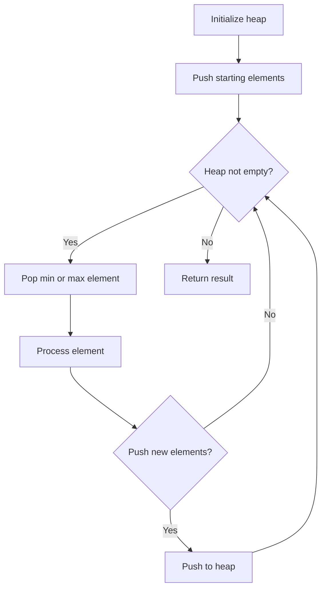
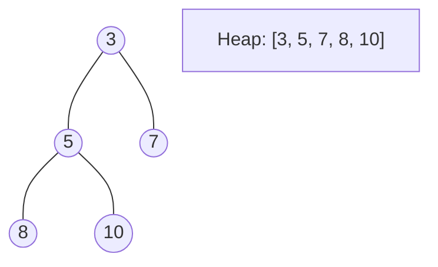
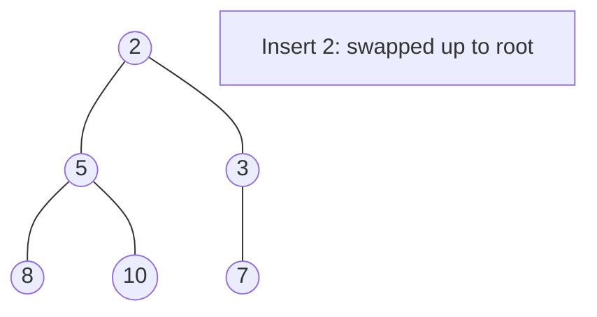
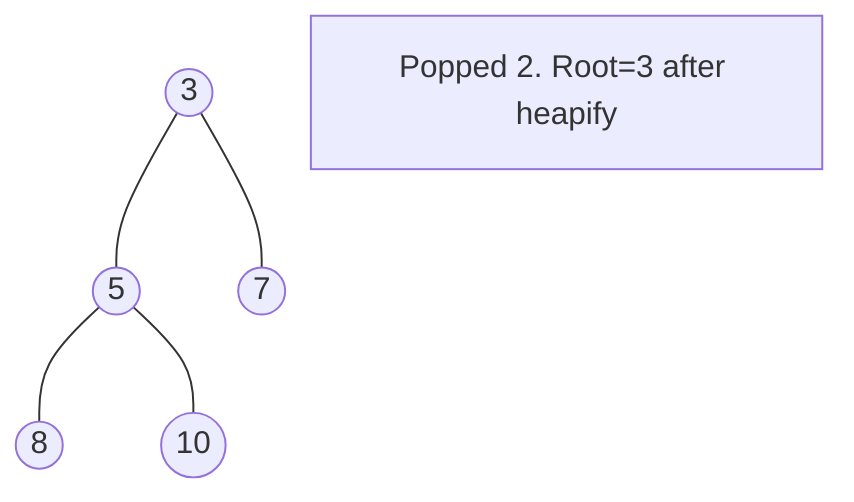

# Problem 2290: Minimum Obstacle Removal to Reach Corner

**Difficulty:** Hard  
**Tags:** Array, Breadth-First Search, Graph Theory, Heap (Priority Queue), Matrix, Shortest Path  
**Pattern:** Heap / Priority Queue  
**Link:** [leetcode.com/problems/minimum-obstacle-removal-to-reach-corner](https://leetcode.com/problems/minimum-obstacle-removal-to-reach-corner/)

## Description

You are given a **0-indexed** 2D integer array `grid` of size `m x n`. Each cell has one of two values:

	- `0` represents an **empty** cell,
	- `1` represents an **obstacle** that may be removed.

You can move up, down, left, or right from and to an empty cell.

Return *the **minimum** number of **obstacles** to **remove** so you can move from the upper left corner *`(0, 0)`* to the lower right corner *`(m - 1, n - 1)`.

 

Example 1:

```

**Input:** grid = [[0,1,1],[1,1,0],[1,1,0]]
**Output:** 2
**Explanation:** We can remove the obstacles at (0, 1) and (0, 2) to create a path from (0, 0) to (2, 2).
It can be shown that we need to remove at least 2 obstacles, so we return 2.
Note that there may be other ways to remove 2 obstacles to create a path.

```

Example 2:

```

**Input:** grid = [[0,1,0,0,0],[0,1,0,1,0],[0,0,0,1,0]]
**Output:** 0
**Explanation:** We can move from (0, 0) to (2, 4) without removing any obstacles, so we return 0.

```

 

**Constraints:**

	- `m == grid.length`
	- `n == grid[i].length`
	- `1 <= m, n <= 10^5`
	- `2 <= m * n <= 10^5`
	- `grid[i][j]` is either `0` **or** `1`.
	- `grid[0][0] == grid[m - 1][n - 1] == 0`

## Approach: Heap / Priority Queue

Use a min-heap or max-heap to efficiently access the smallest/largest element. Push elements and pop the top to process in priority order.

## Pseudocode

```
1. Initialize heap (min or max)
2. Push initial elements onto heap
3. While heap not empty and condition:
   a. Pop top element (min or max)
   b. Process element
   c. Push new elements if needed
4. Return result
```

## Algorithm Flow



## Visual State Transitions

**Heap Operations (Min-Heap):**

**Frame 1: Initial heap**


**Frame 2: Insert 2 - bubble up**


**Frame 3: Pop minimum (2) - heapify down**



## Complexity Analysis

- **Time:** O(n log n)
- **Space:** O(n)

## Solution (Python3)

```python
class Solution:
    def minimumObstacles(self, grid: List[List[int]]) -> int:
        # Heap/Priority Queue - O(n log k) time
        import heapq
        if not grid:
            return 0
        # Min heap (negate for max heap)
        heap = []
        for val in grid:
            heapq.heappush(heap, val)
            if len(heap) > (grid if isinstance(grid, int) else len(grid)):
                heapq.heappop(heap)
        return heap[0] if heap else 0
```

## Solution (C++)

```cpp
#include <queue>
#include <string>
#include <vector>
using namespace std;

class Solution {
public:
    int minimumObstacles(vector<vector<int>>& grid) {
        // Heap/Priority Queue - O(n log k) time
        priority_queue<int, vector<int>, greater<int>> pq;
        for (int val : grid) {
            pq.push(val);
            if ((int)pq.size() > grid)
                pq.pop();
        }
        return pq.empty() ? 0 : pq.top();
    }
};
```
