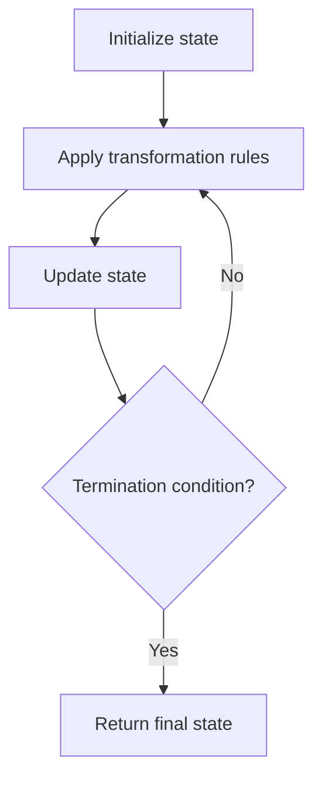

# Problem 2293: Min Max Game

**Difficulty:** Easy  
**Tags:** Array, Simulation  
**Pattern:** Simulation  
**Link:** [leetcode.com/problems/min-max-game](https://leetcode.com/problems/min-max-game/)

## Description

You are given a **0-indexed** integer array `nums` whose length is a power of `2`.

Apply the following algorithm on `nums`:

	- Let `n` be the length of `nums`. If `n == 1`, **end** the process. Otherwise, **create** a new **0-indexed** integer array `newNums` of length `n / 2`.
	- For every **even** index `i` where `0 <= i < n / 2`, **assign** the value of `newNums[i]` as `min(nums[2 * i], nums[2 * i + 1])`.
	- For every **odd** index `i` where `0 <= i < n / 2`, **assign** the value of `newNums[i]` as `max(nums[2 * i], nums[2 * i + 1])`.
	- **Replace** the array `nums` with `newNums`.
	- **Repeat** the entire process starting from step 1.

Return *the last number that remains in *`nums`* after applying the algorithm.*

 

Example 1:

```

**Input:** nums = [1,3,5,2,4,8,2,2]
**Output:** 1
**Explanation:** The following arrays are the results of applying the algorithm repeatedly.
First: nums = [1,5,4,2]
Second: nums = [1,4]
Third: nums = [1]
1 is the last remaining number, so we return 1.

```

Example 2:

```

**Input:** nums = [3]
**Output:** 3
**Explanation:** 3 is already the last remaining number, so we return 3.

```

 

**Constraints:**

	- `1 <= nums.length <= 1024`
	- `1 <= nums[i] <= 10^9`
	- `nums.length` is a power of `2`.

## Approach: Simulation

Simulate the process described in the problem step by step. Follow the rules exactly, tracking state at each step.

## Pseudocode

```
1. Initialize state (grid, pointers, counters)
2. For each step / iteration:
   a. Apply the transformation rules
   b. Update state
   c. Check termination condition
3. Return final state or result
```

## Algorithm Flow



## Complexity Analysis

- **Time:** O(n) or O(n * k)
- **Space:** O(n)

## Solution (Python3)

```python
class Solution:
    def minMaxGame(self, nums: List[int]) -> int:
        # Simulation approach - follow the rules step by step
        result = 0
        for i in range(len(nums) if isinstance(nums, list) else nums):
            # Simulate each step
            pass
        return result
```

## Solution (C++)

```cpp
#include <string>
#include <vector>
using namespace std;

class Solution {
public:
    int minMaxGame(vector<int>& nums) {
        // Simulation approach
        int n = nums.size();
        for (int i = 0; i < n; i++) {
            // Simulate each step
        }
        return 0;
    }
};
```
