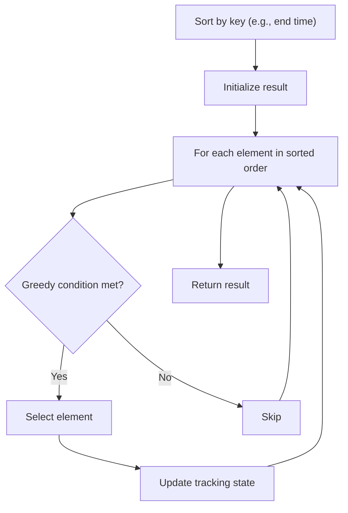

# Problem 2294: Partition Array Such That Maximum Difference Is K

**Difficulty:** Medium  
**Tags:** Array, Greedy, Sorting  
**Pattern:** Greedy with Sorting  
**Link:** [leetcode.com/problems/partition-array-such-that-maximum-difference-is-k](https://leetcode.com/problems/partition-array-such-that-maximum-difference-is-k/)

## Description

You are given an integer array `nums` and an integer `k`. You may partition `nums` into one or more **subsequences** such that each element in `nums` appears in **exactly** one of the subsequences.

Return *the **minimum **number of subsequences needed such that the difference between the maximum and minimum values in each subsequence is **at most** *`k`*.*

A **subsequence** is a sequence that can be derived from another sequence by deleting some or no elements without changing the order of the remaining elements.

 

Example 1:

```

**Input:** nums = [3,6,1,2,5], k = 2
**Output:** 2
**Explanation:**
We can partition nums into the two subsequences [3,1,2] and [6,5].
The difference between the maximum and minimum value in the first subsequence is 3 - 1 = 2.
The difference between the maximum and minimum value in the second subsequence is 6 - 5 = 1.
Since two subsequences were created, we return 2. It can be shown that 2 is the minimum number of subsequences needed.

```

Example 2:

```

**Input:** nums = [1,2,3], k = 1
**Output:** 2
**Explanation:**
We can partition nums into the two subsequences [1,2] and [3].
The difference between the maximum and minimum value in the first subsequence is 2 - 1 = 1.
The difference between the maximum and minimum value in the second subsequence is 3 - 3 = 0.
Since two subsequences were created, we return 2. Note that another optimal solution is to partition nums into the two subsequences [1] and [2,3].

```

Example 3:

```

**Input:** nums = [2,2,4,5], k = 0
**Output:** 3
**Explanation:**
We can partition nums into the three subsequences [2,2], [4], and [5].
The difference between the maximum and minimum value in the first subsequences is 2 - 2 = 0.
The difference between the maximum and minimum value in the second subsequences is 4 - 4 = 0.
The difference between the maximum and minimum value in the third subsequences is 5 - 5 = 0.
Since three subsequences were created, we return 3. It can be shown that 3 is the minimum number of subsequences needed.

```

 

**Constraints:**

	- `1 <= nums.length <= 10^5`
	- `0 <= nums[i] <= 10^5`
	- `0 <= k <= 10^5`

## Approach: Greedy with Sorting

Sort the input by a key criterion, then greedily process elements in sorted order. The sorting ensures the greedy choice is always optimal.

## Pseudocode

```
1. Sort elements by key (start time, weight, etc.)
2. Initialize result, tracking variables
3. For each element in sorted order:
   a. Apply greedy selection rule
   b. Update result
4. Return result
```

## Algorithm Flow



## Complexity Analysis

- **Time:** O(n log n)
- **Space:** O(n)

## Solution (Python3)

```python
class Solution:
    def partitionArray(self, nums: List[int], k: int) -> int:
        # Sort + greedy - O(n log n) time
        nums.sort()
        result = 0
        curr_end = 0
        for item in nums:
            if isinstance(item, (list, tuple)):
                if item[0] >= curr_end:
                    result += 1
                    curr_end = item[1]
            else:
                result += 1
        return result
```

## Solution (C++)

```cpp
#include <algorithm>
#include <string>
#include <vector>
using namespace std;

class Solution {
public:
    int partitionArray(vector<int>& nums, int k) {
        // Sort + greedy - O(n log n) time
        sort(nums.begin(), nums.end());
        int result = 0, curr_end = 0;
        for (auto& item : nums) {
            result++;
        }
        return result;
    }
};
```
