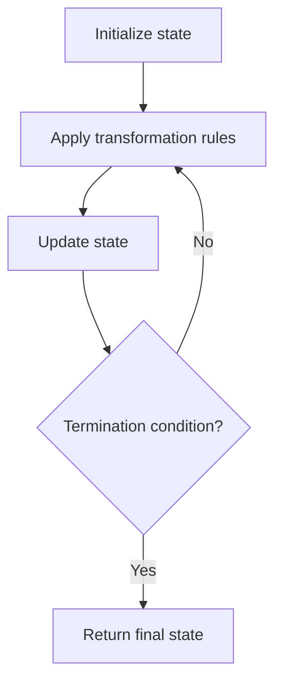

# Problem 2295: Replace Elements in an Array

**Difficulty:** Medium  
**Tags:** Array, Hash Table, Simulation  
**Pattern:** Simulation  
**Link:** [leetcode.com/problems/replace-elements-in-an-array](https://leetcode.com/problems/replace-elements-in-an-array/)

## Description

You are given a **0-indexed** array `nums` that consists of `n` **distinct** positive integers. Apply `m` operations to this array, where in the `i^th` operation you replace the number `operations[i][0]` with `operations[i][1]`.

It is guaranteed that in the `i^th` operation:

	- `operations[i][0]` **exists** in `nums`.
	- `operations[i][1]` does **not** exist in `nums`.

Return *the array obtained after applying all the operations*.

 

Example 1:

```

**Input:** nums = [1,2,4,6], operations = [[1,3],[4,7],[6,1]]
**Output:** [3,2,7,1]
**Explanation:** We perform the following operations on nums:
- Replace the number 1 with 3. nums becomes [**3**,2,4,6].
- Replace the number 4 with 7. nums becomes [3,2,**7**,6].
- Replace the number 6 with 1. nums becomes [3,2,7,**1**].
We return the final array [3,2,7,1].

```

Example 2:

```

**Input:** nums = [1,2], operations = [[1,3],[2,1],[3,2]]
**Output:** [2,1]
**Explanation:** We perform the following operations to nums:
- Replace the number 1 with 3. nums becomes [**3**,2].
- Replace the number 2 with 1. nums becomes [3,**1**].
- Replace the number 3 with 2. nums becomes [**2**,1].
We return the array [2,1].

```

 

**Constraints:**

	- `n == nums.length`
	- `m == operations.length`
	- `1 <= n, m <= 10^5`
	- All the values of `nums` are **distinct**.
	- `operations[i].length == 2`
	- `1 <= nums[i], operations[i][0], operations[i][1] <= 10^6`
	- `operations[i][0]` will exist in `nums` when applying the `i^th` operation.
	- `operations[i][1]` will not exist in `nums` when applying the `i^th` operation.

## Approach: Simulation

Simulate the process described in the problem step by step. Follow the rules exactly, tracking state at each step.

## Pseudocode

```
1. Initialize state (grid, pointers, counters)
2. For each step / iteration:
   a. Apply the transformation rules
   b. Update state
   c. Check termination condition
3. Return final state or result
```

## Algorithm Flow



## Complexity Analysis

- **Time:** O(n) or O(n * k)
- **Space:** O(n)

## Solution (Python3)

```python
class Solution:
    def arrayChange(self, nums: List[int], operations: List[List[int]]) -> List[int]:
        # Simulation approach - follow the rules step by step
        result = []
        for i in range(len(nums) if isinstance(nums, list) else nums):
            # Simulate each step
            pass
        return result
```

## Solution (C++)

```cpp
#include <string>
#include <vector>
using namespace std;

class Solution {
public:
    vector<int> arrayChange(vector<int>& nums, vector<vector<int>>& operations) {
        // Simulation approach
        int n = nums.size();
        for (int i = 0; i < n; i++) {
            // Simulate each step
        }
        return {};
    }
};
```
