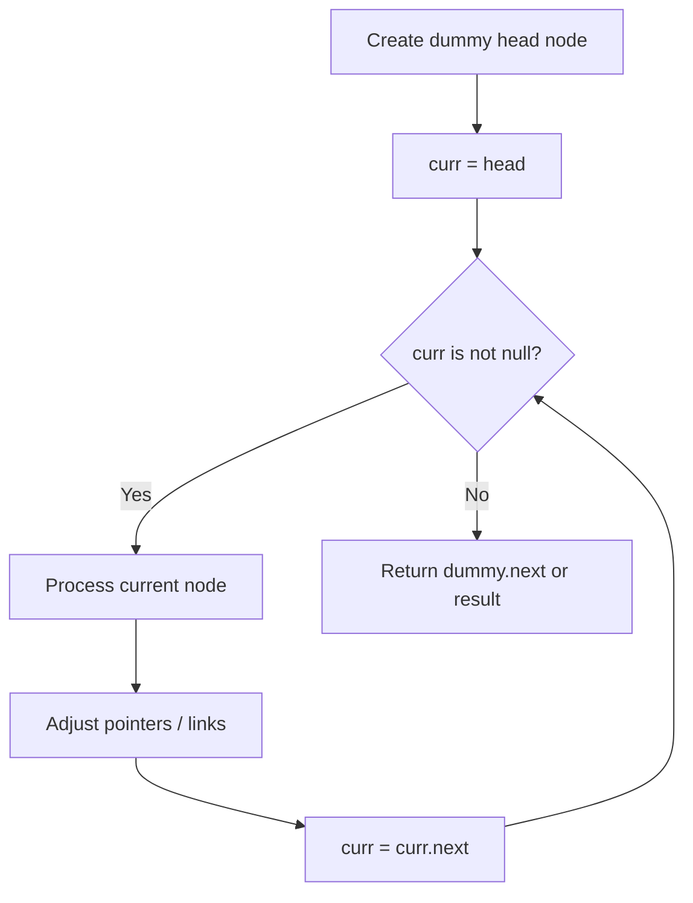
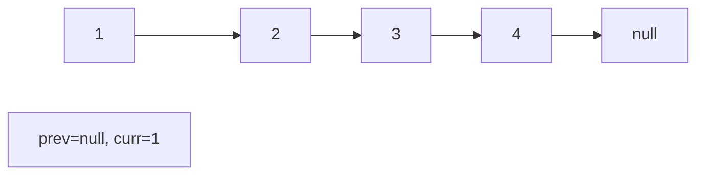
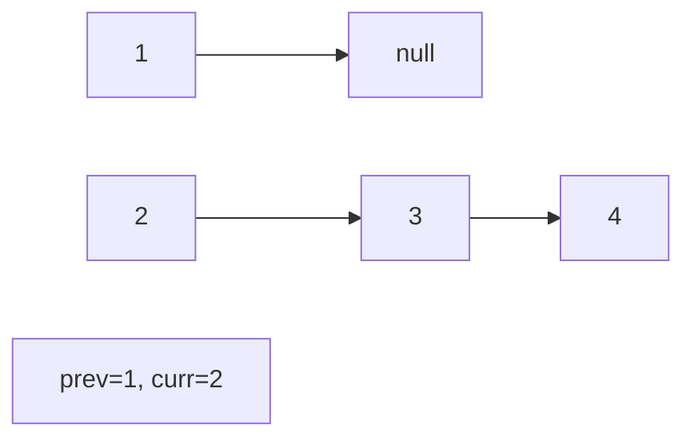
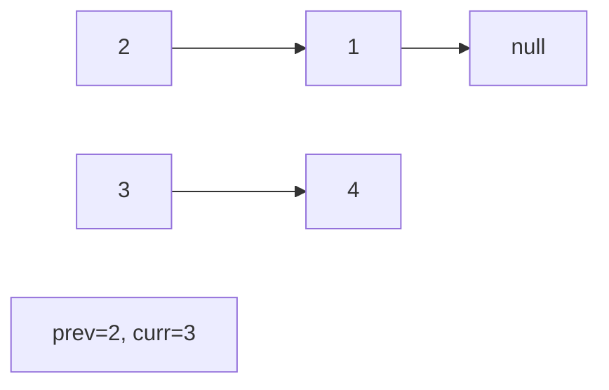
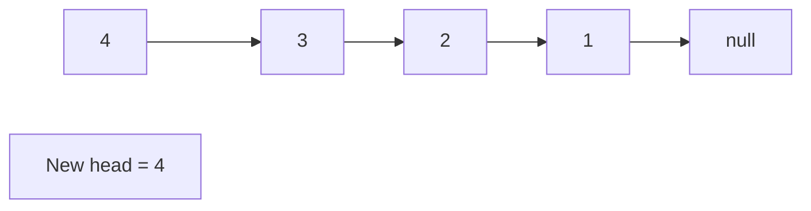

# Problem 2296: Design a Text Editor

**Difficulty:** Hard  
**Tags:** Linked List, String, Stack, Design, Simulation, Doubly-Linked List  
**Pattern:** Linked List  
**Link:** [leetcode.com/problems/design-a-text-editor](https://leetcode.com/problems/design-a-text-editor/)

## Description

Design a text editor with a cursor that can do the following:

	- **Add** text to where the cursor is.
	- **Delete** text from where the cursor is (simulating the backspace key).
	- **Move** the cursor either left or right.

When deleting text, only characters to the left of the cursor will be deleted. The cursor will also remain within the actual text and cannot be moved beyond it. More formally, we have that `0 <= cursor.position <= currentText.length` always holds.

Implement the `TextEditor` class:

	- `TextEditor()` Initializes the object with empty text.
	- `void addText(string text)` Appends `text` to where the cursor is. The cursor ends to the right of `text`.
	- `int deleteText(int k)` Deletes `k` characters to the left of the cursor. Returns the number of characters actually deleted.
	- `string cursorLeft(int k)` Moves the cursor to the left `k` times. Returns the last `min(10, len)` characters to the left of the cursor, where `len` is the number of characters to the left of the cursor.
	- `string cursorRight(int k)` Moves the cursor to the right `k` times. Returns the last `min(10, len)` characters to the left of the cursor, where `len` is the number of characters to the left of the cursor.

 

Example 1:

```

**Input**
["TextEditor", "addText", "deleteText", "addText", "cursorRight", "cursorLeft", "deleteText", "cursorLeft", "cursorRight"]
[[], ["leetcode"], [4], ["practice"], [3], [8], [10], [2], [6]]
**Output**
[null, null, 4, null, "etpractice", "leet", 4, "", "practi"]

**Explanation**
TextEditor textEditor = new TextEditor(); // The current text is "|". (The '|' character represents the cursor)
textEditor.addText("leetcode"); // The current text is "leetcode|".
textEditor.deleteText(4); // return 4
                          // The current text is "leet|". 
                          // 4 characters were deleted.
textEditor.addText("practice"); // The current text is "leetpractice|". 
textEditor.cursorRight(3); // return "etpractice"
                           // The current text is "leetpractice|". 
                           // The cursor cannot be moved beyond the actual text and thus did not move.
                           // "etpractice" is the last 10 characters to the left of the cursor.
textEditor.cursorLeft(8); // return "leet"
                          // The current text is "leet|practice".
                          // "leet" is the last min(10, 4) = 4 characters to the left of the cursor.
textEditor.deleteText(10); // return 4
                           // The current text is "|practice".
                           // Only 4 characters were deleted.
textEditor.cursorLeft(2); // return ""
                          // The current text is "|practice".
                          // The cursor cannot be moved beyond the actual text and thus did not move. 
                          // "" is the last min(10, 0) = 0 characters to the left of the cursor.
textEditor.cursorRight(6); // return "practi"
                           // The current text is "practi|ce".
                           // "practi" is the last min(10, 6) = 6 characters to the left of the cursor.

```

 

**Constraints:**

	- `1 <= text.length, k <= 40`
	- `text` consists of lowercase English letters.
	- At most `2 * 10^4` calls **in total** will be made to `addText`, `deleteText`, `cursorLeft` and `cursorRight`.

 

**Follow-up:** Could you find a solution with time complexity of `O(k)` per call?

## Approach: Linked List

Traverse or manipulate the linked list using pointer techniques. Common patterns: dummy head node for edge cases, fast/slow pointers for cycle detection or middle finding, in-place reversal, and merge operations.

## Pseudocode

```
1. Create dummy head if needed
2. Initialize pointer(s) at head
3. Traverse / modify list:
   a. Process current node
   b. Adjust next pointers as needed
   c. Move to next node
4. Return dummy.next or result
```

## Algorithm Flow



## Visual State Transitions

**Linked List Operation (Reverse):**

**Frame 1: Initial list**


**Frame 2: Reverse first link**


**Frame 3: Reverse second link**


**Frame 4: Fully reversed**



## Complexity Analysis

- **Time:** O(n)
- **Space:** O(1)

## Solution (Python3)

```python
class TextEditor:
    def __init__(self):
        # Initialize data structure
        pass

    def addText(self, text: str) -> None:
        return None

    def deleteText(self, k: int) -> int:
        return 0

    def cursorLeft(self, k: int) -> str:
        return ""

    def cursorRight(self, k: int) -> str:
        return ""

```

## Solution (C++)

```cpp
#include <string>
#include <vector>
using namespace std;

class TextEditor {
public:
    TextEditor() {
        // Initialize
    }

    void addText(string& text) {
        return ;
    }

    int deleteText(int k) {
        return 0;
    }

    string cursorLeft(int k) {
        return "";
    }

    string cursorRight(int k) {
        return "";
    }

};
```
