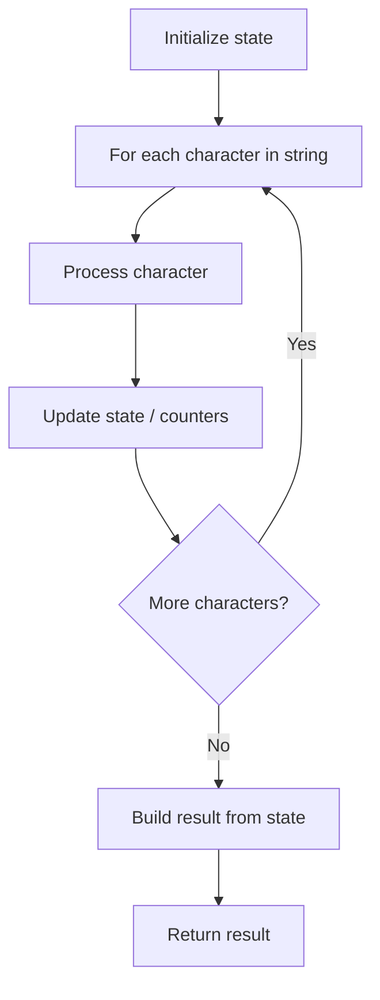

# Problem 2299: Strong Password Checker II

**Difficulty:** Easy  
**Tags:** String  
**Pattern:** String Processing  
**Link:** [leetcode.com/problems/strong-password-checker-ii](https://leetcode.com/problems/strong-password-checker-ii/)

## Description

A password is said to be **strong** if it satisfies all the following criteria:

	- It has at least `8` characters.
	- It contains at least **one lowercase** letter.
	- It contains at least **one uppercase** letter.
	- It contains at least **one digit**.
	- It contains at least **one special character**. The special characters are the characters in the following string: `"!@#$%^&*()-+"`.
	- It does **not** contain `2` of the same character in adjacent positions (i.e., `"aab"` violates this condition, but `"aba"` does not).

Given a string `password`, return `true`* if it is a **strong** password*. Otherwise, return `false`.

 

Example 1:

```

**Input:** password = "IloveLe3tcode!"
**Output:** true
**Explanation:** The password meets all the requirements. Therefore, we return true.

```

Example 2:

```

**Input:** password = "Me+You--IsMyDream"
**Output:** false
**Explanation:** The password does not contain a digit and also contains 2 of the same character in adjacent positions. Therefore, we return false.

```

Example 3:

```

**Input:** password = "1aB!"
**Output:** false
**Explanation:** The password does not meet the length requirement. Therefore, we return false.
```

 

**Constraints:**

	- `1 <= password.length <= 100`
	- `password` consists of letters, digits, and special characters: `"!@#$%^&*()-+"`.

## Approach: String Processing

Process the string character by character. Common techniques: two pointers, sliding window, hash map for frequencies, stack for matching.

## Pseudocode

```
1. Initialize result / tracking state
2. Iterate through string characters:
   a. Process character based on rules
   b. Update state (counters, pointers, stack)
3. Build and return result
```

## Algorithm Flow



## Complexity Analysis

- **Time:** O(n)
- **Space:** O(n)

## Solution (Python3)

```python
class Solution:
    def strongPasswordCheckerII(self, password: str) -> bool:
        # String processing approach - O(n) time
        result = []
        for ch in password:
            if ch.isalnum():
                result.append(ch.lower())
        # Check palindrome or process
        processed = ''.join(result)
        return processed == processed[::-1] if isinstance(False, bool) else processed
```

## Solution (C++)

```cpp
#include <algorithm>
#include <cctype>
#include <string>
#include <vector>
using namespace std;

class Solution {
public:
    bool strongPasswordCheckerII(string& password) {
        // String processing approach - O(n) time
        string processed;
        for (char ch : password) {
            if (isalnum(ch)) {
                processed += tolower(ch);
            }
        }
        string rev = processed;
        reverse(rev.begin(), rev.end());
        return processed == rev;
    }
};
```
