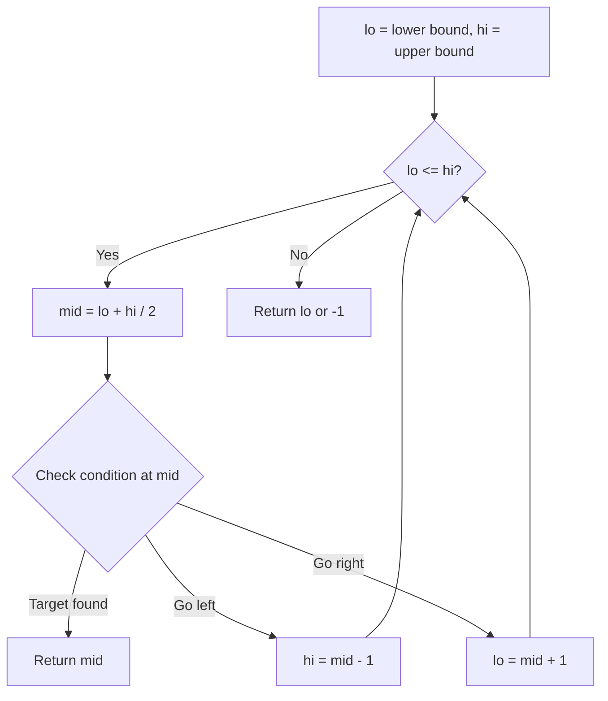
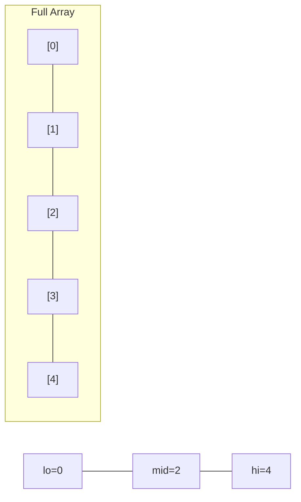
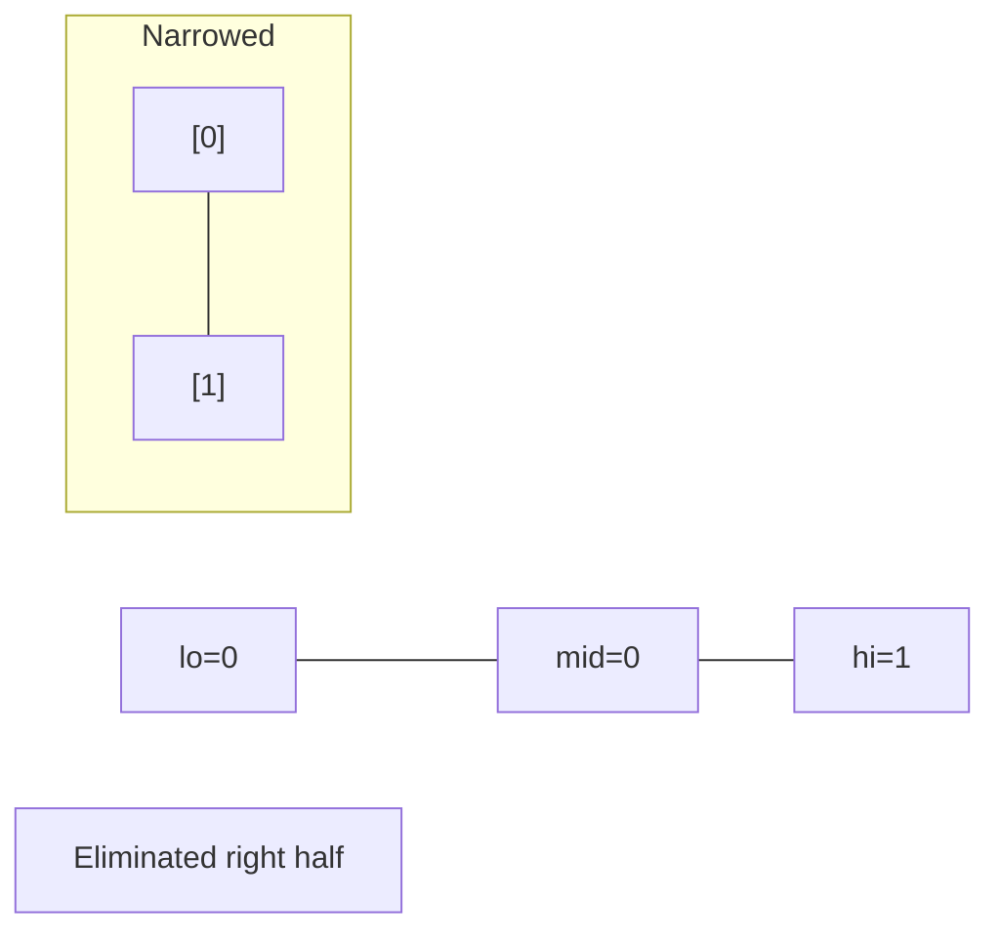
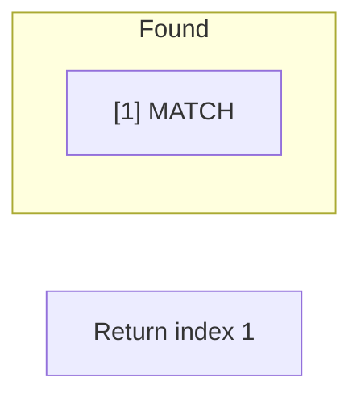

# Problem 2300: Successful Pairs of Spells and Potions

**Difficulty:** Medium  
**Tags:** Array, Two Pointers, Binary Search, Sorting  
**Pattern:** Binary Search + Sorting  
**Link:** [leetcode.com/problems/successful-pairs-of-spells-and-potions](https://leetcode.com/problems/successful-pairs-of-spells-and-potions/)

## Description

You are given two positive integer arrays `spells` and `potions`, of length `n` and `m` respectively, where `spells[i]` represents the strength of the `i^th` spell and `potions[j]` represents the strength of the `j^th` potion.

You are also given an integer `success`. A spell and potion pair is considered **successful** if the **product** of their strengths is **at least** `success`.

Return *an integer array *`pairs`* of length *`n`* where *`pairs[i]`* is the number of **potions** that will form a successful pair with the *`i^th`* spell.*

 

Example 1:

```

**Input:** spells = [5,1,3], potions = [1,2,3,4,5], success = 7
**Output:** [4,0,3]
**Explanation:**
- 0th spell: 5 * [1,2,3,4,5] = [5,**10**,**15**,**20**,**25**]. 4 pairs are successful.
- 1st spell: 1 * [1,2,3,4,5] = [1,2,3,4,5]. 0 pairs are successful.
- 2nd spell: 3 * [1,2,3,4,5] = [3,6,**9**,**12**,**15**]. 3 pairs are successful.
Thus, [4,0,3] is returned.

```

Example 2:

```

**Input:** spells = [3,1,2], potions = [8,5,8], success = 16
**Output:** [2,0,2]
**Explanation:**
- 0th spell: 3 * [8,5,8] = [**24**,15,**24**]. 2 pairs are successful.
- 1st spell: 1 * [8,5,8] = [8,5,8]. 0 pairs are successful. 
- 2nd spell: 2 * [8,5,8] = [**16**,10,**16**]. 2 pairs are successful. 
Thus, [2,0,2] is returned.

```

 

**Constraints:**

	- `n == spells.length`
	- `m == potions.length`
	- `1 <= n, m <= 10^5`
	- `1 <= spells[i], potions[i] <= 10^5`
	- `1 <= success <= 10^10`

## Approach: Binary Search + Sorting

Sort potions. For each spell, binary search for minimum potion needed.

## Pseudocode

```
1. lo = lower_bound, hi = upper_bound
2. While lo <= hi (or lo < hi):
   a. mid = (lo + hi) // 2
   b. If condition(mid) is satisfied: record answer, search left half
   c. Else: search right half
3. Return answer
```

## Algorithm Flow



## Visual State Transitions

**Binary Search Step-by-Step:**

**Frame 1: Initial search space**


**Frame 2: Compare mid, narrow search**


**Frame 3: Found target**



## Complexity Analysis

- **Time:** O((m+n) log n)
- **Space:** O(1) extra

## Solution (Python3)

```python
class Solution:
    def successfulPairs(self, spells, potions, success):
        potions.sort()
        n = len(potions)
        result = []
        for spell in spells:
            needed = (success + spell - 1) // spell
            from bisect import bisect_left
            idx = bisect_left(potions, needed)
            result.append(n - idx)
        return result
```

## Solution (C++)

```cpp
#include <string>
#include <vector>
using namespace std;

class Solution {
public:
    vector<int> successfulPairs(vector<int>& spells, vector<int>& potions, int success) {
        // Binary search - O(log n) time, O(1) space
        int lo = 0, hi = spells.size() - 1;
        while (lo <= hi) {
            int mid = lo + (hi - lo) / 2;
            if (spells[mid] == potions) {
                return mid;
            } else if (spells[mid] < potions) {
                lo = mid + 1;
            } else {
                hi = mid - 1;
            }
        }
        return {};
    }
};
```
