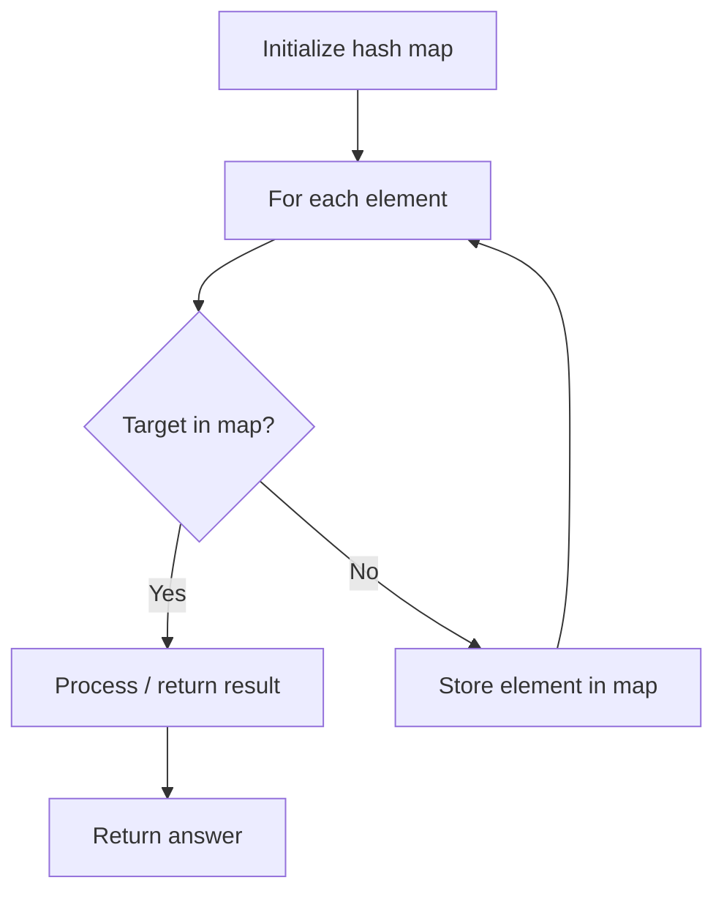

# Problem 2301: Match Substring After Replacement

**Difficulty:** Hard  
**Tags:** Array, Hash Table, String, String Matching  
**Pattern:** Hash Map Lookup  
**Link:** [leetcode.com/problems/match-substring-after-replacement](https://leetcode.com/problems/match-substring-after-replacement/)

## Description

You are given two strings `s` and `sub`. You are also given a 2D character array `mappings` where `mappings[i] = [oldi, newi]` indicates that you may perform the following operation **any** number of times:

	- **Replace** a character `oldi` of `sub` with `newi`.

Each character in `sub` **cannot** be replaced more than once.

Return `true`* if it is possible to make *`sub`* a substring of *`s`* by replacing zero or more characters according to *`mappings`. Otherwise, return `false`.

A **substring** is a contiguous non-empty sequence of characters within a string.

 

Example 1:

```

**Input:** s = "fool3e7bar", sub = "leet", mappings = [["e","3"],["t","7"],["t","8"]]
**Output:** true
**Explanation:** Replace the first 'e' in sub with '3' and 't' in sub with '7'.
Now sub = "l3e7" is a substring of s, so we return true.
```

Example 2:

```

**Input:** s = "fooleetbar", sub = "f00l", mappings = [["o","0"]]
**Output:** false
**Explanation:** The string "f00l" is not a substring of s and no replacements can be made.
Note that we cannot replace '0' with 'o'.

```

Example 3:

```

**Input:** s = "Fool33tbaR", sub = "leetd", mappings = [["e","3"],["t","7"],["t","8"],["d","b"],["p","b"]]
**Output:** true
**Explanation:** Replace the first and second 'e' in sub with '3' and 'd' in sub with 'b'.
Now sub = "l33tb" is a substring of s, so we return true.

```

 

**Constraints:**

	- `1 <= sub.length <= s.length <= 5000`
	- `0 <= mappings.length <= 1000`
	- `mappings[i].length == 2`
	- `oldi != newi`
	- `s` and `sub` consist of uppercase and lowercase English letters and digits.
	- `oldi` and `newi` are either uppercase or lowercase English letters or digits.

## Approach: Hash Map Lookup

Use a hash map (dictionary) to store elements for O(1) lookup. Iterate through the input, checking membership or counting frequencies in the map.

## Pseudocode

```
1. Initialize hash map
2. Iterate through elements:
   a. Check if target/complement exists in map
   b. If found: process result
   c. Otherwise: store element in map
3. Return result
```

## Algorithm Flow



## Complexity Analysis

- **Time:** O(n)
- **Space:** O(n)

## Solution (Python3)

```python
class Solution:
    def matchReplacement(self, s: str, sub: str, mappings: List[List[str]]) -> bool:
        # Hash map approach - O(n) time, O(n) space
        seen = {}
        for i, val in enumerate(s):
            complement = sub - val
            if complement in seen:
                return [seen[complement], i]
            seen[val] = i
        return False
```

## Solution (C++)

```cpp
#include <string>
#include <unordered_map>
#include <vector>
using namespace std;

class Solution {
public:
    bool matchReplacement(string& s, string& sub, vector<vector<string>>& mappings) {
        // Hash map approach - O(n) time, O(n) space
        unordered_map<int, int> seen;
        for (int i = 0; i < s.size(); i++) {
            int complement = sub - s[i];
            if (seen.count(complement)) {
                return {seen[complement], i};
            }
            seen[s[i]] = i;
        }
        return false;
    }
};
```
