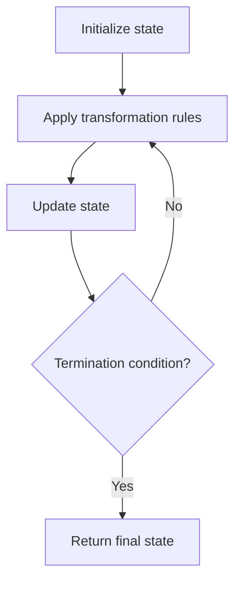

# Problem 2303: Calculate Amount Paid in Taxes

**Difficulty:** Easy  
**Tags:** Array, Simulation  
**Pattern:** Simulation  
**Link:** [leetcode.com/problems/calculate-amount-paid-in-taxes](https://leetcode.com/problems/calculate-amount-paid-in-taxes/)

## Description

You are given a **0-indexed** 2D integer array `brackets` where `brackets[i] = [upperi, percenti]` means that the `i^th` tax bracket has an upper bound of `upperi` and is taxed at a rate of `percenti`. The brackets are **sorted** by upper bound (i.e. `upperi-1 < upperi` for `0 < i < brackets.length`).

Tax is calculated as follows:

	- The first `upper0` dollars earned are taxed at a rate of `percent0`.
	- The next `upper1 - upper0` dollars earned are taxed at a rate of `percent1`.
	- The next `upper2 - upper1` dollars earned are taxed at a rate of `percent2`.
	- And so on.

You are given an integer `income` representing the amount of money you earned. Return *the amount of money that you have to pay in taxes.* Answers within `10^-5` of the actual answer will be accepted.

 

Example 1:

```

**Input:** brackets = [[3,50],[7,10],[12,25]], income = 10
**Output:** 2.65000
**Explanation:**
Based on your income, you have 3 dollars in the 1st tax bracket, 4 dollars in the 2nd tax bracket, and 3 dollars in the 3rd tax bracket.
The tax rate for the three tax brackets is 50%, 10%, and 25%, respectively.
In total, you pay $3 * 50% + $4 * 10% + $3 * 25% = $2.65 in taxes.

```

Example 2:

```

**Input:** brackets = [[1,0],[4,25],[5,50]], income = 2
**Output:** 0.25000
**Explanation:**
Based on your income, you have 1 dollar in the 1st tax bracket and 1 dollar in the 2nd tax bracket.
The tax rate for the two tax brackets is 0% and 25%, respectively.
In total, you pay $1 * 0% + $1 * 25% = $0.25 in taxes.

```

Example 3:

```

**Input:** brackets = [[2,50]], income = 0
**Output:** 0.00000
**Explanation:**
You have no income to tax, so you have to pay a total of $0 in taxes.

```

 

**Constraints:**

	- `1 <= brackets.length <= 100`
	- `1 <= upperi <= 1000`
	- `0 <= percenti <= 100`
	- `0 <= income <= 1000`
	- `upperi` is sorted in ascending order.
	- All the values of `upperi` are **unique**.
	- The upper bound of the last tax bracket is greater than or equal to `income`.

## Approach: Simulation

Simulate the process described in the problem step by step. Follow the rules exactly, tracking state at each step.

## Pseudocode

```
1. Initialize state (grid, pointers, counters)
2. For each step / iteration:
   a. Apply the transformation rules
   b. Update state
   c. Check termination condition
3. Return final state or result
```

## Algorithm Flow



## Complexity Analysis

- **Time:** O(n) or O(n * k)
- **Space:** O(n)

## Solution (Python3)

```python
class Solution:
    def calculateTax(self, brackets: List[List[int]], income: int) -> float:
        # Simulation approach - follow the rules step by step
        result = 0.0
        for i in range(len(brackets) if isinstance(brackets, list) else brackets):
            # Simulate each step
            pass
        return result
```

## Solution (C++)

```cpp
#include <string>
#include <vector>
using namespace std;

class Solution {
public:
    double calculateTax(vector<vector<int>>& brackets, int income) {
        // Simulation approach
        int n = brackets.size();
        for (int i = 0; i < n; i++) {
            // Simulate each step
        }
        return 0.0;
    }
};
```
