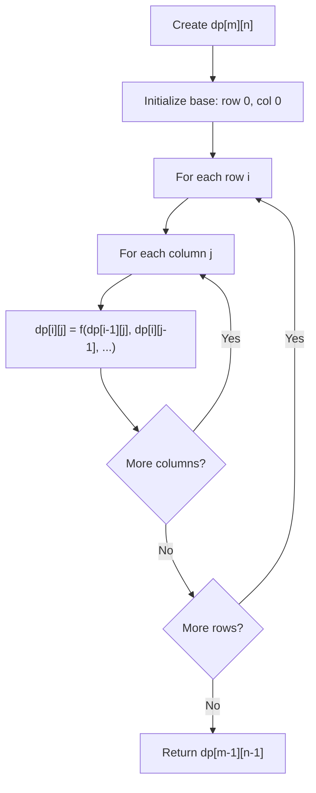
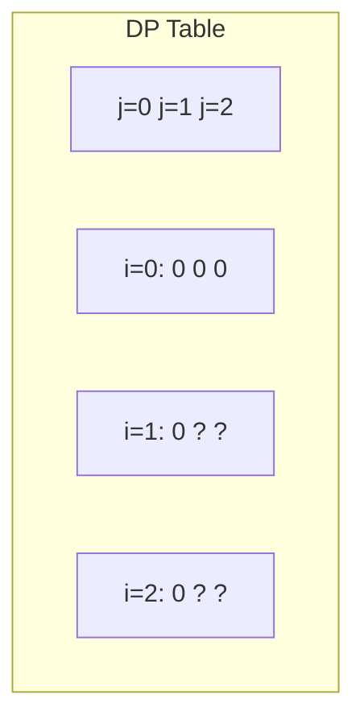
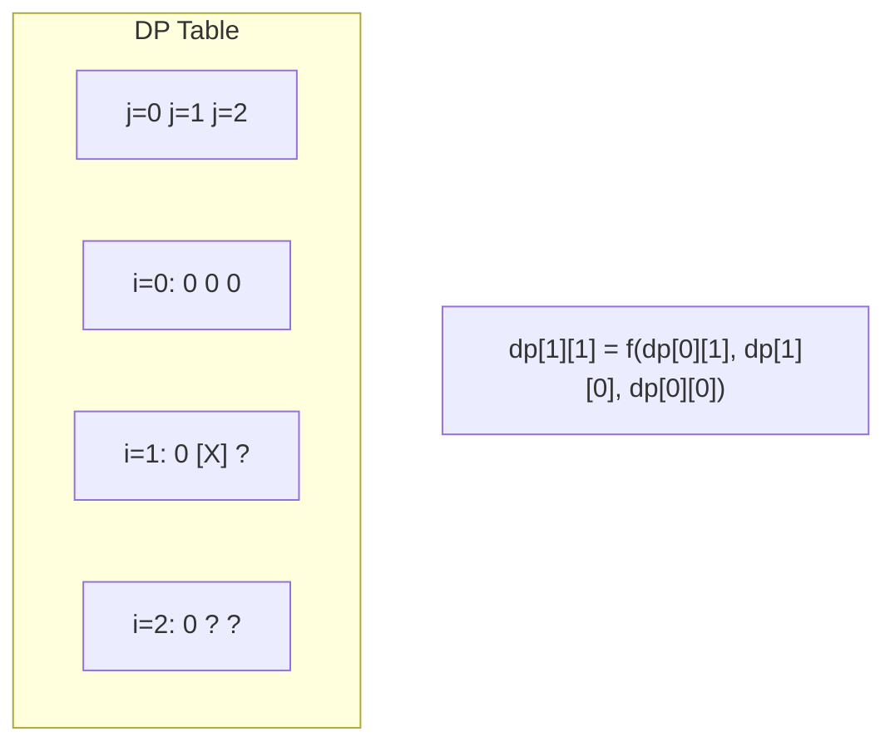
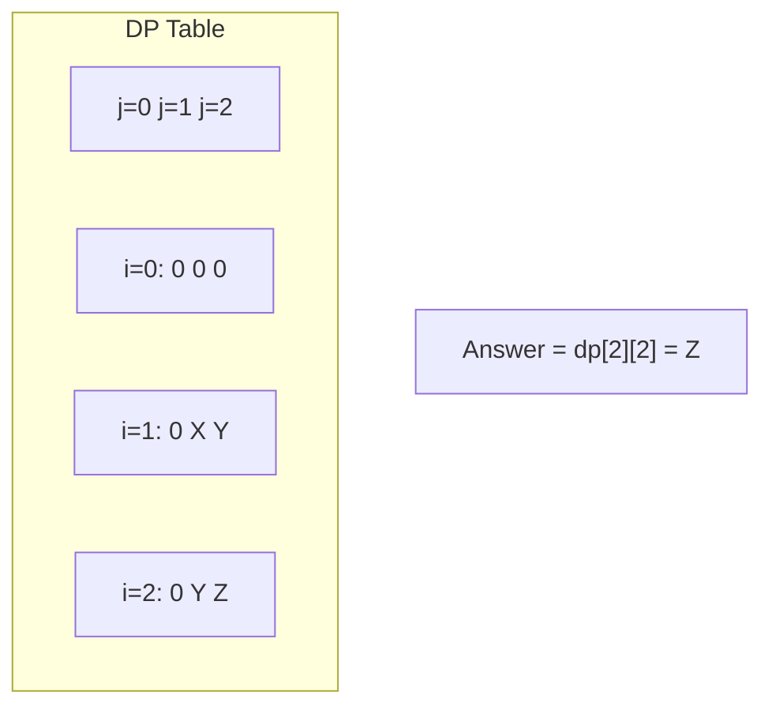

# Problem 2304: Minimum Path Cost in a Grid

**Difficulty:** Medium  
**Tags:** Array, Dynamic Programming, Matrix  
**Pattern:** Dynamic Programming (2D Grid/Matrix)  
**Link:** [leetcode.com/problems/minimum-path-cost-in-a-grid](https://leetcode.com/problems/minimum-path-cost-in-a-grid/)

## Description

You are given a **0-indexed** `m x n` integer matrix `grid` consisting of **distinct** integers from `0` to `m * n - 1`. You can move in this matrix from a cell to any other cell in the **next** row. That is, if you are in cell `(x, y)` such that `x < m - 1`, you can move to any of the cells `(x + 1, 0)`, `(x + 1, 1)`, ..., `(x + 1, n - 1)`. **Note** that it is not possible to move from cells in the last row.

Each possible move has a cost given by a **0-indexed** 2D array `moveCost` of size `(m * n) x n`, where `moveCost[i][j]` is the cost of moving from a cell with value `i` to a cell in column `j` of the next row. The cost of moving from cells in the last row of `grid` can be ignored.

The cost of a path in `grid` is the **sum** of all values of cells visited plus the **sum** of costs of all the moves made. Return *the **minimum** cost of a path that starts from any cell in the **first** row and ends at any cell in the **last** row.*

 

Example 1:

```

**Input:** grid = [[5,3],[4,0],[2,1]], moveCost = [[9,8],[1,5],[10,12],[18,6],[2,4],[14,3]]
**Output:** 17
**Explanation: **The path with the minimum possible cost is the path 5 -> 0 -> 1.
- The sum of the values of cells visited is 5 + 0 + 1 = 6.
- The cost of moving from 5 to 0 is 3.
- The cost of moving from 0 to 1 is 8.
So the total cost of the path is 6 + 3 + 8 = 17.

```

Example 2:

```

**Input:** grid = [[5,1,2],[4,0,3]], moveCost = [[12,10,15],[20,23,8],[21,7,1],[8,1,13],[9,10,25],[5,3,2]]
**Output:** 6
**Explanation:** The path with the minimum possible cost is the path 2 -> 3.
- The sum of the values of cells visited is 2 + 3 = 5.
- The cost of moving from 2 to 3 is 1.
So the total cost of this path is 5 + 1 = 6.

```

 

**Constraints:**

	- `m == grid.length`
	- `n == grid[i].length`
	- `2 <= m, n <= 50`
	- `grid` consists of distinct integers from `0` to `m * n - 1`.
	- `moveCost.length == m * n`
	- `moveCost[i].length == n`
	- `1 <= moveCost[i][j] <= 100`

## Approach: Dynamic Programming (2D Grid/Matrix)

Use a 2D DP table where dp[i][j] represents the optimal value for the subproblem defined by rows 0..i and columns 0..j. Fill row by row or column by column.

## Pseudocode

```
1. Create dp[m][n] table
2. Initialize base cases (first row, first column)
3. For i from 1 to m-1:
   For j from 1 to n-1:
     dp[i][j] = recurrence(dp[i-1][j], dp[i][j-1], dp[i-1][j-1])
4. Return dp[m-1][n-1]
```

## Algorithm Flow



## Visual State Transitions

**2D DP Table Build:**

**Frame 1: Initialize borders**


**Frame 2: Fill cell by cell**


**Frame 3: Table complete**



## Complexity Analysis

- **Time:** O(m * n)
- **Space:** O(m * n)

## Solution (Python3)

```python
class Solution:
    def minPathCost(self, grid: List[List[int]], moveCost: List[List[int]]) -> int:
        # Dynamic programming (2D) - O(m*n) time and space
        if not grid:
            return 0
        m, n = len(grid), len(grid[0])
        dp = [[0] * (n + 1) for _ in range(m + 1)]
        for i in range(1, m + 1):
            for j in range(1, n + 1):
                dp[i][j] = max(dp[i-1][j], dp[i][j-1])
                # Add problem-specific transition
        return dp[m][n]
```

## Solution (C++)

```cpp
#include <algorithm>
#include <string>
#include <vector>
using namespace std;

class Solution {
public:
    int minPathCost(vector<vector<int>>& grid, vector<vector<int>>& moveCost) {
        // Dynamic programming (2D) - O(m*n) time and space
        if (grid.empty()) return 0;
        int m = grid.size(), n = grid[0].size();
        vector<vector<int>> dp(m + 1, vector<int>(n + 1, 0));
        for (int i = 1; i <= m; i++) {
            for (int j = 1; j <= n; j++) {
                dp[i][j] = max(dp[i-1][j], dp[i][j-1]);
            }
        }
        return dp[m][n];
    }
};
```
