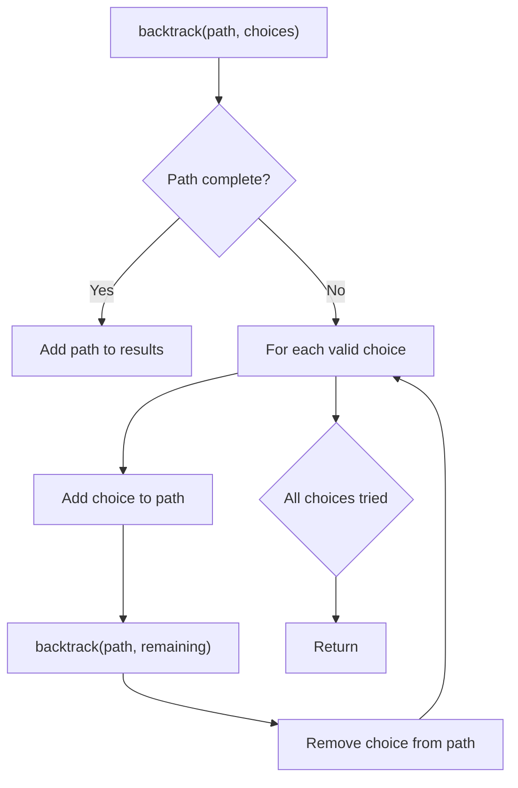
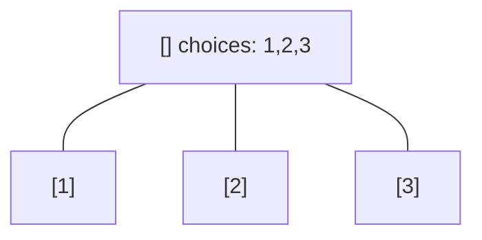
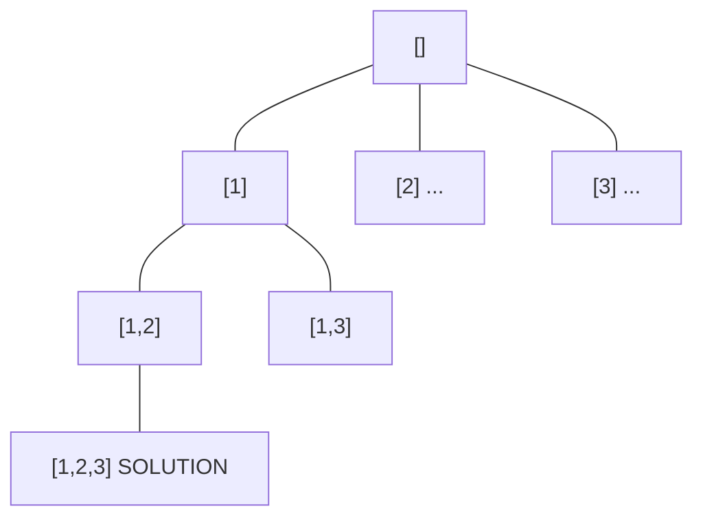
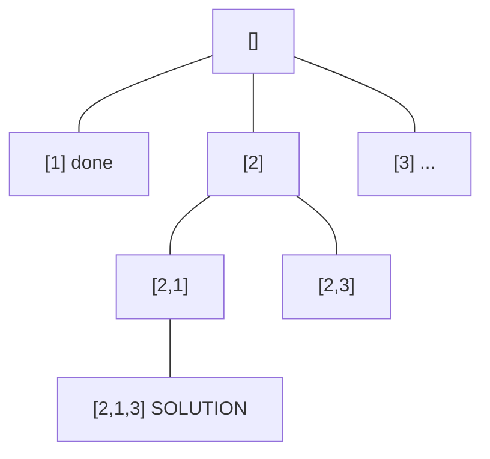
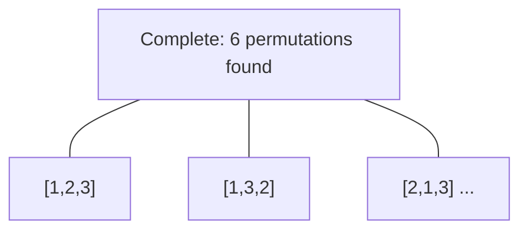

# Problem 2305: Fair Distribution of Cookies

**Difficulty:** Medium  
**Tags:** Array, Dynamic Programming, Backtracking, Bit Manipulation, Bitmask  
**Pattern:** Backtracking  
**Link:** [leetcode.com/problems/fair-distribution-of-cookies](https://leetcode.com/problems/fair-distribution-of-cookies/)

## Description

You are given an integer array `cookies`, where `cookies[i]` denotes the number of cookies in the `i^th` bag. You are also given an integer `k` that denotes the number of children to distribute **all** the bags of cookies to. All the cookies in the same bag must go to the same child and cannot be split up.

The **unfairness** of a distribution is defined as the **maximum** **total** cookies obtained by a single child in the distribution.

Return *the **minimum** unfairness of all distributions*.

 

Example 1:

```

**Input:** cookies = [8,15,10,20,8], k = 2
**Output:** 31
**Explanation:** One optimal distribution is [8,15,8] and [10,20]
- The 1st child receives [8,15,8] which has a total of 8 + 15 + 8 = 31 cookies.
- The 2nd child receives [10,20] which has a total of 10 + 20 = 30 cookies.
The unfairness of the distribution is max(31,30) = 31.
It can be shown that there is no distribution with an unfairness less than 31.

```

Example 2:

```

**Input:** cookies = [6,1,3,2,2,4,1,2], k = 3
**Output:** 7
**Explanation:** One optimal distribution is [6,1], [3,2,2], and [4,1,2]
- The 1st child receives [6,1] which has a total of 6 + 1 = 7 cookies.
- The 2nd child receives [3,2,2] which has a total of 3 + 2 + 2 = 7 cookies.
- The 3rd child receives [4,1,2] which has a total of 4 + 1 + 2 = 7 cookies.
The unfairness of the distribution is max(7,7,7) = 7.
It can be shown that there is no distribution with an unfairness less than 7.

```

 

**Constraints:**

	- `2 <= cookies.length <= 8`
	- `1 <= cookies[i] <= 10^5`
	- `2 <= k <= cookies.length`

## Approach: Backtracking

Explore all possible solutions by building candidates incrementally. At each step, make a choice and recurse. If the choice leads to a dead end, undo the choice (backtrack) and try the next option.

## Pseudocode

```
1. Define backtrack(path, choices):
   a. If path is a complete solution: add to results
   b. For each choice in choices:
      - If choice is valid:
        * Add choice to path
        * backtrack(path, remaining_choices)
        * Remove choice from path (backtrack)
2. Call backtrack([], all_choices)
```

## Algorithm Flow



## Visual State Transitions

**Backtracking Decision Tree:**

**Frame 1: Root - start with empty path**


**Frame 2: Explore branch [1]**


**Frame 3: Backtrack, explore [2]**


**Frame 4: All solutions found**



## Complexity Analysis

- **Time:** O(k^n) or O(n!)
- **Space:** O(n)

## Solution (Python3)

```python
class Solution:
    def distributeCookies(self, cookies: List[int], k: int) -> int:
        # Backtracking - O(2^n) or O(n!) time
        result = []
        
        def backtrack(path, start):
            result.append(path[:])
            for i in range(start, len(cookies)):
                path.append(cookies[i])
                backtrack(path, i + 1)
                path.pop()
        
        backtrack([], 0)
        return result
```

## Solution (C++)

```cpp
#include <functional>
#include <string>
#include <vector>
using namespace std;

class Solution {
public:
    int distributeCookies(vector<int>& cookies, int k) {
        // Backtracking - O(2^n) or O(n!) time
        vector<vector<int>> result;
        vector<int> path;
        function<void(int)> backtrack = [&](int start) {
            result.push_back(path);
            for (int i = start; i < (int)cookies.size(); i++) {
                path.push_back(cookies[i]);
                backtrack(i + 1);
                path.pop_back();
            }
        };
        backtrack(0);
        return result;
    }
};
```
