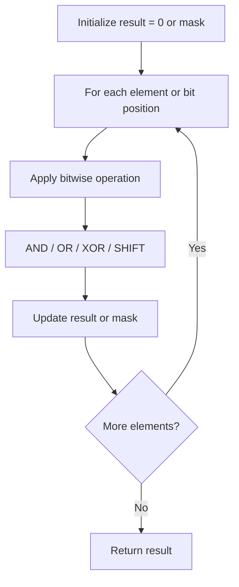

# Problem 2306: Naming a Company

**Difficulty:** Hard  
**Tags:** Array, Hash Table, String, Bit Manipulation, Enumeration  
**Pattern:** Bit Manipulation  
**Link:** [leetcode.com/problems/naming-a-company](https://leetcode.com/problems/naming-a-company/)

## Description

You are given an array of strings `ideas` that represents a list of names to be used in the process of naming a company. The process of naming a company is as follows:

	- Choose 2 **distinct** names from `ideas`, call them `ideaA` and `ideaB`.
	- Swap the first letters of `ideaA` and `ideaB` with each other.
	- If **both** of the new names are not found in the original `ideas`, then the name `ideaA ideaB` (the **concatenation** of `ideaA` and `ideaB`, separated by a space) is a valid company name.
	- Otherwise, it is not a valid name.

Return *the number of **distinct** valid names for the company*.

 

Example 1:

```

**Input:** ideas = ["coffee","donuts","time","toffee"]
**Output:** 6
**Explanation:** The following selections are valid:
- ("coffee", "donuts"): The company name created is "doffee conuts".
- ("donuts", "coffee"): The company name created is "conuts doffee".
- ("donuts", "time"): The company name created is "tonuts dime".
- ("donuts", "toffee"): The company name created is "tonuts doffee".
- ("time", "donuts"): The company name created is "dime tonuts".
- ("toffee", "donuts"): The company name created is "doffee tonuts".
Therefore, there are a total of 6 distinct company names.

The following are some examples of invalid selections:
- ("coffee", "time"): The name "toffee" formed after swapping already exists in the original array.
- ("time", "toffee"): Both names are still the same after swapping and exist in the original array.
- ("coffee", "toffee"): Both names formed after swapping already exist in the original array.

```

Example 2:

```

**Input:** ideas = ["lack","back"]
**Output:** 0
**Explanation:** There are no valid selections. Therefore, 0 is returned.

```

 

**Constraints:**

	- `2 <= ideas.length <= 5 * 10^4`
	- `1 <= ideas[i].length <= 10`
	- `ideas[i]` consists of lowercase English letters.
	- All the strings in `ideas` are **unique**.

## Approach: Bit Manipulation

Operate on individual bits using bitwise operators (AND, OR, XOR, shift). Common tricks: x & (x-1) removes lowest set bit, x ^ x = 0, XOR all elements to find unique.

## Pseudocode

```
1. Apply bitwise operations:
   - XOR all elements to cancel paired bits
   - Use bitmask to track state
   - Shift and mask to extract/set individual bits
2. Return result
```

## Algorithm Flow



## Complexity Analysis

- **Time:** O(n) or O(log n)
- **Space:** O(1)

## Solution (Python3)

```python
class Solution:
    def distinctNames(self, ideas: List[str]) -> int:
        # Bit manipulation - O(n) time, O(1) space
        result = 0
        for val in ideas:
            result ^= val
        return result
```

## Solution (C++)

```cpp
#include <string>
#include <vector>
using namespace std;

class Solution {
public:
    int distinctNames(vector<string>& ideas) {
        // Bit manipulation - O(n) time, O(1) space
        int result = 0;
        for (int val : ideas) {
            result ^= val;
        }
        return result;
    }
};
```
