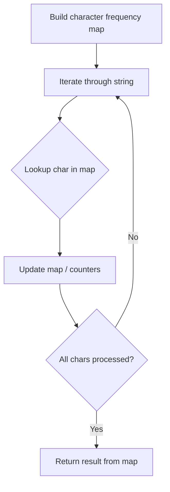

# Problem 2309: Greatest English Letter in Upper and Lower Case

**Difficulty:** Easy  
**Tags:** Hash Table, String, Enumeration  
**Pattern:** Hash Map String Processing  
**Link:** [leetcode.com/problems/greatest-english-letter-in-upper-and-lower-case](https://leetcode.com/problems/greatest-english-letter-in-upper-and-lower-case/)

## Description

Given a string of English letters `s`, return *the **greatest **English letter which occurs as **both** a lowercase and uppercase letter in* `s`. The returned letter should be in **uppercase**. If no such letter exists, return *an empty string*.

An English letter `b` is **greater** than another letter `a` if `b` appears **after** `a` in the English alphabet.

 

Example 1:

```

**Input:** s = "l**Ee**TcOd**E**"
**Output:** "E"
**Explanation:**
The letter 'E' is the only letter to appear in both lower and upper case.

```

Example 2:

```

**Input:** s = "a**rR**AzFif"
**Output:** "R"
**Explanation:**
The letter 'R' is the greatest letter to appear in both lower and upper case.
Note that 'A' and 'F' also appear in both lower and upper case, but 'R' is greater than 'F' or 'A'.

```

Example 3:

```

**Input:** s = "AbCdEfGhIjK"
**Output:** ""
**Explanation:**
There is no letter that appears in both lower and upper case.

```

 

**Constraints:**

	- `1 <= s.length <= 1000`
	- `s` consists of lowercase and uppercase English letters.

## Approach: Hash Map String Processing

Use a hash map to count character frequencies or map characters/strings for O(1) lookups. Process the string in one or two passes.

## Pseudocode

```
1. Build frequency map / char-to-index map
2. Iterate through string:
   a. Look up character in map
   b. Update counts or mappings
3. Return result based on map state
```

## Algorithm Flow



## Complexity Analysis

- **Time:** O(n)
- **Space:** O(n)

## Solution (Python3)

```python
class Solution:
    def greatestLetter(self, s: str) -> str:
        # Hash map for string/character frequency - O(n) time
        freq = {}
        for ch in s:
            freq[ch] = freq.get(ch, 0) + 1
        # Process frequency map
        for ch, cnt in freq.items():
            if cnt == 1:
                return s.index(ch)
        return ""
```

## Solution (C++)

```cpp
#include <string>
#include <unordered_map>
#include <vector>
using namespace std;

class Solution {
public:
    string greatestLetter(string& s) {
        // Hash map for string/character frequency - O(n) time
        unordered_map<char, int> freq;
        for (char ch : s) {
            freq[ch]++;
        }
        // Process frequency map
        for (int i = 0; i < s.size(); i++) {
            if (freq[s[i]] == 1) return i;
        }
        return "";
    }
};
```
