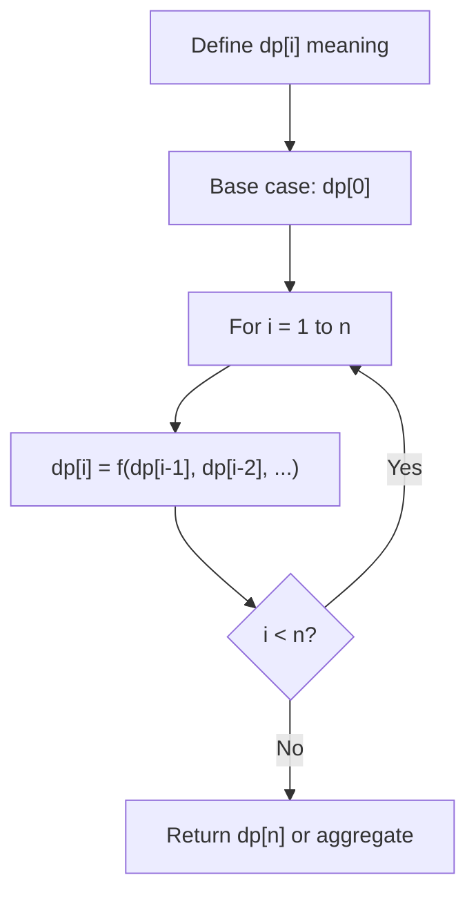
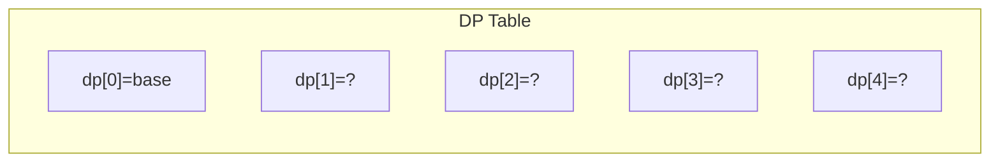
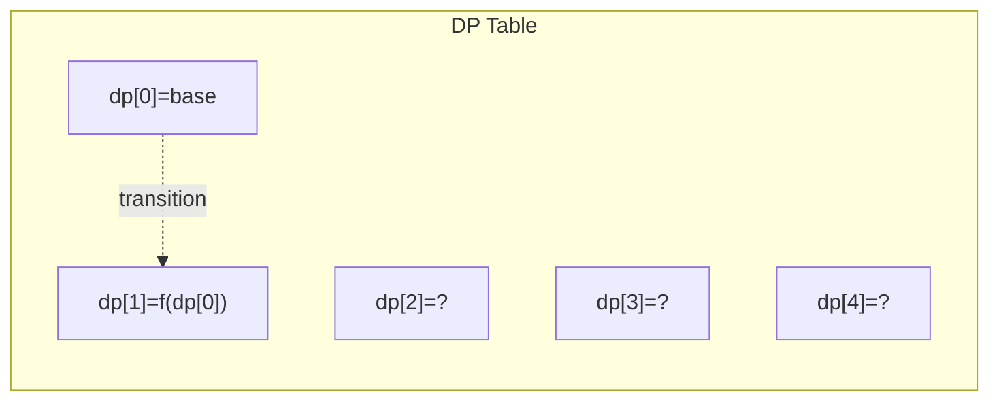
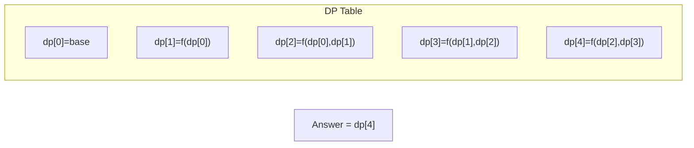

# Problem 2310: Sum of Numbers With Units Digit K

**Difficulty:** Medium  
**Tags:** Math, Dynamic Programming, Greedy, Enumeration  
**Pattern:** Dynamic Programming (1D)  
**Link:** [leetcode.com/problems/sum-of-numbers-with-units-digit-k](https://leetcode.com/problems/sum-of-numbers-with-units-digit-k/)

## Description

Given two integers `num` and `k`, consider a set of positive integers with the following properties:

	- The units digit of each integer is `k`.
	- The sum of the integers is `num`.

Return *the **minimum** possible size of such a set, or *`-1`* if no such set exists.*

Note:

	- The set can contain multiple instances of the same integer, and the sum of an empty set is considered `0`.
	- The **units digit** of a number is the rightmost digit of the number.

 

Example 1:

```

**Input:** num = 58, k = 9
**Output:** 2
**Explanation:**
One valid set is [9,49], as the sum is 58 and each integer has a units digit of 9.
Another valid set is [19,39].
It can be shown that 2 is the minimum possible size of a valid set.

```

Example 2:

```

**Input:** num = 37, k = 2
**Output:** -1
**Explanation:** It is not possible to obtain a sum of 37 using only integers that have a units digit of 2.

```

Example 3:

```

**Input:** num = 0, k = 7
**Output:** 0
**Explanation:** The sum of an empty set is considered 0.

```

 

**Constraints:**

	- `0 <= num <= 3000`
	- `0 <= k <= 9`

## Approach: Dynamic Programming (1D)

Break the problem into overlapping subproblems. Define dp[i] as the optimal value for the subproblem ending at or considering index i. Build the solution bottom-up, using previously computed dp values.

## Pseudocode

```
1. Define dp[i] = optimal value for subproblem i
2. Base case: dp[0] = initial value
3. For i from 1 to n:
   a. dp[i] = recurrence(dp[i-1], dp[i-2], ...)
4. Return dp[n] or max/min of dp
```

## Algorithm Flow



## Visual State Transitions

**1D Dynamic Programming Table Build:**

**Frame 1: Initialize base cases**


**Frame 2: Fill dp[1] from dp[0]**


**Frame 3: Fill remaining cells**



## Complexity Analysis

- **Time:** O(n)
- **Space:** O(n)

## Solution (Python3)

```python
class Solution:
    def minimumNumbers(self, num: int, k: int) -> int:
        # Dynamic programming (1D) - O(n) time, O(n) space
        if not num:
            return 0
        n = len(num) if isinstance(num, list) else num
        dp = [0] * (n + 1)
        dp[0] = 1  # base case
        for i in range(1, n + 1):
            dp[i] = dp[i-1]  # transition (customize per problem)
            if i >= 2:
                dp[i] += dp[i-2]
        return dp[n]
```

## Solution (C++)

```cpp
#include <string>
#include <vector>
using namespace std;

class Solution {
public:
    int minimumNumbers(int num, int k) {
        // Dynamic programming (1D) - O(n) time, O(n) space
        int n = num;
        if (n <= 0) return 0;
        vector<int> dp(n + 1, 0);
        dp[0] = 1;
        for (int i = 1; i <= n; i++) {
            dp[i] = dp[i-1];
            if (i >= 2) dp[i] += dp[i-2];
        }
        return dp[n];
    }
};
```
